# Data — banco de preguntas y datasets

Ficheros que usa el juego y las herramientas de mantenimiento.

**Datos propios (usuario):** solo CSV mínimo → juego mínimo (`--csv` o `MATCAD_juego_minimal.zip`). Ver [`Plantillas/README.md`](Plantillas/README.md).

**Juego completo MATCAD (autor):** `Data/Banco/` curricular + listado + zip portable. No está previsto que el usuario monte un paquete completo alternativo (versión intermedia futura).

## Estructura

```
Data/
├── Banco/        # Banco de preguntas y catálogos (.csv, .json de producción)
├── Juego/        # Estado local del jugador (.json runtime, informes .txt)
├── Privado/      # Config del autor y fuentes locales (no se versiona ni empaqueta)
└── README.md
```

### `Data/Banco/` (banco cerrado y datos de mantenimiento)

| Fichero | Uso |
|---------|-----|
| `Preguntas.csv` | Banco principal (**480** preguntas cerradas) — **único imprescindible** para jugar |
| `listado_materias.csv` | Metadatos de **40** materias (juego completo) |
| `plantillas.json` | **Opcional (autor):** 480 revisadas + 480 extras sin revisar; activa el **banco ampliado** y el pool de resistencia. **No se incluye en el zip portable.** |

| `criterios_clasificacion_materia.csv` | Palabras clave por materia |
| `Historic_qualificacions_MatCAD_completo.csv` | Histórico — modo historia |

### `Data/Privado/` (autor: no versionar ni empaquetar)

Todo lo **privado o local del mantenimiento** en un solo sitio (no va al zip portable).

| Fichero | Uso |
|---------|-----|
| `creador_privado.json` | Datos personales, SMTP del feedback, secretos GitHub |
| `Preguntas_minimal.csv` | Exportación mínima del banco (tests y zip mínimo; ver `Tests/Fixtures/generar_preguntas_minimal.py`) |
| `*.xlsx` | Fuentes de mantenimiento (p. ej. histórico antes de exportar a CSV en `Banco/`) |

Plantilla del JSON: `cd Juego && python -m Comun.feedback`. Ver [`Privado/README.md`](Privado/README.md).

### `Data/Juego/` (solo datos locales del jugador)

Se crea al jugar; **no debe contener catálogos ni banco** (ni versionarse copias de `presets.json`, `preguntas_resistencia.json`, etc.).

| Fichero | Uso |
|---------|-----|
| `preferencias_grafico.json` | Nombre, emojis, tooltips (menú opciones) |
| `estadisticas_jugador.json` | Totales, récords, evolución agregada |
| `*.txt` | Informes de partida y copias de feedback |

Auditoría: `python Files/health_check.py --solo-datos` (o `Comun.persistencia.auditar_carpetas_data`).

Catálogo de modos: [`Juego/presets.json`](../Juego/presets.json) (viaja con el código, no en `Data/Juego/`).

El juego resuelve rutas con [`Juego/Comun/rutas.py`](../Juego/Comun/rutas.py): banco en `Data/Banco/`, estado local en `Data/Juego/` (con compatibilidad hacia rutas legadas).

Plantilla de ejemplo para datos propios: [`Plantillas/Preguntas.csv`](Plantillas/Preguntas.csv) (ver [`Plantillas/README.md`](Plantillas/README.md)).

### Catálogo `Juego/presets.json`

Modos activos en el carrusel de historia (`contexto_reglas`: `historia_*`):

| ID | Rol |
|----|-----|
| `repaso` | Repaso flexible por ámbito (N asignaturas, histórico opcional) |
| `repaso_area` | Todas las materias de un bloque G1–G10 |
| `simulacro` | Ronda de exámenes (semestre o curso completo; tipo de preguntas teórico/cálculo) |
| `examen_asignatura` | Simulacro de una materia (N preguntas por plantilla; tipo de preguntas teórico/cálculo) |
| `examen_fijo` | Plantilla 4×6 (24 preguntas): diario, aleatorio o semilla numérica (sin histórico) |

**Modos especiales** (definidos en código, `Comun/presets_historia.py`; `contexto_reglas`: `escape` / `resistencia`):

| ID | Rol |
|----|-----|
| `escape_room` | Escape room: 30 salas, 3 puertas, descanso, tienda, botín, inventario |
| `resistencia` | Modo resistencia (partida infinita, eventos) |

**Presets retirados** (ya no están en el JSON; la lógica se unificó):

| ID antiguo | Sustituto |
|------------|-----------|
| `examen_dia_historia` | `examen_fijo` con `origen_semilla: diario` (atajo en Retos del día 📅) |
| `examen_aleatorio_historia` | `examen_fijo` con `origen_semilla: aleatorio` (atajo en Retos del día 📅) |
| `repaso_historico`, `repaso_integral`, `vuelta_grado`, `repaso_express` | Unificados en `repaso` |
| `semana_examenes`, `simulacro_curso` | Unificados en `simulacro` |
| `ranking_resistencia` | *(retirado)* — usar preset `resistencia`; récords en estadísticas |

Semilla diaria compartida (`DDMMYYYY`, p. ej. `22062026`; en UI siempre 8 dígitos) **solo** fija el **contenido** del **Examen del día** (`examen_fijo` con `origen_semilla: diario`). Al iniciar cada partida se asigna una semilla de sesión (`semilla_partida_aleatoria()` si el orden varía); un único `RngPartida` ([`semillas.py`](../Juego/Comun/semillas.py), `resolver_semillas_partida`) consume todo el azar de la partida (orden, opciones A–D, salas, eventos, etc.): la semilla identifica la sesión y cada operación aleatoria avanza el generador, sin sub-semillas ni reinicios a mitad de juego.

## Esquema de `Preguntas.csv`

Banco cerrado (**480** preguntas = **40 materias × 12**), separador `;`, UTF-8.

**10 columnas** en orden:

`Id`;`Materia`;`Dificultad`;`Tipo`;`Pregunta`;`A`;`B`;`C`;`D`;`Correcta`

**Estructura por materia** (12 preguntas): 2FT 2MT 2DT 2FC 2MC 2DC — 6 Teoría + 6 Cálculo, escalón F→M→D en cada mitad.

**Reparto global:**

| Dimensión | Valor |
|-----------|-------|
| Dificultad | 160 Fácil / 160 Media / 160 Difícil |
| Tipo | 240 Teoría / 240 Cálculo |
| Respuesta correcta | 120 por letra A–D (`Correcta` según `(Id−1) mod 4`) |

Los metadatos curriculares (`curso`, `semestre`, `grupo`, `nivel`, `tematica`) **no** van en el CSV de preguntas; se obtienen de `listado_materias.csv` al cargar o al guardar con `utils_dataset_csv.guardar_filas_csv`.

Validación: `python Files/mantenimiento.py validar`

Auditoría de distractores (salida por terminal; `--json` opcional): `python Files/mantenimiento.py auditar-distractores`

Duplicados semánticos: `python Files/duplicados.py revisar` → **0 pares similares** en CSV y plantillas intra-materia (2026-06-15).

El CSV está cerrado; cualquier reescritura requiere `TFG_PERMITIR_CSV=1` (solo mantenimiento excepcional).

## Objetivos de balanceo

Definidos en [`Files/objetivos_balanceo.py`](../Files/objetivos_balanceo.py):

- `TARGET_TOTAL_PREGUNTAS = 480`
- 12 preguntas por materia (2FT 2MT 2DT 2FC 2MC 2DC)
- Clasificación semántica orientativa: `utils_clasificacion_pregunta.clasificar_pregunta(...)` contrasta Materia + Tipo + Dificultad inferidos del texto con las columnas del CSV.

## Revisión manual del banco

**Base (480):** `Preguntas.csv` y las filas `dataset_480` de `plantillas.json` — revisión manual completada (enunciado, distractores, metadatos).

**Beta (480 extras en JSON):** filas extra reales (`internet`, `repuesto`, `general`, …) — materia, tipo y dificultad equilibrados; **pendiente revisar enunciado y opciones A–D**.

`plantillas.json` está **cerrado** (960 filas = 480 dataset + 480 extra, sin `variaciones`, 2026-06-27). No regenerar salvo `TFG_PERMITIR_PLANTILLAS=1`.

En el juego: **banco revisado** = 480 (CSV); **banco ampliado** = 960 (solo si existe `plantillas.json` en el repo del autor); **resistencia** = 480 + 40 exclusivas (520) o **1000** con plantillas, desbloqueo progresivo por capas.

Auditoría: `python Files/mantenimiento.py auditar-distractores` (banco ampliado) o `--solo-dataset` (base). Cobertura: `auditar-plantillas`. Estado del TFG: [`CHANGELOG_PROYECTO.md`](../Docs/CHANGELOG_PROYECTO.md), [`RELEASE_1.0.md`](../Docs/RELEASE_1.0.md) y [`CHECKLIST.md`](../Docs/CHECKLIST.md).

## Evolución futura del modelo de datos

El CSV actual usa una etiqueta principal `Materia`. Se propone ampliar con:

- `Materias_relacionadas`: solapamiento temático entre asignaturas.
- `Prerequisitos`: dependencias de conocimiento previo.

Estas columnas **aún no existen** en el banco; el esquema vigente es el de la tabla anterior.

## Jerarquía curricular (40 materias)

Cada materia se indica como `[Gx|Ny]` (grupo × nivel). Organización por curso y semestre:

```mermaid
flowchart TB
    C1["Curso 1"] --> C1S1["Semestre 1"]
    C1["Curso 1"] --> C1S2["Semestre 2"]
    C2["Curso 2"] --> C2S1["Semestre 1"]
    C2["Curso 2"] --> C2S2["Semestre 2"]
    C3["Curso 3"] --> C3S1["Semestre 1"]
    C3["Curso 3"] --> C3S2["Semestre 2"]
    C4["Curso 4"] --> C4S1["Semestre 1"]
    C4["Curso 4"] --> C4S2["Semestre 2"]

    C1S1 --> M01["Àlgebra Lineal [G1|N1]"]
    C1S1 --> M02["Càlcul en una Variable [G2|N1]"]
    C1S1 --> M03["Fonaments de Computadors [G3|N1]"]
    C1S1 --> M04["Iniciació a la Programació [G4|N1]"]
    C1S1 --> M05["Programari de Sistema [G5|N1]"]

    C1S2 --> M06["Algorítmia i Combinatòria en Grafs [G5|N2]"]
    C1S2 --> M07["Càlcul en Diverses Variables [G2|N2]"]
    C1S2 --> M08["Càlcul Numèric [G6|N1]"]
    C1S2 --> M09["Probabilitat [G7|N1]"]
    C1S2 --> M10["Programació Orientada als Objectes [G4|N2]"]

    C2S1 --> M11["Bases de Dades Relacionals [G8|N1]"]
    C2S1 --> M12["Equacions Diferencials Ordinàries [G2|N3]"]
    C2S1 --> M13["Modelització i Inferència [G7|N2]"]
    C2S1 --> M14["Tècniques de Disseny d'Algoritmes [G5|N3]"]
    C2S1 --> M15["Visualització 3D [G1|N2]"]

    C2S2 --> M16["Anàlisi Complexa i de Fourier [G2|N4]"]
    C2S2 --> M17["Anàlisi de Dades Complexes [G7|N3]"]
    C2S2 --> M18["Intel·ligència Artificial [G9|N1]"]
    C2S2 --> M19["Mètodes Numèrics i Probabilístics [G6|N2]"]
    C2S2 --> M20["Optimització [G6|N2]"]

    C3S1 --> M21["Aprenentatge Computacional [G9|N2]"]
    C3S1 --> M22["Computació i Simulació d'Altes Prestacions [G6|N3]"]
    C3S1 --> M23["Equacions en Derivades Parcials [G2|N4]"]
    C3S1 --> M24["Física, Abstracció i Computació [G10|N1]"]
    C3S1 --> M25["Teoria de la Informació [G10|N1]"]

    C3S2 --> M26["Bases de Dades No Relacionals [G8|N2]"]
    C3S2 --> M27["Informació Quàntica [G10|N2]"]
    C3S2 --> M28["Modelització i Simulació [G10|N2]"]
    C3S2 --> M29["Sistemes Distribuïts i el Núvol [G3|N2]"]
    C3S2 --> M30["Xarxes Neuronals i Aprenentatge Profund [G9|N3]"]

    C4S1 --> M31["Anàlisi de Dades Financeres [G7|N4]"]
    C4S1 --> M32["Anàlisi de Dades Temporals [G7|N4]"]
    C4S1 --> M33["Anàlisi Topològica de Dades [G7|N4]"]
    C4S1 --> M34["Internet de les Coses [G3|N3]"]
    C4S1 --> M35["Mètodes d Anàlisi en Ciències de la Salut [G8|N3]"]

    C4S2 --> M36["Anàlisi de Dades en Astrofísica [G7|N4]"]
    C4S2 --> M37["Bioinformàtica [G7|N4]"]
    C4S2 --> M38["Informació i Seguretat [G3|N4]"]
    C4S2 --> M39["Teoria de Jocs [G5|N4]"]
    C4S2 --> M40["Visió per Computador [G9|N4]"]
```



## Grupos temáticos (10 grupos)

| Grupo | Temática |
|-------|----------|
| G1 | Àlgebra i geometria / visualització |
| G2 | Càlcul i equacions |
| G3 | Sistemes i seguretat computacional |
| G4 | Programació de software |
| G5 | Algorítmia i teoria de jocs |
| G6 | Mètodes numèrics i optimització |
| G7 | Probabilitat i ciència de dades |
| G8 | Bases de dades |
| G9 | Intel·ligència artificial i aprenentatge automàtic |
| G10 | Modelització física i informació |

```mermaid
flowchart LR
    G1["Grupo 1 - Algebra i Visualitzacio"] --> G1A["Àlgebra Lineal [N1|1-1]"]
    G1 --> G1B["Visualització 3D [N2|2-1]"]

    G2["Grupo 2 - Calcul i Equacions"] --> G2A["Càlcul en una Variable [N1|1-1]"]
    G2 --> G2B["Càlcul en Diverses Variables [N2|1-2]"]
    G2 --> G2C["Equacions Diferencials Ordinàries [N3|2-1]"]
    G2 --> G2D["Anàlisi Complexa i de Fourier [N4|2-2]"]
    G2 --> G2E["Equacions en Derivades Parcials [N4|3-1]"]

    G3["Grupo 3 - Sistemes i Seguretat"] --> G3A["Fonaments de Computadors [N1|1-1]"]
    G3 --> G3B["Sistemes Distribuïts i el Núvol [N2|3-2]"]
    G3 --> G3C["Internet de les Coses [N3|4-1]"]
    G3 --> G3D["Informació i Seguretat [N4|4-2]"]

    G4["Grupo 4 - Programacio Software"] --> G4A["Iniciació a la Programació [N1|1-1]"]
    G4 --> G4B["Programació Orientada als Objectes [N2|1-2]"]

    G5["Grupo 5 - Algoritmia i Jocs"] --> G5A["Programari de Sistema [N1|1-1]"]
    G5 --> G5B["Algorítmia i Combinatòria en Grafs [N2|1-2]"]
    G5 --> G5C["Tècniques de Disseny d'Algoritmes [N3|2-1]"]
    G5 --> G5D["Teoria de Jocs [N4|4-2]"]

    G6["Grupo 6 - Numeric i Optimitzacio"] --> G6A["Càlcul Numèric [N1|1-2]"]
    G6 --> G6B["Mètodes Numèrics i Probabilístics [N2|2-2]"]
    G6 --> G6C["Optimització [N2|2-2]"]
    G6 --> G6D["Computació i Simulació d'Altes Prestacions [N3|3-1]"]

    G7["Grupo 7 - Probabilitat i Dades"] --> G7A["Probabilitat [N1|1-2]"]
    G7 --> G7B["Modelització i Inferència [N2|2-1]"]
    G7 --> G7C["Anàlisi de Dades Complexes [N3|2-2]"]
    G7 --> G7D["Anàlisi de Dades Financeres [N4|4-1]"]
    G7 --> G7E["Anàlisi de Dades Temporals [N4|4-1]"]
    G7 --> G7F["Bioinformàtica [N4|4-2]"]
    G7 --> G7G["Anàlisi Topològica de Dades [N4|4-1]"]
    G7 --> G7H["Anàlisi de Dades en Astrofísica [N4|4-2]"]

    G8["Grupo 8 - Bases de Dades"] --> G8A["Bases de Dades Relacionals [N1|2-1]"]
    G8 --> G8B["Bases de Dades No Relacionals [N2|3-2]"]
    G8 --> G8C["Mètodes d Anàlisi en Ciències de la Salut [N3|4-1]"]

    G9["Grupo 9 - IA i Aprenentatge"] --> G9A["Intel·ligència Artificial [N1|2-2]"]
    G9 --> G9B["Aprenentatge Computacional [N2|3-1]"]
    G9 --> G9C["Xarxes Neuronals i Aprenentatge Profund [N3|3-2]"]
    G9 --> G9D["Visió per Computador [N4|4-2]"]

    G10["Grupo 10 - Modelitzacio i Informacio"] --> G10A["Física, Abstracció i Computació [N1|3-1]"]
    G10 --> G10B["Teoria de la Informació [N1|3-1]"]
    G10 --> G10C["Modelització i Simulació [N2|3-2]"]
    G10 --> G10D["Informació Quàntica [N2|3-2]"]
```



## Fichero privado del creador (no se sube a git)

`Data/Privado/creador_privado.json` guarda en un solo sitio:

- Datos personales (`creador`: nombre, correo, tutor, notas).
- Secretos de GitHub (`github`: usuario, repo, token).
- SMTP del modo feedback (`feedback_smtp`).

La plantilla por defecto está en código: [`Juego/Comun/feedback.py`](../Juego/Comun/feedback.py).

```bash
cd Juego
python -m Comun.feedback
```

Rellena tus datos reales en el fichero generado. En Gmail, `smtp_password` es una contraseña de aplicación de 16 caracteres.

Los informes y el feedback del jugador se guardan en `Data/Juego/` en tiempo de ejecución (`.txt` generados por [`Comun/informe_examen.py`](../Comun/informe_examen.py) y [`Comun/feedback.py`](../Comun/feedback.py)).

## Limpieza de datos locales

Informes `.txt`, preferencias y estadísticas en `Data/Juego/` se pueden borrar desde la raíz del proyecto:

```bash
python Docs/utilidades_tfg.py --solo-limpieza
```

Ver también [`Docs/utilidades_tfg.py`](../Docs/utilidades_tfg.py) y [`Juego/Comun/persistencia.py`](../Juego/Comun/persistencia.py).
