# Data — banco de preguntas y datasets

Ficheros que usa el juego y las herramientas de mantenimiento.

| Fichero | Uso |
|---------|-----|
| `Preguntas.csv` | Banco principal (**480** preguntas cerradas en producción) |
| `listado_materias.csv` | Metadatos de **40** materias (`Grupo`, `Nivel`, `Curso`, `Semestre`, `Tematica`, …) |
| `plantillas.json` | Plantillas / pool extra (modos beta del juego) |
| `criterios_clasificacion_materia.csv` | Palabras clave por materia (`utils_puntuacion_materia.py`) |
| `Historic_qualificacions_MatCAD_completo.csv` | Histórico de qualificacions — **modo historia** |
| `Històric_qualificacions_MatCAD.xlsx` | Fuente original del histórico; el juego usa el **CSV** |
| `revision_manual.md` | Trazabilidad de la revisión manual del banco por bloques de Ids |
| `creador_privado.json` | Datos personales y secretos del creador (local, no se versiona) |

El juego resuelve rutas con [`Juego/Consola/rutas.py`](../Juego/Consola/rutas.py): busca una carpeta `Data/` en la raíz del proyecto, en el directorio de trabajo o junto al `.exe` (PyInstaller extrae `Data/` dentro del bundle).

## Esquema de `Preguntas.csv`

Banco cerrado (**480** preguntas = **40 materias × 12**), separador `;`, UTF-8.

**10 columnas** en orden:

`Id`;`Materia`;`Dificultad`;`Tipo`;`Pregunta`;`A`;`B`;`C`;`D`;`Correcta`

**Estructura por materia** (12 preguntas): 2FT 2MT 2DT 2FC 2MC 2DC — 6 Teoría + 6 Cálculo, escalón F→M→D en cada mitad.

**Reparto global:**

| Dimensión | Valor |
|-----------|-------|
| Dificultad | 160 Fácil / 160 Media / 160 Difícil |
| Tipo | 240 Teoría / 240 Cálculo |
| Respuesta correcta | 120 por letra A–D (`Correcta` según `(Id−1) mod 4`) |

Los metadatos curriculares (`curso`, `semestre`, `grupo`, `nivel`, `tematica`) **no** van en el CSV de preguntas; se obtienen de `listado_materias.csv` al cargar o al guardar con `utils_dataset_csv.guardar_filas_csv`.

Validación: `python Files/Scripts/mantenimiento.py validar`

Auditoría de distractores (consola; `--json` opcional): `python Files/Scripts/mantenimiento.py auditar-distractores`

Regeneración histórica del CSV: solo scripts en `Files/Archivo/` con `TFG_PERMITIR_CSV=1`.

## Objetivos de balanceo

Definidos en [`Files/Scripts/objetivos_balanceo.py`](../Files/Scripts/objetivos_balanceo.py):

- `TARGET_TOTAL_PREGUNTAS = 480`
- 12 preguntas por materia (2FT 2MT 2DT 2FC 2MC 2DC)
- Clasificación semántica orientativa: `utils_clasificacion_pregunta.clasificar_pregunta(...)` contrasta Materia + Tipo + Dificultad inferidos del texto con las columnas del CSV.

## Estado de la revisión manual

**Progreso: 480 / 480** — banco cerrado por el autor (redacción genérica, sin referencias a temario de asignatura).

| Tramo | Ids | Materias (resumen) | Registro |
|-------|-----|-------------------|----------|
| Hecho | 1–30 | Àlgebra, Càlcul I, Fonaments | `revision_manual.md` |
| Hecho | 31–130 | Iniciació … Modelització i Inferència (13 materias) | `revision_manual.md` |
| Hecho | 131–200 | Tècniques … Optimització (7 materias) | `revision_manual.md` |
| Hecho | 201–240 | Visualització 3D … Optimització (cierre bloque 20 materias) | `revision_manual.md` |
| Hecho | 241–480 | Aprenentatge Computacional … Visió per Computador (20 materias) | `revision_manual.md` |

Mantenimiento de artefactos tras cambios: ver cabecera de `revision_manual.md` (`plantillas pipeline`, auditoría de distractores, etc.).

## Evolución futura del modelo de datos

El CSV actual usa una etiqueta principal `Materia`. Se propone ampliar con:

- `Materias_relacionadas`: solapamiento temático entre asignaturas.
- `Prerequisitos`: dependencias de conocimiento previo.

Estas columnas **aún no existen** en el banco; el esquema vigente es el de la tabla anterior.

## Jerarquía curricular (40 materias)

Cada materia se indica como `[Gx|Ny]` (grupo × nivel). Organización por curso y semestre:

```mermaid
flowchart TB
    C1["Curso 1"] --> C1S1["Semestre 1"]
    C1["Curso 1"] --> C1S2["Semestre 2"]
    C2["Curso 2"] --> C2S1["Semestre 1"]
    C2["Curso 2"] --> C2S2["Semestre 2"]
    C3["Curso 3"] --> C3S1["Semestre 1"]
    C3["Curso 3"] --> C3S2["Semestre 2"]
    C4["Curso 4"] --> C4S1["Semestre 1"]
    C4["Curso 4"] --> C4S2["Semestre 2"]

    C1S1 --> M01["Àlgebra Lineal [G1|N1]"]
    C1S1 --> M02["Càlcul en una Variable [G2|N1]"]
    C1S1 --> M03["Fonaments de Computadors [G3|N1]"]
    C1S1 --> M04["Iniciació a la Programació [G4|N1]"]
    C1S1 --> M05["Programari de Sistema [G5|N1]"]

    C1S2 --> M06["Algorítmia i Combinatòria en Grafs [G5|N2]"]
    C1S2 --> M07["Càlcul en Diverses Variables [G2|N2]"]
    C1S2 --> M08["Càlcul Numèric [G6|N1]"]
    C1S2 --> M09["Probabilitat [G7|N1]"]
    C1S2 --> M10["Programació Orientada als Objectes [G4|N2]"]

    C2S1 --> M11["Bases de Dades Relacionals [G8|N1]"]
    C2S1 --> M12["Equacions Diferencials Ordinàries [G2|N3]"]
    C2S1 --> M13["Modelització i Inferència [G7|N2]"]
    C2S1 --> M14["Tècniques de Disseny d'Algoritmes [G5|N3]"]
    C2S1 --> M15["Visualització 3D [G1|N2]"]

    C2S2 --> M16["Anàlisi Complexa i de Fourier [G2|N4]"]
    C2S2 --> M17["Anàlisi de Dades Complexes [G7|N3]"]
    C2S2 --> M18["Intel·ligència Artificial [G9|N1]"]
    C2S2 --> M19["Mètodes Numèrics i Probabilístics [G6|N2]"]
    C2S2 --> M20["Optimització [G6|N2]"]

    C3S1 --> M21["Aprenentatge Computacional [G9|N2]"]
    C3S1 --> M22["Computació i Simulació d'Altes Prestacions [G6|N3]"]
    C3S1 --> M23["Equacions en Derivades Parcials [G2|N4]"]
    C3S1 --> M24["Física, Abstracció i Computació [G10|N1]"]
    C3S1 --> M25["Teoria de la Informació [G10|N1]"]

    C3S2 --> M26["Bases de Dades No Relacionals [G8|N2]"]
    C3S2 --> M27["Informació Quàntica [G10|N2]"]
    C3S2 --> M28["Modelització i Simulació [G10|N2]"]
    C3S2 --> M29["Sistemes Distribuïts i el Núvol [G3|N2]"]
    C3S2 --> M30["Xarxes Neuronals i Aprenentatge Profund [G9|N3]"]

    C4S1 --> M31["Anàlisi de Dades Financeres [G7|N4]"]
    C4S1 --> M32["Anàlisi de Dades Temporals [G7|N4]"]
    C4S1 --> M33["Anàlisi Topològica de Dades [G7|N4]"]
    C4S1 --> M34["Internet de les Coses [G3|N3]"]
    C4S1 --> M35["Mètodes d Anàlisi en Ciències de la Salut [G8|N3]"]

    C4S2 --> M36["Anàlisi de Dades en Astrofísica [G7|N4]"]
    C4S2 --> M37["Bioinformàtica [G7|N4]"]
    C4S2 --> M38["Informació i Seguretat [G3|N4]"]
    C4S2 --> M39["Teoria de Jocs [G5|N4]"]
    C4S2 --> M40["Visió per Computador [G9|N4]"]
```



## Grupos temáticos (10 grupos)

| Grupo | Temática |
|-------|----------|
| G1 | Àlgebra i geometria / visualització |
| G2 | Càlcul i equacions |
| G3 | Sistemes i seguretat computacional |
| G4 | Programació de software |
| G5 | Algorítmia i teoria de jocs |
| G6 | Mètodes numèrics i optimització |
| G7 | Probabilitat i ciència de dades |
| G8 | Bases de dades |
| G9 | Intel·ligència artificial i aprenentatge automàtic |
| G10 | Modelització física i informació |

```mermaid
flowchart LR
    G1["Grupo 1 - Algebra i Visualitzacio"] --> G1A["Àlgebra Lineal [N1|1-1]"]
    G1 --> G1B["Visualització 3D [N2|2-1]"]

    G2["Grupo 2 - Calcul i Equacions"] --> G2A["Càlcul en una Variable [N1|1-1]"]
    G2 --> G2B["Càlcul en Diverses Variables [N2|1-2]"]
    G2 --> G2C["Equacions Diferencials Ordinàries [N3|2-1]"]
    G2 --> G2D["Anàlisi Complexa i de Fourier [N4|2-2]"]
    G2 --> G2E["Equacions en Derivades Parcials [N4|3-1]"]

    G3["Grupo 3 - Sistemes i Seguretat"] --> G3A["Fonaments de Computadors [N1|1-1]"]
    G3 --> G3B["Sistemes Distribuïts i el Núvol [N2|3-2]"]
    G3 --> G3C["Internet de les Coses [N3|4-1]"]
    G3 --> G3D["Informació i Seguretat [N4|4-2]"]

    G4["Grupo 4 - Programacio Software"] --> G4A["Iniciació a la Programació [N1|1-1]"]
    G4 --> G4B["Programació Orientada als Objectes [N2|1-2]"]

    G5["Grupo 5 - Algoritmia i Jocs"] --> G5A["Programari de Sistema [N1|1-1]"]
    G5 --> G5B["Algorítmia i Combinatòria en Grafs [N2|1-2]"]
    G5 --> G5C["Tècniques de Disseny d'Algoritmes [N3|2-1]"]
    G5 --> G5D["Teoria de Jocs [N4|4-2]"]

    G6["Grupo 6 - Numeric i Optimitzacio"] --> G6A["Càlcul Numèric [N1|1-2]"]
    G6 --> G6B["Mètodes Numèrics i Probabilístics [N2|2-2]"]
    G6 --> G6C["Optimització [N2|2-2]"]
    G6 --> G6D["Computació i Simulació d'Altes Prestacions [N3|3-1]"]

    G7["Grupo 7 - Probabilitat i Dades"] --> G7A["Probabilitat [N1|1-2]"]
    G7 --> G7B["Modelització i Inferència [N2|2-1]"]
    G7 --> G7C["Anàlisi de Dades Complexes [N3|2-2]"]
    G7 --> G7D["Anàlisi de Dades Financeres [N4|4-1]"]
    G7 --> G7E["Anàlisi de Dades Temporals [N4|4-1]"]
    G7 --> G7F["Bioinformàtica [N4|4-2]"]
    G7 --> G7G["Anàlisi Topològica de Dades [N4|4-1]"]
    G7 --> G7H["Anàlisi de Dades en Astrofísica [N4|4-2]"]

    G8["Grupo 8 - Bases de Dades"] --> G8A["Bases de Dades Relacionals [N1|2-1]"]
    G8 --> G8B["Bases de Dades No Relacionals [N2|3-2]"]
    G8 --> G8C["Mètodes d Anàlisi en Ciències de la Salut [N3|4-1]"]

    G9["Grupo 9 - IA i Aprenentatge"] --> G9A["Intel·ligència Artificial [N1|2-2]"]
    G9 --> G9B["Aprenentatge Computacional [N2|3-1]"]
    G9 --> G9C["Xarxes Neuronals i Aprenentatge Profund [N3|3-2]"]
    G9 --> G9D["Visió per Computador [N4|4-2]"]

    G10["Grupo 10 - Modelitzacio i Informacio"] --> G10A["Física, Abstracció i Computació [N1|3-1]"]
    G10 --> G10B["Teoria de la Informació [N1|3-1]"]
    G10 --> G10C["Modelització i Simulació [N2|3-2]"]
    G10 --> G10D["Informació Quàntica [N2|3-2]"]
```



## Fichero privado del creador (no se sube a git)

`Data/creador_privado.json` guarda en un solo sitio:

- Datos personales (`creador`: nombre, correo, tutor, notas).
- Secretos de GitHub (`github`: usuario, repo, token).
- SMTP del modo feedback (`feedback_smtp`).

La plantilla por defecto está en código: [`Juego/Consola/config_creador.py`](../Juego/Consola/config_creador.py).

```bash
cd Juego
python -m Consola.config_creador
```

Rellena tus datos reales en el fichero generado. En Gmail, `smtp_password` es una contraseña de aplicación de 16 caracteres.

## Empaquetado en el `.exe`

Al ejecutar `Juego/build_exe_onefile.ps1`, se incluye esta carpeta (salvo que copies datos solo en `Juego/Data/`). Conviene tener aquí al menos los CSV/JSON que uses en todos los modos.

`creador_privado.json` **no** se empaqueta en el `.exe`; configúralo en la máquina donde generes o distribuyas el ejecutable si necesitas SMTP.
