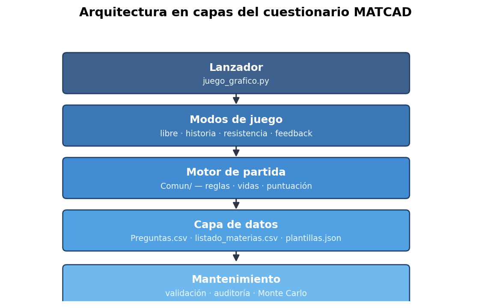
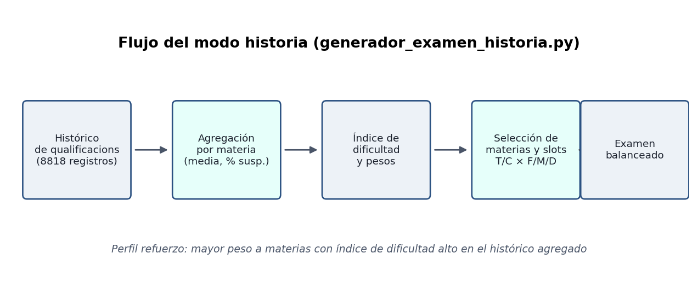
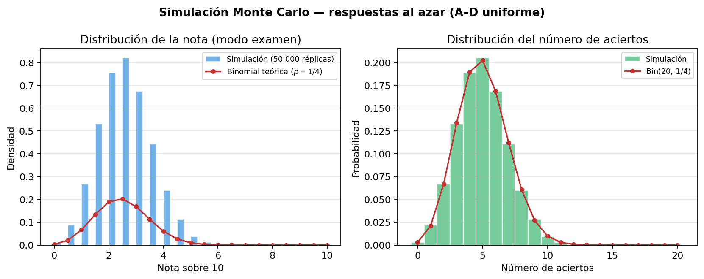
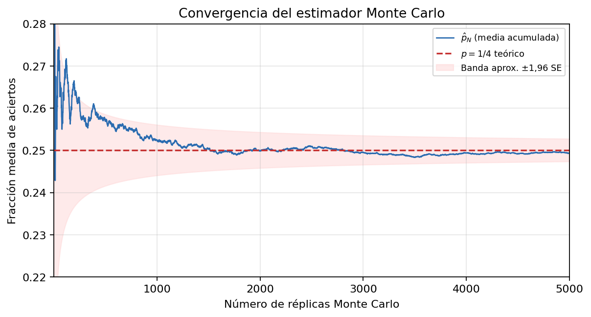

# Diseño y desarrollo de un juego interactivo educativo basado en contenidos del grado en Matemática Computacional y Análisis de Datos

**Alumno:** Daniel Fageda Figueredo · **NIU:** 1601846 · **Tutor:** Víctor Navas Portella

> *Nota sobre el título:* el documento de proyecto inicial planteaba un escape room con interfaz gráfica. El **entregable de este TFG** es el cuestionario (banco + juego en **pygame** con cuatro modos) descrito en esta memoria; la capa narrativa escape room completa queda como evolución futura del mismo proyecto.

El detalle técnico del repositorio (esquema del banco, scripts, arquitectura del juego) se documenta en los [`README.md`](../../README.md) del proyecto y se cita en los apéndices al final de esta memoria.

**Versión de entrega:** dos Word en este directorio (`Memoria_TFG_markdown.docx`, `Memoria_TFG_latex.docx`). Figuras en [`../Figuras/`](../Figuras/README.md). Regenerar figuras: `python Docs/generar_figuras_memoria.py`. Regenerar Word: `python utilidades_tfg.py --solo-memoria`. El PDF lo exportas desde Word tras editar.

## Resumen

Se presenta el diseño e implementación de un cuestionario educativo alineado con el plan de estudios del grado en Matemática Computacional y Análisis de Datos (MatCAD). El entregable incluye un banco cerrado de **480 preguntas** con metadatos curriculares, un juego en **pygame** con cuatro modos (libre, historia, resistencia y feedback), y herramientas de validación del dataset. El desarrollo siguió un enfoque incremental: primero un prototipo en terminal para validar el motor de evaluación y, después, una interfaz gráfica que concentra toda la experiencia de juego. Los resultados muestran un sistema funcional, documentado y extensible; la validación con usuarios y la narrativa gráfica quedan como trabajo futuro.

**Palabras clave:** cuestionario educativo, gamificación, banco de preguntas, autoevaluación, MatCAD, serious games.

## 1. Introducción

### 1.1 Contexto

El grado en Matemática Computacional y Análisis de Datos (MatCAD) de la Universitat Autònoma de Barcelona articula un plan de estudios amplio en el que conviven contenidos de matemáticas, computación, estadística, optimización e inteligencia artificial. La evaluación continua y la autoevaluación son piezas habituales del aprendizaje universitario. Muchas herramientas genéricas de práctica (listas de ejercicios, plataformas de preguntas sin metadatos curriculares) **no etiquetan** el contenido según curso, semestre o asignatura del grado; ello dificulta practicar de forma segmentada alineada con el plan de estudios, sin que ello implique que los recursos institucionales del grado sean inadecuados.

Paralelamente, la gamificación y los *serious games* (Michael y Chen, 2005) han ganado relevancia como complemento a la enseñanza formal: permiten practicar con retroalimentación inmediata y pueden favorecer la motivación mediante mecánicas de juego (vidas, puntuación, progresión), según evidencia en contextos educativos digitales (Kiili, 2005; Habgood y Ainsworth, 2011). Los escape rooms educativos y las novelas gráficas interactivas representan un subconjunto de los *serious games* en el que la **narrativa** —secuencia de escenas o salas que contextualizan los retos— envuelve desafíos cognitivos; sin embargo, su desarrollo completo exige un esfuerzo considerable en diseño gráfico, guion y validación pedagógica.

### 1.2 Motivación

Este Trabajo de Fin de Grado surge de la necesidad de disponer de una herramienta de autoevaluación alineada con las asignaturas del grado. El sistema debe gestionar un banco de preguntas **estructurado y auditable** —mediante reglas automatizadas, revisión manual documentada y scripts de mantenimiento reproducibles—, ofrecer una experiencia de juego que incentive la práctica repetida, permitir analizar la calidad del contenido (distractores, duplicados, coherencia curricular) y sentar las bases para modelos pedagógicos más ricos.

En este contexto, **gamificación** designa el uso de elementos de diseño de juego (puntos, vidas, retos, progresión) en un contexto formativo no recreativo (Deterding et al., 2011); en este TFG se aplica al cuestionario interactivo con retroalimentación inmediata en pantalla. Un **banco de preguntas auditable** es un conjunto de ítems cuya calidad y estructura pueden revisarse de forma sistemática mediante `mantenimiento.py validar`, la revisión manual del banco de producción (480 ítems, cerrada) y scripts de auditoría. Los **distractores plausibles** son opciones incorrectas creíbles para quien no domina el concepto (Haladyna et al., 2002). La **narrativa** (capa pendiente) sería la secuencia ficcional de escenas que contextualiza los retos; el entregable actual funciona sin ella. Por **multiasignatura** y **prerrequisitos** se entiende el solapamiento entre materias y los conocimientos previos que un ítem da por asumidos.

La motivación principal es combinar programación, matemáticas y diseño interactivo en una aplicación práctica que consolide conocimientos del grado y que pueda ser extendida por el propio autor o por el profesorado.

### 1.3 Alcance del entregable

El documento de proyecto inicial planteaba un juego interactivo tipo escape room con interfaz gráfica. Durante el desarrollo se priorizó la **calidad y estructura del banco de preguntas** y un **prototipo jugable** (primero en terminal, después en pygame), decisión metodológica coherente con un enfoque incremental: validar el contenido y la lógica de evaluación antes de la capa narrativa visual. En junio de 2026 el código se unificó en una **única interfaz gráfica** (`juego_grafico.py`).

### 1.4 Objetivos derivados del desarrollo

Durante el proyecto surgieron objetivos técnicos no recogidos en el documento inicial pero necesarios para la calidad del entregable: definir un **esquema canónico** del banco (480 preguntas, balance por dificultad, tipo y respuesta correcta), enriquecer cada pregunta con **metadatos curriculares** (curso, semestre, grupo temático, nivel), construir un **pipeline de mantenimiento** (validación, auditoría de distractores, deduplicación) e implementar un **modo historia** que genere exámenes balanceados según el histórico de calificaciones del grado (`Historic_qualificacions_MatCAD_completo.csv`).

### 1.5 Marco teórico y estado del arte

#### 1.5.1 Aprendizaje activo y evaluación formativa

El aprendizaje universitario de calidad se asocia a estrategias que sitúan al estudiante en el centro del proceso: resolver problemas, recibir retroalimentación y reflexionar sobre los errores (Biggs, Tang y Kennedy, 2022). La **evaluación formativa** no tiene como única finalidad calificar, sino orientar el aprendizaje mediante información sobre el desempeño y sobre cómo mejorarlo (Nicol y Macfarlane-Dick, 2006).

Los cuestionarios de opción múltiple, cuando están bien diseñados, permiten cubrir un espectro amplio de contenidos con corrección automática. Su efectividad depende de la calidad del ítem: enunciados claros, distractores plausibles y alineación con los resultados de aprendizaje (Haladyna et al., 2002).

#### 1.5.2 Gamificación y aprendizaje basado en juegos

El **aprendizaje basado en juegos digitales** (*game-based learning*) apuesta por experiencias interactivas con reglas claras y retroalimentación inmediata (Prensky, 2003; Gee, 2003). En educación superior **STEM** (ciencia, tecnología, ingeniería y matemáticas), los *serious games* (Michael y Chen, 2005) han mostrado potencial para reforzar conceptos abstractos, con evidencia dependiente del dominio (Kiili, 2005).

#### 1.5.3 Serious games, escape rooms y narrativa

Los *serious games* persiguen un propósito formativo principal (Michael y Chen, 2005). Los escape rooms educativos y las novelas gráficas aportan **narrativa** envolvente (Veldkamp et al., 2020); si no está alineada con los objetivos de aprendizaje, puede distraer (Habgood y Ainsworth, 2011). Este TFG separa la capa evaluable (banco + motor) de la narrativa gráfica pendiente.

#### 1.5.4 Bancos de preguntas y tutoría inteligente

Plataformas como Moodle integran cuestionarios con categorías; los sistemas adaptativos seleccionan ítems según prerrequisitos (Brusilovsky y Peylo, 2003). Este proyecto anticipa esa línea con metadatos curriculares y el modo historia ponderado por calificaciones históricas.

#### 1.5.5 Posicionamiento

Pocas herramientas modelan el **plan completo de un grado** con metadatos curriculares explícitos y código mantenible. La contribución distintiva es triple: alineación curricular (40 materias, 4×2×5), trazabilidad de calidad del banco y arquitectura extensible.

#### 1.5.6 Ítems, distractores fuertes y débiles

En un ítem A–D, las tres opciones incorrectas son **distractores**. Un **distractor fuerte** es plausible para quien no domina el concepto; un **distractor débil** delata el ítem (opciones genéricas, longitudes desiguales, etc.). La auditoría automatizada detecta patrones débiles; la revisión manual valora la plausibilidad pedagógica.

## 2. Objetivos

### 2.1 Objetivo general

Diseñar e implementar un juego interactivo educativo en el que la progresión del jugador dependa de la resolución de retos basados en contenidos del grado en Matemática Computacional y Análisis de Datos.

### 2.2 Objetivos específicos

| # | Objetivo | Indicador de logro |
|---|----------|-------------------|
| OE1 | Diseñar una narrativa interactiva como marco de los retos | Guion de escenas/salas vinculadas a materias del grado |
| OE2 | Crear distintos tipos de retos relacionados con las materias | Banco con preguntas de Teoría y Cálculo, tres niveles de dificultad, 40 materias |
| OE3 | Implementar algoritmos que validen las respuestas del jugador | Motor de partida con corrección A–D, puntuación, vidas, informes |
| OE4 | Desarrollar una interfaz gráfica sencilla e intuitiva | Interfaz gráfica de usuario (Pygame u otro motor) |
| OE5 | Evaluar el funcionamiento y el valor formativo del sistema | Banco validado, pruebas unitarias, revisión manual, modo feedback |

El grado de cumplimiento de cada objetivo se discute en la sección 6.

## 3. Hipótesis de trabajo

A partir del marco teórico y del diseño del sistema, se formulan las siguientes hipótesis de modo **contrastable** con datos del propio sistema (auditorías, histórico, simulación):

**H1.** Un banco estructurado según el plan curricular (materia, dificultad, tipo, metadatos curso/semestre/grupo/nivel) **permite autoevaluación segmentada** verificable mediante los filtros implementados en el modo libre.

**H2.** Un pipeline automatizado de validación y auditoría **detecta inconsistencias** (desequilibrios, distractores débiles, duplicados) de forma reproducible, con conteos cuantificables en cada ejecución.

**H3.** El histórico de calificaciones del grado permite **ponderar materias** en el modo historia de forma coherente con estadísticas agregadas (media, tasa de suspensos, índice de dificultad por asignatura).

> **Nota metodológica:** **H1** y **H2** se contrastan con informes de auditoría y validación estructural. **H3** se apoya en el análisis de 8818 registros del CSV histórico (véase §5.6). La hipótesis sobre **motivación** (gamificación vs. listado estático) no se incluye por falta de indicadores de usuario en este TFG; se traslada a trabajo futuro (§6.6 y §7).

## 4. Metodología

### 4.1 Enfoque general

El desarrollo siguió una **metodología incremental** en cuatro fases, alineada con el documento de proyecto:

1. **Análisis y diseño:** definición de materias, esquema del banco, metadatos y modos de juego.
2. **Implementación:** dataset, scripts de mantenimiento, motor de partida y juego en pygame.
3. **Pruebas:** validación estructural, pruebas unitarias, revisión manual del contenido.
4. **Evaluación:** análisis del resultado, identificación de limitaciones y líneas futuras.

El control de versiones con Git permitió iterar sobre el banco y el código de forma trazable. El repositorio público facilita la reproducibilidad del trabajo.

### 4.2 Diseño del banco de preguntas

**Población de ítems:** 40 materias del grado MatCAD × 12 preguntas = **480 ítems**.

**Esquema por materia:** notación `2FT 2MT 2DT 2FC 2MC 2DC`, donde la letra indica **T**eoría o **C**álculo y la inicial **F**ácil, **M**edia o **D**ifícil (p. ej. `2FT` = dos preguntas de Teoría Fácil). En total: 6 de Teoría + 6 de Cálculo, con escalón Fácil → Media → Difícil en cada mitad.

**Reparto global:**

| Dimensión | Distribución |
|-----------|--------------|
| Dificultad | 160 Fácil / 160 Media / 160 Difícil |
| Tipo | 240 Teoría / 240 Cálculo |
| Respuesta correcta | 120 por letra A, B, C y D |

**Metadatos curriculares** en `listado_materias.csv`: `Grupo`, `Nivel`, `Curso`, `Semestre`, `Tematica` (10 grupos temáticos globales).

**Revisión de contenido:** revisión manual por bloques de Ids (1–480), completada. Criterios: redacción genérica, coherencia con el nivel de la materia, distractores plausibles, ausencia de referencias a temarios internos de asignatura. La calidad estructural se verifica con `mantenimiento.py validar`.

**Validación automatizada:** comando `mantenimiento.py validar` comprueba balance, orden canónico e integridad de columnas. Auditoría de distractores y detección de duplicados semánticos mediante scripts dedicados.

Detalle técnico: [`Data/README.md`](../../Data/README.md).

### 4.3 Diseño e implementación del software

**Stack tecnológico:**

- Lenguaje: Python 3.10+; **pygame-ce** para la interfaz gráfica (`requirements.txt`).
- Persistencia: CSV y JSON para datos; informes y feedback en `.txt` locales bajo `Data/Juego/`.
- Empaquetado opcional: PyInstaller (`Juego/build_exe_onefile.ps1` → `juego_grafico.exe`).

La arquitectura del software se organiza en capas desacopladas (figura 1): el lanzador orquesta los modos de juego; cada modo delega en el motor de partida la corrección, la puntuación y los informes; la capa de datos abstrae el acceso al banco cerrado y a los metadatos curriculares. Los scripts de mantenimiento operan sobre los mismos ficheros sin formar parte del ejecutable del juego.

*Figura 1. Arquitectura en capas del sistema (módulos principales y flujo de dependencias).*

| Capa | Módulos principales | Función |
|------|---------------------|---------|
| Lanzador | `juego_grafico.py` | Arranque pygame (libre, historia, resistencia, feedback) |
| Dominio | `Juego/Comun/` (`motor_nucleo.py`, `reglas_partida.py`, `datos.py`, `informe_examen.py`, `envio_feedback.py`, resistencia, …) | Reglas, puntuación, pool, informes, rutas |
| Interfaz gráfica | `Juego/Grafico/` (`pantallas*.py`, `ui.py`, `tooltips_ui.py`, …) | Menús y partida con ratón (pygame) |
| Historia | `Comun/generador_examen_historia.py` | Ponderación según histórico de calificaciones |

**Modos implementados:**

| Modo | Función pedagógica |
|------|-------------------|
| **Libre** | Autoevaluación abierta con filtros por curso, semestre, temática, grupo, nivel, materia y dificultad |
| **Historia** | Simulación de examen balanceado según histórico de qualificacions del grado |
| **Resistencia** | Partida infinita con eventos, objetos y ranking local de preguntas alcanzadas |
| **Feedback** | Canal de mejora continua (bugs, sugerencias) hacia el creador |

**Evaluación del jugador (motor de partida):** el sistema corrige cada respuesta comparando la letra elegida (A–D) con el campo `Correcta` del ítem (`motor_nucleo.py`). Según el preset de reglas:

| Mecanismo | Comportamiento |
|-----------|----------------|
| **Corrección inmediata** | En modo arcade/repaso: acierto → mensaje y, si aplica, suma de puntos; fallo → resta de vida y/o penalización de puntos, opcionalmente muestra la solución. |
| **Corrección al final** | En modo examen (historia): no hay feedback durante el bloque; al cerrar se genera informe con nota y detalle pregunta a pregunta. |
| **Puntuación arcade** | +10 / +20 / +30 por acierto (Fácil / Media / Difícil); penalización en fallo: al menos 5 puntos o la mitad del valor base. |
| **Nota / porcentaje** | `nota = 10 × aciertos / total` o porcentaje equivalente cuando el preset usa sistema NOTA o PORCENTAJE. |
| **Vidas** | Por defecto 3; cada error resta una vida; la partida termina al llegar a 0 (antes de completar el objetivo de preguntas). |
| **Dificultad progresiva** | En modo libre arcade: la dificultad global del pool sube cada tres preguntas respondidas. |
| **Tiempo** | Opcional por pregunta o total; si se agota, la respuesta cuenta como fallo. |

### 4.4 Validación y aseguramiento de la calidad

| Actividad | Herramienta / método |
|-----------|---------------------|
| Balance estructural del CSV | `mantenimiento.py validar` |
| Revisión manual del contenido | 480/480 ítems revisados; validación automatizada |
| Auditoría de distractores | `mantenimiento.py auditar-distractores` (terminal; `--json` opcional) |
| Duplicados semánticos | `duplicados.py revisar` (0 pares similares en CSV y plantillas intra-materia, 2026-06-15) |
| Pruebas de regresión | `python -m unittest discover -s Tests -v` (**258** tests: 250 + 8 en `Files/`) |
| Integración continua | GitHub Actions (`.github/workflows/tests.yml`) |
| Revisión con profesorado | Identificación de solapamiento temático y prerrequisitos (véase §6.2) |
| Simulación Monte Carlo (respuestas al azar) | `Files/simulacion_evaluacion_azar.py` (véase §5.7) |

El banco de producción (`Preguntas.csv`) se declaró **cerrado** en junio de 2026; las escrituras en el CSV requieren `TFG_PERMITIR_CSV=1` para evitar modificaciones accidentales.

### 4.5 Criterios de éxito

Se consideró exitoso el entregable si:

1. El banco cumplía el esquema 480 ítems con balance verificado.
2. Los modos de juego principales eran ejecutables sin errores en el flujo principal (`juego_grafico.py`).
3. Existía documentación reproducible (README, memoria, scripts de mantenimiento).
4. El contenido había pasado revisión manual completa.

## 5. Resultados

### 5.1 Banco de preguntas

Se obtuvo un banco cerrado de **480 preguntas** con las siguientes propiedades verificadas:

- **40 materias** alineadas con el listado del grado.
- **12 preguntas por materia** siguiendo el patrón 2FT 2MT 2DT 2FC 2MC 2DC.
- **Revisión manual 480/480** completada en cinco tramos temporales.
- **Auditorías de calidad** ejecutadas (`mantenimiento.py auditar-distractores`, `duplicados.py revisar`): **0 pares similares** en CSV y plantillas intra-materia tras sustituciones y deduplicación (junio 2026). Pool de plantillas beta: **1289** entradas.

El banco distingue **modo seguro** (solo dataset revisado) y **modo beta** (pool ampliado con plantillas no revisadas, hasta 1440 ítems jugables), dejando clara la trazabilidad para evaluación formal del TFG.

### 5.2 Aplicación de juego

**Estado del entregable:** cuestionario en **pygame** con cuatro modos operativos (libre, historia, resistencia, feedback), banco de **480 preguntas** revisadas manualmente y herramientas de mantenimiento del dataset. La capa narrativa escape room / novela gráfica completa queda como evolución futura.

El desarrollo siguió un enfoque incremental: un prototipo en terminal validó el motor de evaluación; la interfaz gráfica concentró después toda la experiencia de juego. En junio de 2026 se eliminó la capa de consola y se unificó el código en `juego_grafico.py` con dominio en `Juego/Comun/` e interfaz en `Juego/Grafico/`.

| Componente | Resultado |
|------------|-----------|
| Lanzador | `Juego/juego_grafico.py` |
| Dominio | `Juego/Comun/` (motor, reglas, datos, informes, feedback, historia, resistencia) |
| Interfaz | `Juego/Grafico/` (menús, partida, tooltips, barra superior) |
| Modo libre | Filtros multidimensionales, informes `.txt` |
| Modo historia | Generador de examen según `Historic_qualificacions_MatCAD_completo.csv` |
| Modo resistencia | Reto del día, apuestas, maldiciones, power-ups |
| Modo feedback | Guardado local + envío SMTP opcional |
| Pruebas | Suite en `Tests/` (juego) y `Files/test_*.py` (mantenimiento); CI en GitHub Actions |

### 5.3 Organización curricular modelada

Las 40 materias se distribuyen en **4 cursos × 2 semestres × 5 materias** (tabla 1). Los metadatos provienen de `listado_materias.csv`.

**Tabla 1.** Materias por curso y semestre (5 por celda → 40 en total).

| Curso | Semestre 1 | Semestre 2 |
|-------|------------|------------|
| 1 | 5 | 5 |
| 2 | 5 | 5 |
| 3 | 5 | 5 |
| 4 | 5 | 5 |

Transversalmente, las materias se agrupan en **10 grupos temáticos** (tabla 2). El grupo no coincide con el curso: varias materias del mismo bloque temático se imparten en etapas distintas del grado.

**Tabla 2.** Grupos temáticos y número de materias.

| Grupo | Materias | Temática (resumen) |
|-------|----------|-------------------|
| G1 | 2 | Álgebra y geometría / visualización |
| G2 | 5 | Cálculo y ecuaciones |
| G3 | 4 | Sistemas y seguridad computacional |
| G4 | 2 | Programación de software |
| G5 | 4 | Algoritmia y teoría de juegos |
| G6 | 4 | Métodos numéricos y optimización |
| G7 | 8 | Probabilidad y ciencia de datos |
| G8 | 3 | Bases de datos |
| G9 | 4 | Inteligencia artificial y aprendizaje automático |
| G10 | 4 | Modelización física e información |

Cada pregunta se enriquece al cargar con `curso`, `semestre`, `grupo`, `nivel` y `tematica`, lo que habilita filtros de partida alineados con la etapa formativa del estudiante.

Diagrama detallado (40 materias con posición curricular): [`Data/README.md`](../../Data/README.md#jerarquía-curricular-40-materias).

### 5.4 Herramientas de mantenimiento

Se desarrolló un conjunto de scripts en `Files/` con punto de entrada unificado (`mantenimiento.py`): validación, revisión, pipeline de plantillas, auditorías (salida por terminal), deduplicación y estadísticas del histórico de qualificacions. La lógica de claves de contenido y expansión de plantillas se centralizó en `utils_plantillas_core.py`, compartida con `Juego/Comun/datos.py`. Los datos del juego se organizan en `Data/Banco/` (banco y catálogos) y `Data/Juego/` (estado local del jugador). Tras el cierre del banco (2026-06), los scripts de regeneración masiva del CSV se eliminaron del repositorio. Suite de pruebas en `Tests/` (**258** tests) con CI en GitHub Actions. Catálogo de comandos: [`Files/README.md`](../../Files/README.md).

### 5.5 Síntesis cuantitativa

| Métrica | Valor |
|---------|-------|
| Preguntas en banco de producción | 480 |
| Materias cubiertas | 40 |
| Módulos Python del juego (`Comun/` + `Grafico/`) | ~35 |
| Modos de juego operativos | 4 |
| Pruebas automatizadas | 258 |
| Grupos temáticos modelados | 10 |

### 5.6 Validación analítica del modo historia (H3)

La hipótesis H3 se contrasta con el histórico institucional `Historic_qualificacions_MatCAD_completo.csv` (**8818** registros de calificaciones), del que se derivan estadísticas agregadas por asignatura para las **40** materias del listado del grado.

El procedimiento, implementado en `generador_examen_historia.py`, sigue el flujo de la figura 2. En primer lugar, por cada materia se calculan la media numérica, la tasa de suspensos (nota &lt; 5) y un **índice de dificultad** en el intervalo \([0,1]\) que combina ambos indicadores. A continuación, el generador asigna **pesos** a las materias según el perfil elegido —por ejemplo, el perfil *refuerzo* incrementa el peso de las materias con índice alto—. Finalmente, por cada materia seleccionada se rellenan los *slots* canónicos Teoría/Cálculo × Fácil/Media/Difícil con preguntas del banco cerrado.

*Figura 2. Pipeline del generador de examen balanceado (modo historia).*

La tabla siguiente recoge una muestra ilustrativa de materias con mayor índice de dificultad en el histórico agregado:

| Materia | Índice | Media | Tasa suspensos | Registros |
|---------|--------|-------|----------------|-----------|
| Càlcul en Diverses Variables | 0,026 | 5,66 | 22,9 % | 341 |
| Probabilitat | 0,021 | 5,65 | 21,6 % | 343 |
| Anàlisi Complexa i de Fourier | 0,008 | 5,55 | 16,3 % | 258 |

Estos valores orientan la ponderación del modo historia; un piloto con estudiantes permitiría contrastar si los exámenes generados se perciben alineados con la exigencia real del grado.

### 5.7 Simulación Monte Carlo de la evaluación (respuestas al azar)

Para validar que el motor de corrección penaliza el azar como cabría esperar en un examen tipo test, se implementó `Files/simulacion_evaluacion_azar.py` y se formalizó el experimento en términos probabilísticos. En cada ítem, la respuesta del jugador que contesta al azar se modela como una variable de Bernoulli \(X_i \sim \mathrm{Bernoulli}(p)\) con \(p = 1/4\), al elegir uniformemente entre las cuatro opciones A–D. El número de aciertos en un bloque de \(n = 20\) preguntas es entonces

\[
Y = \sum_{i=1}^{n} X_i \sim \mathrm{Binomial}(n,\, p),
\]

con valor esperado \(\mathbb{E}[Y] = np = 5\) y varianza \(\mathrm{Var}(Y) = np(1-p) = 3{,}75\). La nota del motor, definida como \(\mathrm{nota} = 10\,Y/n\), verifica \(\mathbb{E}[\mathrm{nota}] = 2{,}5\), coherente con el umbral de suspensión universitario.

El estimador Monte Carlo de la fracción de aciertos tras \(N\) réplicas independientes,

\[
\hat{p}_N = \frac{1}{N}\sum_{k=1}^{N}\frac{Y^{(k)}}{n},
\]

es insesgado (\(\mathbb{E}[\hat{p}_N] = p\)) y su error estándar decrece como \(\mathcal{O}(1/\sqrt{N})\). Con \(N = 50\,000\) y semilla 42, la simulación arroja una fracción media de **24,98 %**, próxima al valor teórico (figura 4). La figura 3 contrasta el histograma empírico de notas con la masa de probabilidad binomial; la coincidencia visual confirma que la implementación reproduce el modelo probabilístico.

*Figura 3. Histograma de la simulación (50 000 réplicas) frente a la distribución binomial teórica.*

*Figura 4. Convergencia de \(\hat{p}_N\) hacia \(p = 1/4\) al aumentar el número de réplicas.*

En el **modo arcade** con tres vidas, cada fallo consume una vida y la probabilidad de error por pregunta es \(q = 3/4\). El número de preguntas respondidas hasta agotar las vidas coincide, en ausencia de límite superior, con el número de ensayos hasta observar \(r = 3\) fallos en ensayos de Bernoulli con probabilidad de «éxito» \(q\); dicha variable sigue una ley binomial negativa con valor esperado \(\mathbb{E}[T] = r/q = 4\), lo que explica la media empírica de **4,0** preguntas por partida. La probabilidad de completar las 20 preguntas sin perder las tres vidas es \(\mathbb{P}(Y_{20} \geq 18) = \sum_{j=18}^{20}\binom{20}{j}(1/4)^j(3/4)^{20-j}\), prácticamente nula; de ahí que el **100 %** de partidas simuladas agoten vidas antes del objetivo.

| Escenario | Métrica | Resultado |
|-----------|---------|-----------|
| Modo examen (sin vidas) | Fracción media de aciertos | **24,98 %** (≈ 25 % teórico) |
| Modo examen | Nota media /10 | **2,5** |
| Modo arcade (3 vidas) | Partidas que agotan vidas antes de 20 preguntas | **100 %** |
| Modo arcade | Preguntas respondidas de media | **4,0** / 20 |
| Modo arcade | Puntos medios | **−10,0** |

En conjunto, el experimento demuestra que el azar produce suspensión sistemática y que, con vidas limitadas, impide completar bloques largos sin conocimiento real. Las figuras se regeneran con `python Docs/generar_figuras_memoria.py`; la simulación numérica, con `python Files/simulacion_evaluacion_azar.py`.

## 6. Discusión

### 6.1 Cumplimiento de los objetivos

El **objetivo general** se cumple de forma parcial: existe un juego educativo interactivo basado en contenidos del grado, pero la progresión narrativa tipo escape room no está implementada. La progresión actual es ludificada (vidas, puntos, dificultad creciente) y curricular (filtros por etapa del grado).

| # | Objetivo | Estado | Comentario |
|---|----------|--------|------------|
| OE1 | Narrativa interactiva | Pendiente (futuro) | Sin guion de escenas/salas implementado |
| OE2 | Retos por materias | **Cumplido** | Banco 480 ítems, Teoría/Cálculo, tres dificultades |
| OE3 | Validación de respuestas | **Cumplido** | Motor A–D, puntuación, vidas, informes |
| OE4 | Interfaz gráfica | **Cumplido** | `juego_grafico.py` con libre, historia, resistencia y feedback; tooltips y barra superior |
| OE5 | Valor formativo | **Parcialmente cumplido** | Banco validado, 258 tests + CI; sin estudio con usuarios |

Los **objetivos específicos** OE2, OE3, OE4 y OE5 están cubiertos en la versión pygame. OE1 (narrativa gráfica completa tipo escape room) queda como trabajo futuro. El enfoque incremental —primero validar el núcleo evaluable, después la capa visual— permitió concentrar el esfuerzo en un único lanzador mantenible.

### 6.2 Validez del banco de preguntas

La **validez de contenido** se abordó mediante revisión manual exhaustiva y criterios de redacción acordados. La **validez estructural** se garantiza con reglas de balance automatizadas. La **validez semántica** fina se reforzó en junio de 2026 (sustitución de pares similares en CSV y deduplicación del pool de plantillas; `duplicados.py revisar` → 0 pares similares). Queda abierta:

- la **validez predictiva** (relación entre desempeño en el juego y desempeño académico real), no medida en este TFG.

La revisión con profesorado puso de manifiesto limitaciones del modelo de una sola etiqueta `Materia`:

1. **Solapamiento temático:** preguntas que encajan en varias asignaturas (p. ej. inferencia en Probabilidad y en Modelización e Inferencia).
2. **Prerrequisitos:** preguntas de cursos avanzados que asumen conceptos de materias previas (p. ej. optimización y cálculo multivariable).

Estas observaciones motivan la propuesta de campos `Materias_relacionadas` y `Prerequisitos` en futuras versiones del esquema.

### 6.3 Utilidad para autoevaluación y apoyo docente

El sistema permite al estudiante practicar por **semestre o temática** acorde a su momento del grado, simular un **examen balanceado** mediante el modo historia y recibir un **informe detallado** al finalizar una partida en modo examen.

Para el profesorado, el banco estructurado y los scripts de auditoría facilitan revisión por materia y detección de ítems problemáticos. El modo feedback cierra un ciclo de mejora continua.

La interfaz pygame facilita el despliegue para usuarios no familiarizados con terminal; requiere instalar **pygame-ce** (`requirements.txt`).

### 6.4 Relación con las hipótesis

La hipótesis **H1** queda apoyada por la operatividad de los filtros curriculares en el modo libre, que permiten segmentar la práctica por curso, semestre y materia. **H2** se sustenta en las auditorías y en la validación estructural, cuyos conteos son reproducibles en cada ejecución de los scripts de mantenimiento. **H3** encuentra respaldo en el modo historia y en el análisis del histórico institucional (8818 registros), desarrollado en la sección 5.6. La simulación Monte Carlo de la sección 5.7 complementa estas hipótesis al verificar cuantitativamente que el motor de evaluación no concede aprobación al azar.

### 6.5 Limitaciones del estudio

El estudio no incluye **evaluación con usuarios**: no se recogieron datos de usabilidad ni de aprendizaje con una muestra de estudiantes. La **interfaz gráfica** actual cubre menús y partida, pero aún no implementa la narrativa escape room del documento inicial. El **modelo de datos** asigna una sola materia por pregunta y aún no modela prerrequisitos explícitos. El **idioma del banco** mezcla castellano y catalán según la asignatura, con coherencia terminológica revisada pero mejorable. Por último, el **modo beta** amplía el pool con plantillas no revisadas y debe distinguirse del banco de producción en cualquier evaluación formal.

### 6.6 Trabajo futuro

Entre las líneas futuras inmediatas figuran la implementación de `Materias_relacionadas` y `Prerequisitos` en el CSV y en los filtros del juego, el desarrollo de la capa gráfica escape room o novela gráfica, y un piloto con usuarios (n ≈ 15–20, cuestionario SUS, tiempo de práctica) para contrastar si las mecánicas de juego aumentan la práctica respecto a un listado estático —línea no formulada como hipótesis contrastada en este TFG por ausencia de datos. La integración con plataformas institucionales (Moodle, AulaWeb) completaría el despliegue en el grado.

## 7. Conclusiones

Este Trabajo de Fin de Grado ha diseñado e implementado un **sistema de cuestionarios académicos** alineado con el plan de estudios del grado en Matemática Computacional y Análisis de Datos, integrando:

- un **banco de 480 preguntas** estructurado, balanceado y revisado manualmente;
- un **juego** en pygame con modos libre, historia, resistencia y feedback que gamifica la autoevaluación;
- un **conjunto de herramientas** de validación y mantenimiento del dataset;
- y una **arquitectura extensible** preparada para narrativa gráfica y modelos pedagógicos más ricos.

La principal contribución académica es pasar de un cuestionario genérico a una herramienta con **criterio didáctico explícito**: trazabilidad curricular, calidad auditable del banco y mecánicas de juego orientadas a la práctica repetida. El desvío respecto al título inicial (escape room gráfico) se compensa con un entregable técnicamente sólido y documentado, que constituye la base sobre la que construir la experiencia narrativa.

En el plano personal, el proyecto ha consolidado competencias de programación en Python, diseño de datos, ingeniería de software incremental y reflexión pedagógica sobre la evaluación en grados STEM interdisciplinares.

Las líneas futuras más inmediatas son la validación con usuarios reales (incluida la motivación frente a un listado estático), el enriquecimiento del modelo de datos con multiasignatura y prerrequisitos, y el desarrollo de la capa narrativa escape room prevista en el documento de proyecto.

La simulación Monte Carlo (§5.7) aporta una primera validación cuantitativa del motor de evaluación: el azar no permite aprobar ni completar partidas largas con vidas limitadas.

## 8. Bibliografía

Biggs, J., Tang, C., y Kennedy, G. (2022). *Teaching for Quality Learning at University* (5.ª ed.). McGraw-Hill Education (UK).

Brusilovsky, P., y Peylo, C. (2003). Adaptive and intelligent web-based educational systems. *International Journal of Artificial Intelligence in Education*, *13*(2–4), 159–172.

Deterding, S., Dixon, D., Khaled, R., y Nacke, L. (2011). From game design elements to gamefulness: Defining "gamification". En *Proceedings of the 15th International Academic MindTrek Conference* (pp. 9–15). ACM. https://doi.org/10.1145/2181037.2181040

Gee, J. P. (2003). What video games have to teach us about learning and literacy. *Computers in Entertainment*, *1*(1), 20. https://doi.org/10.1145/950566.950595

Habgood, M. P. J., y Ainsworth, S. E. (2011). Motivating children to learn effectively: Exploring the use of intrinsic and extrinsic motivation in educational games. *British Journal of Educational Technology*, *42*(2), 183–200. https://doi.org/10.1111/j.1467-8535.2009.01034.x

Haladyna, T. M., Downing, S. M., y Rodriguez, M. C. (2002). A review of multiple-choice item-writing guidelines for classroom assessment. *Applied Measurement in Education*, *15*(3), 309–333. https://doi.org/10.1207/S15324818AME1503_5

Kiili, K. (2005). Digital game-based learning: Towards an experiential gaming model. *The Internet and Higher Education*, *8*(1), 13–24. https://doi.org/10.1016/j.iheduc.2004.12.001

Michael, D. R., y Chen, S. L. (2005). *Serious Games: Games That Educate, Train, and Inform*. Thomson Course Technology.

Nicol, D. J., y Macfarlane-Dick, D. (2006). Formative assessment and self-regulated learning: A model and seven principles of good feedback practice. *Studies in Higher Education*, *31*(2), 199–218. https://doi.org/10.1080/03075070600572090

Prensky, M. (2003). Digital game-based learning. *Computers in Entertainment*, *1*(1), 21. https://doi.org/10.1145/950566.950596

Veldkamp, A., van de Grint, L., Knippels, M. C. P. J., y van Joolingen, W. R. (2020). Escape education: A systematic review on escape rooms in education. *Educational Research Review*, *31*, 100364. https://doi.org/10.1016/j.edurev.2020.100364

## Apéndices — documentación técnica del repositorio

| Apéndice | Contenido | Enlace |
|----------|-----------|--------|
| A | Esquema del banco y diagramas curriculares | [`Data/README.md`](../../Data/README.md) |
| H | Estado del proyecto y seguimiento | [`CHANGELOG_PROYECTO.md`](../CHANGELOG_PROYECTO.md), [`CHANGELOG_JUEGO.md`](../CHANGELOG_JUEGO.md), [`CHECKLIST.md`](../CHECKLIST.md) |
| B | Arquitectura del juego, modos, puntuación, bancos beta | [`Juego/README.md`](../../Juego/README.md) · [`Juego/Comun/README.md`](../../Juego/Comun/README.md) · [`Juego/Grafico/README.md`](../../Juego/Grafico/README.md) |
| C | Scripts de mantenimiento, balanceo, auditorías | [`Files/README.md`](../../Files/README.md) |
| E | Pruebas unitarias | [`Tests/README.md`](../../Tests/README.md) |
| F | Repositorio y guía rápida | [`README.md`](../../README.md) |
| G | LaTeX, Word y exportación | [`README.md`](../README.md) |

**Repositorio:** https://github.com/Dafafi63f/Escape-Room.git
