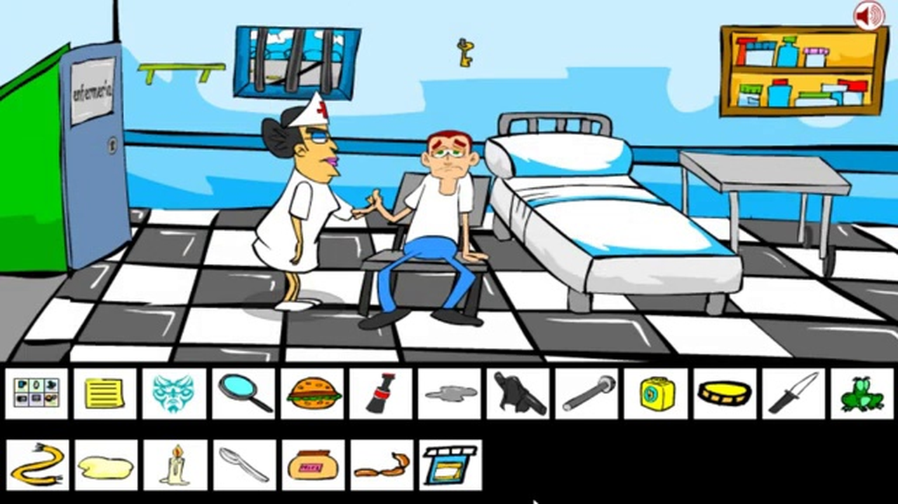
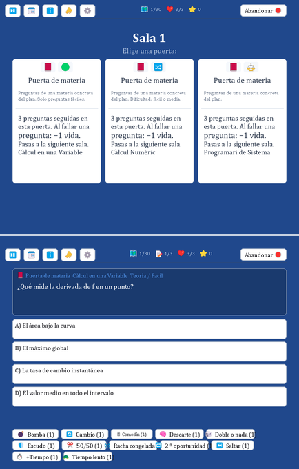
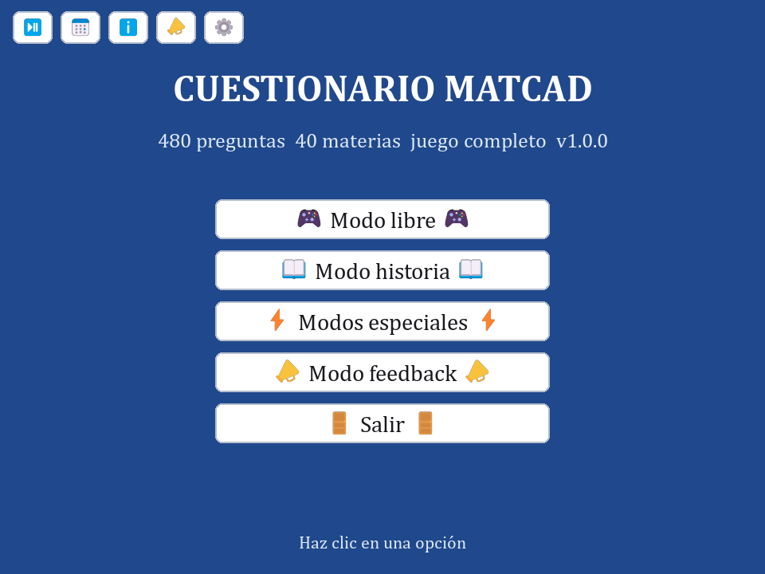
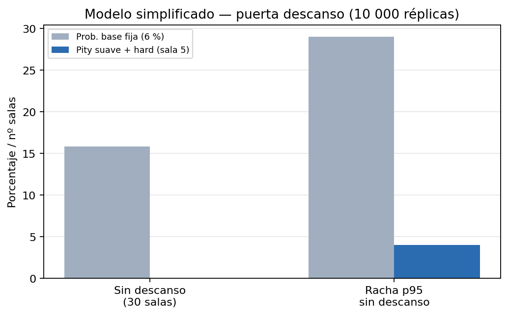

**Alumno:** Daniel Fageda Figueredo · **NIU:** 1601846 · **Tutor:** Víctor Navas Portella

**Resumen**

Se presenta el diseño e implementación de un cuestionario educativo alineado con el plan de estudios del grado en Matemática Computacional y Análisis de Datos (MatCAD). El entregable incluye un banco cerrado de **480 preguntas** con metadatos curriculares, un juego en **pygame-ce** con cinco modos (libre, historia, resistencia, escape room y feedback), herramientas de validación del dataset y **dos paquetes de distribución** (completo y mínimo con CSV reducido). El desarrollo siguió un enfoque incremental descrito en §4. Los resultados muestran un sistema funcional, documentado y extensible; la validación con usuarios y la narrativa gráfica quedan como trabajo futuro.

**Palabras clave:** cuestionario educativo, gamificación, banco de preguntas, autoevaluación, MatCAD, serious games.

> *Nota sobre el título:* el documento de proyecto inicial planteaba un escape room con interfaz gráfica inspirado en las aventuras point-and-click de [Inka Games](https://www.inkagames.com/) (véase §1.3). El **entregable de este TFG** es el cuestionario (banco + juego en **pygame-ce** con cinco modos, incluido escape room con mecánicas jugables) descrito en esta memoria; la capa narrativa gráfica completa queda como evolución futura del mismo proyecto.

El detalle técnico del repositorio (esquema del banco, scripts, arquitectura del juego) se documenta en los [`README.md`](../../README.md) del proyecto y se cita en los apéndices al final de esta memoria.

**Versión de entrega:** dos Word en `Docs/Entrega/` (`Memoria_TFG_markdown.docx`, `Memoria_TFG_latex.docx`). **9 figuras** PNG en [`../Figuras/`](../Figuras/README.md). Regenerar todo (incremental): `python Docs/utilidades_tfg.py --solo-memoria`. Solo figuras: `python Docs/generar_figuras_memoria.py`. El PDF lo exportas desde Word tras editar.

```{=openxml}
<w:p><w:r><w:br w:type="page"/></w:r></w:p>
```

# Introducción

## Contexto

El grado en Matemática Computacional y Análisis de Datos (MatCAD) de la Universitat Autònoma de Barcelona articula un plan de estudios amplio en el que conviven contenidos de matemáticas, computación, estadística, optimización e inteligencia artificial. La evaluación continua y la autoevaluación son piezas habituales del aprendizaje universitario. Muchas herramientas genéricas de práctica (listas de ejercicios, plataformas de preguntas sin metadatos curriculares) **no etiquetan** el contenido según curso, semestre o asignatura del grado; ello dificulta practicar de forma segmentada alineada con el plan de estudios, sin que ello implique que los recursos institucionales del grado sean inadecuados.

Paralelamente, la gamificación y los *serious games* (Michael y Chen, 2005) han ganado relevancia como complemento a la enseñanza formal: permiten practicar con retroalimentación inmediata y pueden favorecer la motivación mediante mecánicas de juego (vidas, puntuación, progresión), según evidencia en contextos educativos digitales (Kiili, 2005; Habgood y Ainsworth, 2011). Los escape rooms educativos y las novelas gráficas interactivas representan un subconjunto de los *serious games* en el que la **narrativa** —secuencia de escenas o salas que contextualizan los retos— envuelve desafíos cognitivos; sin embargo, su desarrollo completo exige un esfuerzo considerable en diseño gráfico, guion y validación pedagógica.

## Motivación

Este Trabajo de Fin de Grado surge de la necesidad de disponer de una herramienta de autoevaluación alineada con las asignaturas del grado. El sistema debe gestionar un banco de preguntas **estructurado y auditable** —mediante reglas automatizadas, revisión manual documentada y scripts de mantenimiento reproducibles—, ofrecer una experiencia de juego que incentive la práctica repetida, permitir analizar la calidad del contenido (distractores, duplicados, coherencia curricular) y sentar las bases para modelos pedagógicos más ricos.

En este contexto, **gamificación** designa el uso de elementos de diseño de juego (puntos, vidas, retos, progresión) en un contexto formativo no recreativo (Deterding et al., 2011); en este TFG se aplica al cuestionario interactivo con retroalimentación inmediata en pantalla. Un **banco de preguntas auditable** es un conjunto de ítems cuya calidad y estructura pueden revisarse de forma sistemática mediante `mantenimiento.py validar`, la revisión manual del banco de producción (480 ítems, cerrada) y scripts de auditoría. Los **distractores plausibles** son opciones incorrectas creíbles para quien no domina el concepto (Haladyna et al., 2002). La **narrativa** (capa pendiente) sería la secuencia ficcional de escenas que contextualiza los retos; el entregable actual funciona sin ella. Por **multiasignatura** y **prerrequisitos** se entiende el solapamiento entre materias y los conocimientos previos que un ítem da por asumidos.

La motivación principal es combinar programación, matemáticas y diseño interactivo en una aplicación práctica que consolide conocimientos del grado y que pueda ser extendida por el propio autor o por el profesorado.

## Inspiración: Inka Games (inkagames.com)

La idea original del TFG partió de los **juegos de aventura point-and-click** de [inkagames.com](https://www.inkagames.com/): el jugador explora escenas, recoge objetos y resuelve acertijos para escapar. El reto principal allí es la lógica combinatoria de los puzles, no un cuestionario académico.



*Figura 1. Escena de juego *Kim Dotcom Prison Break* (Inka Games): enfermería de la prisión con puerta, objetos en escena e inventario con iconos recogidos. Fotograma (~13:30) del [walkthrough en YouTube](https://www.youtube.com/watch?v=ib--6Tl5ZVc). © Inka Games — uso académico ilustrativo.*

Este TFG **no reproduce** la estética ni las licencias de Inka Games. Toma de referencia la **estructura ludonarrativa** (progresión por salas, elección de caminos, inventario) y la **adapta al MatCAD**: cada puerta del modo escape room plantea una pregunta del banco. La capa gráfica tipo novela interactiva queda como evolución futura; el núcleo evaluable (banco + motor) se desarrolló primero. El contraste detallado con el entregable figura en la tabla 1 y en §5.8 (gamificación acotada).

| Aspecto | Inka Games (referencia) | TFG MATCAD (implementación) |
|---------|-------------------------|-----------------------------|
| **Formato** | Aventura point-and-click en web | Modo escape room en pygame |
| **Reto principal** | Puzles lógicos y combinación de objetos | Preguntas A–D del banco curricular |
| **Progresión** | Escenas enlazadas, inventario | Salas con 3 puertas, dificultad creciente |
| **Objetivo formativo** | Entretenimiento general | Autoevaluación alineada al grado |
| **Contenido** | Parodias y personajes mediáticos | 40 materias, metadatos, informes |
| **Estado actual** | Catálogo maduro en inkagames.com | Mecánicas jugables; narrativa gráfica pendiente |

*Tabla 1. Comparación entre el modelo de referencia (Inka Games) y el escape room educativo del entregable.*



*Figura 2. Modo escape room del entregable (capturas pygame con semilla fija): arriba, sala 1 con tres puertas; abajo, pregunta del banco con inventario de powerups. Paralelo funcional al inventario de Inka Games (figura 1), adaptado a la evaluación A–D.*

## Alcance del entregable

El documento de proyecto inicial planteaba un juego interactivo tipo escape room con interfaz gráfica. Durante el desarrollo se priorizó la **calidad y estructura del banco de preguntas** y un prototipo jugable con enfoque incremental (§4); en junio de 2026 toda la experiencia quedó unificada en **`juego_grafico.py`** (pygame-ce).

## Objetivos derivados del desarrollo

Durante el proyecto surgieron objetivos técnicos no recogidos en el documento inicial pero necesarios para la calidad del entregable: definir un **esquema canónico** del banco (480 preguntas, balance por dificultad, tipo y respuesta correcta), enriquecer cada pregunta con **metadatos curriculares** (curso, semestre, grupo temático, nivel), construir un **pipeline de mantenimiento** (validación, auditoría de distractores, deduplicación) e implementar un **modo historia** que genere exámenes balanceados según el histórico de calificaciones del grado (`Historic_qualificacions_MatCAD_completo.csv`).

## Marco teórico y estado del arte

### Aprendizaje activo y evaluación formativa

El aprendizaje universitario de calidad se asocia a estrategias que sitúan al estudiante en el centro del proceso: resolver problemas, recibir retroalimentación y reflexionar sobre los errores (Biggs, Tang y Kennedy, 2022). La **evaluación formativa** no tiene como única finalidad calificar, sino orientar el aprendizaje mediante información sobre el desempeño y sobre cómo mejorarlo (Nicol y Macfarlane-Dick, 2006).

Los cuestionarios de opción múltiple, cuando están bien diseñados, permiten cubrir un espectro amplio de contenidos con corrección automática. Su efectividad depende de la calidad del ítem: enunciados claros, distractores plausibles y alineación con los resultados de aprendizaje (Haladyna et al., 2002).

### Gamificación y aprendizaje basado en juegos

El **aprendizaje basado en juegos digitales** (*game-based learning*) apuesta por experiencias interactivas con reglas claras y retroalimentación inmediata (Prensky, 2003; Gee, 2003). En educación superior **STEM** (ciencia, tecnología, ingeniería y matemáticas), los *serious games* (Michael y Chen, 2005) han mostrado potencial para reforzar conceptos abstractos, con evidencia dependiente del dominio (Kiili, 2005).

### Serious games, escape rooms y narrativa

Los *serious games* persiguen un propósito formativo principal (Michael y Chen, 2005). Los escape rooms educativos y las novelas gráficas aportan **narrativa** envolvente (Veldkamp et al., 2020); si no está alineada con los objetivos de aprendizaje, puede distraer (Habgood y Ainsworth, 2011). Este TFG separa la capa evaluable (banco + motor) de la narrativa gráfica pendiente.

### Bancos de preguntas y tutoría inteligente

Plataformas como Moodle integran cuestionarios con categorías; los sistemas adaptativos seleccionan ítems según prerrequisitos (Brusilovsky y Peylo, 2003). Este proyecto anticipa esa línea con metadatos curriculares y el modo historia ponderado por calificaciones históricas.

### Posicionamiento

Pocas herramientas modelan el **plan completo de un grado** con metadatos curriculares explícitos y código mantenible. La contribución distintiva es triple: alineación curricular (40 materias, 4×2×5), trazabilidad de calidad del banco y arquitectura extensible. Frente a referentes ludicos generalistas como Inka Games (§1.3), este proyecto **especializa** la progresión tipo escape room en evaluación formativa con datos del grado MatCAD.

### Ítems, distractores fuertes y débiles

En un ítem A–D, las tres opciones incorrectas son **distractores**. Un **distractor fuerte** es plausible para quien no domina el concepto; un **distractor débil** delata el ítem (opciones genéricas, longitudes desiguales, etc.). La auditoría automatizada detecta patrones débiles; la revisión manual valora la plausibilidad pedagógica.


# Objetivos

## Objetivo general

Diseñar e implementar un juego interactivo educativo en el que la progresión del jugador dependa de la resolución de retos basados en contenidos del grado en Matemática Computacional y Análisis de Datos.

## Objetivos específicos

| # | Objetivo | Indicador de logro |
|---|----------|-------------------|
| OE1 | Diseñar una narrativa interactiva como marco de los retos | Mecánicas de escape room (salas/puertas) jugables; guion gráfico completo pendiente |
| OE2 | Crear distintos tipos de retos relacionados con las materias | Banco con preguntas de Teoría y Cálculo, tres niveles de dificultad, 40 materias |
| OE3 | Implementar algoritmos que validen las respuestas del jugador | Motor de partida con corrección A–D, puntuación, vidas, informes |
| OE4 | Desarrollar una interfaz gráfica sencilla e intuitiva | Interfaz en **pygame-ce** (`juego_grafico.py`), barra superior común |
| OE5 | Evaluar el funcionamiento y el valor formativo del sistema | Banco validado, pruebas automatizadas + CI, revisión manual, modo feedback |

El grado de cumplimiento de cada objetivo se discute en la sección 6.


# Hipótesis de trabajo

A partir del marco teórico y del diseño del sistema, se formulan las siguientes hipótesis de modo **contrastable** con datos del propio sistema (auditorías, histórico, simulación):

**H1.** Un banco estructurado según el plan curricular (materia, dificultad, tipo, metadatos curso/semestre/grupo/nivel) **permite autoevaluación segmentada** verificable mediante los filtros implementados en el modo libre.

**H2.** Un pipeline automatizado de validación y auditoría **detecta inconsistencias** (desequilibrios, distractores débiles, duplicados) de forma reproducible, con conteos cuantificables en cada ejecución.

**H3.** El histórico de calificaciones del grado permite **ponderar materias** en el modo historia de forma coherente con estadísticas agregadas (media, tasa de suspensos, índice de dificultad por asignatura).

> **Nota metodológica:** **H1** y **H2** se contrastan con informes de auditoría y validación estructural. **H3** se apoya en el análisis de 8818 registros del CSV histórico (véase §5.6). La hipótesis sobre **motivación** (gamificación vs. listado estático) no se incluye por falta de indicadores de usuario en este TFG; se traslada a trabajo futuro (§6.6 y §7).


# Metodología

## Enfoque general

El desarrollo siguió una **metodología incremental** en cuatro fases, alineada con el documento de proyecto:

1. **Análisis y diseño:** definición de materias, esquema del banco, metadatos y modos de juego.
2. **Implementación:** dataset, scripts de mantenimiento, motor de partida y juego en pygame-ce.
3. **Pruebas:** validación estructural, pruebas unitarias, revisión manual del contenido.
4. **Evaluación:** análisis del resultado, identificación de limitaciones y líneas futuras.

El control de versiones con Git permitió iterar sobre el banco y el código de forma trazable. El repositorio público facilita la reproducibilidad del trabajo.

## Diseño del banco de preguntas

**Población de ítems:** 40 materias del grado MatCAD × 12 preguntas = **480 ítems**.

**Esquema por materia:** notación `2FT 2MT 2DT 2FC 2MC 2DC`, donde la letra indica **T**eoría o **C**álculo y la inicial **F**ácil, **M**edia o **D**ifícil (p. ej. `2FT` = dos preguntas de Teoría Fácil). En total: 6 de Teoría + 6 de Cálculo, con escalón Fácil → Media → Difícil en cada mitad.

**Reparto global:**

| Dimensión | Distribución |
|-----------|--------------|
| Dificultad | 160 Fácil / 160 Media / 160 Difícil |
| Tipo | 240 Teoría / 240 Cálculo |
| Respuesta correcta | 120 por letra A, B, C y D |

**Metadatos curriculares** en `listado_materias.csv`: `Grupo`, `Nivel`, `Curso`, `Semestre`, `Tematica` (10 grupos temáticos globales).

**Revisión de contenido:** revisión manual por bloques de Ids (1–480), completada. Criterios: redacción genérica, coherencia con el nivel de la materia, distractores plausibles, ausencia de referencias a temarios internos de asignatura. La calidad estructural se verifica con `mantenimiento.py validar`.

**Validación automatizada:** comando `mantenimiento.py validar` comprueba balance, orden canónico e integridad de columnas. Auditoría de distractores y detección de duplicados semánticos mediante scripts dedicados.

Detalle técnico: [`Data/README.md`](../../Data/README.md).

## Diseño e implementación del software

**Stack tecnológico:**

- Lenguaje: Python 3.10+; **pygame-ce** para la interfaz gráfica (`requirements.txt`).
- Persistencia: CSV y JSON para datos; informes y feedback en `.txt` locales bajo `Data/Juego/`.
- Distribución: zips portable y mínimo (`MATCAD_juego_*.zip` en `Juego/Distribucion/`), `Jugar.bat` y `python Juego/juego_grafico.py` (sin ejecutable PyInstaller).

La arquitectura del software se organiza en capas desacopladas (tabla 2): el lanzador orquesta los modos de juego; cada modo delega en el motor de partida la corrección, la puntuación y los informes; la capa de datos abstrae el acceso al banco cerrado y a los metadatos curriculares. Los scripts de mantenimiento operan sobre los mismos ficheros sin formar parte del ejecutable del juego.

| Orden | Capa | Módulos principales | Función |
|-------|------|---------------------|---------|
| 1 | Lanzador | `juego_grafico.py` | Arranque pygame-ce; carga de contenido y `--csv` opcional |
| 2 | Modos de juego | Presets en `presets.json`, pantallas en `Grafico/` | Libre, historia, resistencia, escape room, feedback |
| 3 | Motor de partida | `Juego/Comun/` (`motor_nucleo.py`, `reglas.py`, `contenido.py`, …) | Reglas, vidas, puntuación, informes |
| 4 | Capa de datos | `Preguntas.csv`, `listado_materias.csv`, `plantillas.json`, histórico | Banco cerrado y metadatos curriculares |
| 5 | Mantenimiento | `Files/mantenimiento.py` y scripts asociados | Validación, auditoría, simulaciones (fuera del ejecutable) |

*Tabla 2. Arquitectura en capas del sistema (de arriba abajo: lanzador → datos).*



*Figura 3. Menú principal de `juego_grafico.py` (captura pygame): acceso a los cinco modos operativos — **Modo libre**, **Modo historia**, **Modos especiales** (escape room y resistencia), **Modo feedback** y **Salir**. Barra fija superior con pausa, modos diarios (examen del día), información/estadísticas, feedback y opciones.*

**Evaluación del jugador (motor de partida):** el sistema corrige cada respuesta comparando la letra elegida (A–D) con el campo `Correcta` del ítem (`motor_nucleo.py`). Según el preset activo, aplica **corrección inmediata** (modos arcade/repaso, con vidas y puntuación opcional) o **corrección al final** (modos examen/historia, con informe y nota 0–10). Las vidas, el temporizador y la dificultad progresiva del modo libre son configurables por preset. El detalle de puntuación arcade (+10/+20/+30), penalizaciones y variantes NOTA/PORCENTAJE se documenta en el Apéndice B ([`Juego/Comun/README.md`](../../Juego/Comun/README.md)).

## Despliegue y accesibilidad

El juego se distribuye en dos zip generados desde el repositorio (`Docs/utilidades_tfg.py`):

| Paquete | Contenido | Uso |
|---------|-----------|-----|
| **Completo** (`MATCAD_juego_portable.zip`) | `Data/` + `Juego/` (banco 480 ítems, histórico, presets) | Autor y despliegue con dataset cerrado |
| **Mínimo** (`MATCAD_juego_minimal.zip`) | Motor + CSV de **7 columnas** (sin metadatos curriculares en el CSV) | Prueba rápida sin clonar todo `Data/` |

El lanzador acepta `python Juego/juego_grafico.py --csv ruta/Preguntas.csv`. Al detectar CSV mínimo, el módulo `contenido.py` activa un **perfil de contenido restringido** (`PerfilContenido`): sin carrusel de historia, **examen fijo** de **24 preguntas** desde la barra superior (día / aleatorio / semilla), modo **resistencia** activo y **escape room** visible pero inactivo. Así se demuestra **H1** (autoevaluación con datos reducidos) sin el banco completo. Guía de usuario: [`Juego/COMO_JUGAR.md`](../../Juego/COMO_JUGAR.md).

## Validación y aseguramiento de la calidad

| Actividad | Herramienta / método |
|-----------|---------------------|
| Balance estructural del CSV | `mantenimiento.py validar` |
| Revisión manual del contenido | 480/480 ítems revisados; validación automatizada |
| Auditoría de distractores | `mantenimiento.py auditar-distractores` (terminal; `--json` opcional) |
| Duplicados semánticos | `duplicados.py revisar` (0 pares similares en CSV y plantillas intra-materia, 2026-06-15) |
| Pruebas de regresión | `python -m unittest discover -s Tests -v` (**578** tests) |
| Integración continua | GitHub Actions: tests, mypy (`Comun/` + `Grafico/`), empaquetado zip Windows |
| Revisión con profesorado | Identificación de solapamiento temático y prerrequisitos (véase §6.2) |
| Simulación Monte Carlo | `Files/simulacion_evaluacion_azar.py` (véase §5.7) |
| Análisis del sistema de pity | `Files/simulacion_pity.py` (véase §5.8) |

El banco de producción (`Preguntas.csv`) se declaró **cerrado** en junio de 2026; las escrituras en el CSV requieren `TFG_PERMITIR_CSV=1` para evitar modificaciones accidentales.

## Criterios de éxito

Se consideró exitoso el entregable si:

1. El banco cumplía el esquema 480 ítems con balance verificado.
2. Los modos de juego principales eran ejecutables sin errores en el flujo principal (`juego_grafico.py`).
3. Existía documentación reproducible (README, memoria, scripts de mantenimiento).
4. El contenido había pasado revisión manual completa.


# Resultados

## Banco de preguntas

Se obtuvo un banco cerrado de **480 preguntas** con las siguientes propiedades verificadas:

- **40 materias** alineadas con el listado del grado.
- **12 preguntas por materia** siguiendo el patrón 2FT 2MT 2DT 2FC 2MC 2DC.
- **Revisión manual 480/480** completada en cinco tramos temporales.
- **Auditorías de calidad** ejecutadas (`mantenimiento.py auditar-distractores`, `duplicados.py revisar`): **0 pares similares** en CSV y plantillas intra-materia tras sustituciones y deduplicación (junio 2026). Pool del banco ampliado: **1411** entradas (480 copias alineadas con el dataset).

El banco distingue **banco revisado** (solo dataset validado) y **banco ampliado** (pool con plantillas no revisadas, hasta 1440 ítems jugables), dejando clara la trazabilidad para evaluación formal del TFG.

## Aplicación de juego

**Estado del entregable:** cuestionario en **pygame-ce** con cinco modos operativos, banco de **480 preguntas** revisadas manualmente, paquetes portable y mínimo, y herramientas de mantenimiento del dataset. El **modo escape room** implementa salas y puertas (tienda, botín, inventario); la narrativa gráfica completa queda como evolución futura.

El código se organiza en `Juego/Comun/` (dominio) e `Juego/Grafico/` (interfaz), con lanzador único `juego_grafico.py`. Todas las pantallas comparten una **barra fija superior** (pausa, diarios, estadísticas, feedback, opciones); en partida se añade la barra de estado con vidas, progreso y puntuación (figuras 2–3).

| Componente | Resultado |
|------------|-----------|
| Lanzador | `Juego/juego_grafico.py` |
| Dominio | `Juego/Comun/` (motor, reglas, datos, informes, feedback, historia, resistencia, escape room) |
| Interfaz | `Juego/Grafico/` (menús, partida, tooltips, barra superior) |
| Modo libre | Filtros multidimensionales, informes `.txt`; semilla de partida por sesión |
| Modo historia | Generador de examen según `Historic_qualificacions_MatCAD_completo.csv`; semilla de partida por sesión |
| Modo resistencia | Reto del día, apuestas, maldiciones, power-ups; semilla de partida por sesión |
| Modo escape room | Salas y puertas, tienda, botín, inventario, pity; semilla de partida por sesión |
| Modo feedback | Guardado local + envío SMTP opcional |
| Modos diarios | Examen del día (semilla UTC `DDMMYYYY`), aleatorio y semilla manual vía preset `examen_fijo` |
| Estadísticas locales | `estadisticas_jugador.json` + pantalla «Mis estadísticas» (totales, récords, días activos) |
| Pruebas | **578** tests + CI (mypy, zip Windows) |

### Modos diarios y semillas

La **barra superior** expone atajos al preset **examen fijo**: **Examen del día** (misma selección de **24 preguntas** para todos los jugadores ese día), **Examen aleatorio** y **Semilla numérica**. La semilla diaria fija el **contenido**; al iniciar cada partida se asigna además una **semilla de sesión** que gobierna orden de ítems, barajado de opciones A–D y aleatoriedad intra-partida (único `RngPartida` por partida en `semillas.py`). En CSV mínimo, la selección es plana (24 preguntas al azar del banco cargado) sin balance por materia. Detalle de implementación: Apéndice B.

## Organización curricular modelada

Las 40 materias se distribuyen en **4 cursos × 2 semestres × 5 materias** (tabla 3). Los metadatos provienen de `listado_materias.csv`.

| Curso | Semestre 1 | Semestre 2 |
|-------|------------|------------|
| 1 | 5 | 5 |
| 2 | 5 | 5 |
| 3 | 5 | 5 |
| 4 | 5 | 5 |

*Tabla 3. Materias por curso y semestre (5 por celda → 40 en total).*

Transversalmente, las materias se agrupan en **10 grupos temáticos** (tabla 4). El grupo no coincide con el curso: varias materias del mismo bloque temático se imparten en etapas distintas del grado.

| Grupo | Materias | Temática (resumen) |
|-------|----------|-------------------|
| G1 | 2 | Álgebra y geometría / visualización |
| G2 | 5 | Cálculo y ecuaciones |
| G3 | 4 | Sistemas y seguridad computacional |
| G4 | 2 | Programación de software |
| G5 | 4 | Algoritmia y teoría de juegos |
| G6 | 4 | Métodos numéricos y optimización |
| G7 | 8 | Probabilidad y ciencia de datos |
| G8 | 3 | Bases de datos |
| G9 | 4 | Inteligencia artificial y aprendizaje automático |
| G10 | 4 | Modelización física e información |

*Tabla 4. Grupos temáticos y número de materias.*

Cada pregunta se enriquece al cargar con `curso`, `semestre`, `grupo`, `nivel` y `tematica`, lo que habilita filtros de partida alineados con la etapa formativa del estudiante.

Diagrama detallado (40 materias con posición curricular): [`Data/README.md`](../../Data/README.md#jerarquía-curricular-40-materias).

## Herramientas de mantenimiento

Se desarrolló un conjunto de scripts en `Files/` con punto de entrada unificado (`mantenimiento.py`): validación, revisión, pipeline de plantillas, auditorías (salida por terminal), deduplicación y estadísticas del histórico de qualificacions. La lógica de claves de contenido y expansión de plantillas se centralizó en `Juego/Comun/utils_plantillas_core.py` (reexportada desde `Files/` para los scripts de mantenimiento). Los datos del juego se organizan en `Data/Banco/` (banco y catálogos) y `Data/Juego/` (estado local del jugador). Tras el cierre del banco (2026-06), los scripts de regeneración masiva del CSV se eliminaron del repositorio. Suite de **578** tests con CI en GitHub Actions. Catálogo de comandos: [`Files/README.md`](../../Files/README.md).

## Síntesis cuantitativa

| Métrica | Valor |
|---------|-------|
| Preguntas en banco de producción | 480 |
| Materias cubiertas | 40 |
| Módulos Python del juego (`Comun/` + `Grafico/`) | ~35 |
| Modos de juego operativos | 5 |
| Pruebas automatizadas | 578 |
| Grupos temáticos modelados | 10 |

## Validación del modo historia (H3)

La hipótesis H3 se contrasta con el histórico institucional `Historic_qualificacions_MatCAD_completo.csv` (**8818** registros de calificaciones), del que se derivan estadísticas agregadas por asignatura para las **40** materias del listado del grado.

El procedimiento, implementado en `generador_examen_historia.py`, sigue el pipeline de la tabla 5. En primer lugar, por cada materia se calculan la media numérica, la tasa de suspensos (nota &lt; 5) y un **índice de dificultad** en el intervalo $[0,1]$ que combina ambos indicadores. A continuación, el generador asigna **pesos** a las materias según el perfil elegido —por ejemplo, el perfil *refuerzo* incrementa el peso de las materias con índice alto—. Finalmente, por cada materia seleccionada se rellenan los *slots* canónicos Teoría/Cálculo × Fácil/Media/Difícil con preguntas del banco cerrado.

| Paso | Etapa | Descripción |
|------|-------|-------------|
| 1 | Histórico de qualificacions | Lectura de `Historic_qualificacions_MatCAD_completo.csv` (8818 registros) |
| 2 | Agregación por materia | Media numérica y tasa de suspensos por asignatura |
| 3 | Índice y pesos | Índice de dificultad $[0,1]$ y ponderación según perfil pedagógico |
| 4 | Slots canónicos | Teoría/Cálculo × Fácil/Media/Difícil por materia seleccionada |
| 5 | Examen balanceado | Lista de preguntas del banco cerrado lista para jugar |

*Tabla 5. Pipeline del generador de examen balanceado (modo historia).*

En el histórico agregado destacan, entre otras, las materias con mayor índice de dificultad:

| Materia | Índice | Media | Tasa suspensos | Registros |
|---------|--------|-------|----------------|-----------|
| Càlcul en Diverses Variables | 0,026 | 5,66 | 22,9 % | 341 |
| Probabilitat | 0,021 | 5,65 | 21,6 % | 343 |
| Anàlisi Complexa i de Fourier | 0,008 | 5,55 | 16,3 % | 258 |

*Tabla 6. Materias con mayor índice de dificultad en el histórico agregado (muestra ilustrativa).*

Estos valores orientan la ponderación del modo historia; un piloto con estudiantes permitiría contrastar si los exámenes generados se perciben alineados con la exigencia real del grado.

## Simulación Monte Carlo

Para comprobar que el motor de corrección penaliza el azar como en un test de opción múltiple, se implementó `Files/simulacion_evaluacion_azar.py`. En cada réplica se extraen preguntas del banco cerrado y la letra A–D se elige al azar con probabilidad uniforme ($p = 1/4$ por ítem).

**Modo examen (sin vidas).** Cada acierto se modela como $X_i \sim \mathrm{Bernoulli}(p)$ independiente. En un bloque de $n = 20$ preguntas,

$$
Y = \sum_{i=1}^{n} X_i \sim \mathrm{Binomial}(n,\, p),
$$

con $\mathbb{E}[Y] = np = 5$ y $\mathrm{Var}(Y) = np(1-p) = 3{,}75$. La nota del motor, $\mathrm{nota} = 10\,Y/n$, tiene valor esperado $2{,}5$, por debajo del umbral de aprobación universitario.

El estimador Monte Carlo de la fracción de aciertos tras $N$ réplicas independientes,

$$
\hat{p}_N = \frac{1}{N}\sum_{k=1}^{N}\frac{Y^{(k)}}{n},
$$

es insesgado ($\mathbb{E}[\hat{p}_N] = p$) y su error estándar decrece como $\mathcal{O}(1/\sqrt{N})$. Con $N = 50\,000$ y semilla 42, la fracción media es **24,98 %**, próxima al 25 % teórico. La figura 4 contrasta el histograma empírico de notas con la masa de probabilidad binomial; la figura 5 muestra la convergencia de $\hat{p}_N$ hacia $p = 1/4$. La coincidencia confirma que la implementación reproduce el modelo probabilístico.


*Figura 4. Histograma de la simulación (50 000 réplicas) frente a la distribución binomial teórica.*


*Figura 5. Convergencia de $\hat{p}_N$ hacia $p = 1/4$ al aumentar el número de réplicas.*

**Modo libre (preset arcade, 3 vidas).** Se replica el esquema de vidas y puntuación arcade descrito en §4.3 (sin dificultad progresiva ni temporizador, para aislar el efecto del azar). Cada fallo resta una vida; con respuesta al azar, la probabilidad de error por pregunta es $q = 3/4$. El número de preguntas respondidas hasta el tercer fallo sigue una binomial negativa con valor esperado $\mathbb{E}[T] = 3/q = 4$, coherente con la media empírica de **4,0** preguntas por partida. La probabilidad de completar las 20 preguntas con solo dos fallos como máximo es $\mathbb{P}(Y_{20} \geq 18) = \sum_{j=18}^{20}\binom{20}{j}(1/4)^j(3/4)^{20-j}$, prácticamente nula; de ahí que el **100 %** de partidas simuladas agoten vidas antes del objetivo.

| Escenario | Métrica | Resultado |
|-----------|---------|-----------|
| Modo examen (sin vidas) | Fracción media de aciertos | **24,98 %** (≈ 25 % teórico) |
| Modo examen | Nota media /10 | **2,5** |
| Modo libre (arcade, 3 vidas) | Partidas que agotan vidas antes de 20 preguntas | **100 %** |
| Modo libre (arcade) | Preguntas respondidas de media | **4,0** / 20 |
| Modo libre (arcade) | Puntos medios | **−10,0** |

*Tabla 7. Resultados agregados de la simulación Monte Carlo (semilla 42).*

En conjunto, el experimento muestra que el azar produce suspensión sistemática y que, con vidas limitadas, impide completar bloques largos sin conocimiento real. Las figuras se regeneran con `python Docs/generar_figuras_memoria.py`; la simulación numérica, con `python Files/simulacion_evaluacion_azar.py`.

## Análisis del sistema de pity

En los modos *escape room* y *resistencia*, eventos beneficiosos (descanso, tienda, botín, power-ups) se sortean por sala o por pregunta. Para evitar **rachas largas sin recompensa** —análogo al *pity* de juegos con sorteos aleatorios— el motor combina probabilidad creciente tras cada fallo (*pity suave*) y **garantía en un umbral** (*hard pity*). El objetivo formativo es reducir la frustración en sesiones largas sin eliminar la incertidumbre ludificada.

| Evento (escape room) | Prob. base | Hard pity (sala) |
|----------------------|------------|------------------|
| Descanso | 6 % | 5 |
| Tienda | 3 % | 10 |
| Botín | — | cada 3 salas sin botín |

*Tabla 8. Parámetros principales de pity en escape room (detalle en Apéndice B).*

Con **10 000** réplicas de 30 salas (semilla 42, `Files/simulacion_pity.py`), un modelo Bernoulli fijo **sin pity** deja **15,6 %** de partidas sin ningún descanso y rachas de hasta 29 salas (percentil 95). **Con pity** implementado, ninguna réplica termina sin descanso; la racha p95 queda en **4 salas** y la sala media del primer descanso es **4,13** (pico en sala 5 por hard pity). En resistencia el esquema es análogo sobre el índice de pregunta.



*Figura 8. Contraste sin/con pity: probabilidad de no ver descanso y racha p95 (10 000 réplicas).*

| Escenario (descanso, 30 salas) | Sin pity | Con pity |
|--------------------------------|----------|----------|
| Partidas sin ningún descanso | **15,6 %** | **0 %** |
| Racha p95 sin descanso | 29 salas | 4 salas |
| Sala media del 1.er descanso | — | **4,13** |

*Tabla 9. Contraste agregado del pity de descanso.*

Las figuras complementarias (curvas de probabilidad, distribución del primer descanso, captura de tienda) y la reproducibilidad numérica se documentan en el repositorio (`Docs/generar_figuras_memoria.py`, `Docs/capturar_pantallas_juego.py`).


# Discusión

## Cumplimiento de los objetivos

El **objetivo general** se cumple de forma parcial: existe un juego educativo interactivo basado en contenidos del grado, con un **modo escape room** que estructura la partida en salas y puertas, aunque sin guion narrativo gráfico completo. La progresión actual es ludificada (vidas, puntos, dificultad creciente) y curricular (filtros por etapa del grado).

| # | Objetivo | Estado | Comentario |
|---|----------|--------|------------|
| OE1 | Narrativa interactiva | **Parcial** | Mecánicas de escape room (salas/puertas) cumplidas; guion gráfico completo pendiente |
| OE2 | Retos por materias | **Cumplido** | Banco 480 ítems, Teoría/Cálculo, tres dificultades |
| OE3 | Validación de respuestas | **Cumplido** | Motor A–D, puntuación, vidas, informes |
| OE4 | Interfaz gráfica | **Cumplido** | `juego_grafico.py` (pygame-ce) con libre, historia, resistencia, escape room y feedback |
| OE5 | Valor formativo | **Parcial** | Banco validado, 578 tests + CI + simulaciones; sin estudio con usuarios |

Los **objetivos específicos** OE2, OE3 y OE4 están cumplidos. OE1 queda parcial en la **capa narrativa visual**, no en la progresión ludificada del escape room. OE5 queda parcial por la ausencia de piloto con estudiantes, aunque el valor formativo se apoya en revisión del banco, auditorías, Monte Carlo (§5.7) y paquete mínimo demostrable (§4.3).

## Validez del banco de preguntas

La calidad del banco se articula en varias capas complementarias:

- **Validez de contenido:** revisión manual de los 480 ítems y criterios de redacción acordados (§4.2): enunciados genéricos, coherencia con el nivel de la materia, distractores plausibles y auditoría automatizada (`mantenimiento.py auditar-distractores`).
- **Integridad estructural del esquema:** reglas de balance y orden canónico verificadas con `mantenimiento.py validar` (distribución por dificultad, tipo, letra correcta y patrón 2FT…2DC por materia).
- **Unicidad semántica:** en junio de 2026 se sustituyeron pares similares en el CSV y se deduplicó el pool de plantillas; `duplicados.py revisar` reporta **0 pares similares** en el banco de producción y en plantillas intra-materia (véase §5.1).

La **validez predictiva** (relación entre desempeño en el juego y rendimiento académico real) no se ha medido en este TFG.

Durante el seguimiento del trabajo, la revisión con el tutor y el profesorado señaló dos limitaciones del modelo de una sola etiqueta `Materia`:

1. **Solapamiento temático:** ítems que encajan en varias asignaturas (p. ej. inferencia en Probabilidad y en Modelización e Inferencia).
2. **Prerrequisitos:** ítems de cursos avanzados que asumen conceptos de materias previas (p. ej. un ítem de Optimización que requiere derivadas parciales de Càlcul en Diverses Variables).

En el esquema propuesto, `Materias_relacionadas` permitiría filtrar o etiquetar solapamientos; `Prerequisitos` advertiría al jugador o restringiría ítems hasta practicar las materias base. Ambos campos quedan para futuras versiones (§6.6).

## Utilidad formativa

El sistema permite al estudiante practicar por **semestre o temática** acorde a su momento del grado, simular un **examen balanceado** mediante el modo historia, usar el **examen del día** como rutina de repaso (24 preguntas compartidas) y recibir un **informe detallado** al finalizar una partida en modo examen. Las **estadísticas locales** (`estadisticas_jugador.json`) agregan actividad y récords sin depender de un servidor. El **paquete mínimo** (§4.3) permite probar el motor con datos reducidos en otro equipo.

Para el profesorado, el banco estructurado y los scripts de auditoría facilitan revisión por materia y detección de ítems problemáticos. El modo feedback cierra un ciclo de mejora continua.

La interfaz pygame-ce se distribuye en zip portable o mínimo; requiere Python 3.10+ y `pip install -r Juego/requirements.txt` ([`Juego/COMO_JUGAR.md`](../../Juego/COMO_JUGAR.md)).

## Relación con las hipótesis

La hipótesis **H1** queda apoyada por la operatividad de los filtros curriculares en el modo libre, que permiten segmentar la práctica por curso, semestre y materia. **H2** se sustenta en las auditorías y en la validación estructural, cuyos conteos son reproducibles en cada ejecución de los scripts de mantenimiento. **H3** encuentra respaldo en el modo historia y en el análisis del histórico institucional (8818 registros), desarrollado en la sección 5.6. La simulación Monte Carlo de la sección 5.7 complementa estas hipótesis al verificar cuantitativamente que el motor de evaluación no concede aprobación al azar. El análisis del pity (§5.8) documenta el diseño probabilístico de la gamificación en modos prolongados.

## Limitaciones del estudio

El estudio no incluye **evaluación con usuarios**: no se recogieron datos de usabilidad ni de aprendizaje con una muestra de estudiantes. La **interfaz gráfica** cubre menús y partida, incluido un **modo escape room** con salas, tienda y botín, pero sin la narrativa gráfica completa del documento inicial. El **modelo de datos** asigna una sola materia por pregunta y aún no modela prerrequisitos explícitos (véase §6.2). El **idioma del banco** mezcla castellano y catalán según la asignatura, con coherencia terminológica revisada pero mejorable. Por último, el **banco ampliado** extiende el pool con plantillas no revisadas y debe distinguirse del banco de producción en cualquier evaluación formal.

## Trabajo futuro

Entre las líneas futuras inmediatas figuran la implementación de `Materias_relacionadas` y `Prerequisitos` en el CSV y en los filtros del juego, el desarrollo de la narrativa gráfica completa del escape room, y un **piloto con usuarios** para contrastar motivación y práctica frente a un listado estático. Diseño previsto del piloto: muestra de **n ≈ 15–20** estudiantes del grado, asignación a juego vs. listado PDF durante **2–3 semanas**, cuestionario **SUS** de usabilidad, registro de **tiempo de práctica** y **número de sesiones** (desde estadísticas locales o encuesta). La hipótesis sobre motivación no se contrastó en este TFG por ausencia de datos. La integración con plataformas institucionales (Moodle, AulaWeb) completaría el despliegue en el grado.


# Conclusiones

Este Trabajo de Fin de Grado ha diseñado e implementado un **sistema de cuestionarios académicos** alineado con el plan de estudios del grado en Matemática Computacional y Análisis de Datos, integrando:

- un **banco de 480 preguntas** estructurado, balanceado y revisado manualmente;
- un **juego** en pygame-ce con modos libre, historia, resistencia, escape room y feedback que gamifica la autoevaluación;
- **paquetes portable y mínimo** para despliegue sin clonar todo el repositorio;
- un **conjunto de herramientas** de validación y mantenimiento del dataset;
- y una **arquitectura extensible** preparada para narrativa gráfica y modelos pedagógicos más ricos.

La principal contribución académica es pasar de un cuestionario genérico a una herramienta con **criterio didáctico explícito**: trazabilidad curricular, calidad auditable del banco y mecánicas de juego orientadas a la práctica repetida. El desvío respecto al título inicial (escape room gráfico) se compensa con un entregable técnicamente sólido y documentado, que constituye la base sobre la que construir la experiencia narrativa.

En el plano personal, el proyecto ha consolidado competencias de programación en Python, diseño de datos, ingeniería de software incremental y reflexión pedagógica sobre la evaluación en grados STEM interdisciplinares.

Las líneas futuras más inmediatas son la validación con usuarios reales (incluida la motivación frente a un listado estático), el enriquecimiento del modelo de datos con multiasignatura y prerrequisitos, y el desarrollo de la capa narrativa escape room prevista en el documento de proyecto.

La simulación Monte Carlo (§5.7) aporta una primera validación cuantitativa del motor de evaluación: el azar no permite aprobar ni completar partidas largas con vidas limitadas. El análisis del pity (§5.8) muestra, de forma resumida, cómo se acotan las rachas sin recompensas en modos prolongados.


# Bibliografía

Biggs, J., Tang, C., y Kennedy, G. (2022). *Teaching for Quality Learning at University* (5.ª ed.). McGraw-Hill Education (UK).

Brusilovsky, P., y Peylo, C. (2003). Adaptive and intelligent web-based educational systems. *International Journal of Artificial Intelligence in Education*, *13*(2–4), 159–172.

Deterding, S., Dixon, D., Khaled, R., y Nacke, L. (2011). From game design elements to gamefulness: Defining "gamification". En *Proceedings of the 15th International Academic MindTrek Conference* (pp. 9–15). ACM. https://doi.org/10.1145/2181037.2181040

Gee, J. P. (2003). What video games have to teach us about learning and literacy. *Computers in Entertainment*, *1*(1), 20. https://doi.org/10.1145/950566.950595

Habgood, M. P. J., y Ainsworth, S. E. (2011). Motivating children to learn effectively: Exploring the use of intrinsic and extrinsic motivation in educational games. *British Journal of Educational Technology*, *42*(2), 183–200. https://doi.org/10.1111/j.1467-8535.2009.01034.x

Haladyna, T. M., Downing, S. M., y Rodriguez, M. C. (2002). A review of multiple-choice item-writing guidelines for classroom assessment. *Applied Measurement in Education*, *15*(3), 309–333. https://doi.org/10.1207/S15324818AME1503_5

Kiili, K. (2005). Digital game-based learning: Towards an experiential gaming model. *The Internet and Higher Education*, *8*(1), 13–24. https://doi.org/10.1016/j.iheduc.2004.12.001

Michael, D. R., y Chen, S. L. (2005). *Serious Games: Games That Educate, Train, and Inform*. Thomson Course Technology.

Nicol, D. J., y Macfarlane-Dick, D. (2006). Formative assessment and self-regulated learning: A model and seven principles of good feedback practice. *Studies in Higher Education*, *31*(2), 199–218. https://doi.org/10.1080/03075070600572090

Prensky, M. (2003). Digital game-based learning. *Computers in Entertainment*, *1*(1), 21. https://doi.org/10.1145/950566.950596

Veldkamp, A., van de Grint, L., Knippels, M. C. P. J., y van Joolingen, W. R. (2020). Escape education: A systematic review on escape rooms in education. *Educational Research Review*, *31*, 100364. https://doi.org/10.1016/j.edurev.2020.100364

Inka Games. (s. f.). *Inkagames.com — juegos de aventura point-and-click*. https://www.inkagames.com/ [Consulta: 27 junio 2026].


# Apéndices

| Apéndice | Contenido | Enlace |
|----------|-----------|--------|
| A | Esquema del banco y diagramas curriculares | [`Data/README.md`](../../Data/README.md) |
| B | Arquitectura del juego, modos, puntuación, bancos beta | [`Juego/README.md`](../../Juego/README.md) · [`Juego/Comun/README.md`](../../Juego/Comun/README.md) · [`Juego/Grafico/README.md`](../../Juego/Grafico/README.md) |
| C | Scripts de mantenimiento, balanceo, auditorías | [`Files/README.md`](../../Files/README.md) |
| D | Pruebas unitarias | [`Tests/README.md`](../../Tests/README.md) |
| E | Repositorio y guía rápida | [`README.md`](../../README.md) |
| F | LaTeX, Word y exportación | [`README.md`](../README.md) |
| G | Estado del proyecto y seguimiento | [`CHANGELOG_PROYECTO.md`](../CHANGELOG_PROYECTO.md), [`CHANGELOG_JUEGO.md`](../CHANGELOG_JUEGO.md), [`CHECKLIST.md`](../CHECKLIST.md) |

**Repositorio:** https://github.com/Dafafi63f/Escape-Room.git
