# Memoria TFG - Borrador inicial

## 1. Contexto y motivacion

Este Trabajo de Fin de Grado plantea el diseño e implementacion de un sistema de cuestionarios academicos con soporte para:

- gestion de banco de preguntas,
- juego interactivo de autoevaluacion,
- analisis de calidad del dataset,
- y evolucion hacia modelos pedagogicos mas realistas (multiasignatura y prerequisitos).

El punto de partida actual es un banco de 400 preguntas en formato CSV y un juego en Python que selecciona preguntas por `Materia` y `Dificultad`. Las filas del CSV siguen un **orden canónico** (listado de materias, bloques 5+5 Teoría/Cálculo, escalón de dificultad y ciclo de respuestas correctas; ver sección **14**). El inventario de ficheros de datos y scripts queda descrito en la **seccion 14**.

## 2. Estado actual del sistema

Actualmente, cada pregunta se representa con una etiqueta principal de `Materia` en `Data/Preguntas.csv`. El juego (`Juego/juego_cuestionario.py`) utiliza esta etiqueta para filtrar preguntas en partida y enriquecerlas con metadatos del archivo `Data/listado_materias.csv`.

Esta modelizacion es funcional para una primera version, pero presenta limitaciones didacticas:

1. No permite representar de forma explicita preguntas con solapamiento conceptual entre varias asignaturas.
2. No captura dependencias de conocimiento entre asignaturas (prerequisitos) como parte del dato de pregunta.

## 3. Problema pedagogico detectado

Durante la revision con profesorado se identifican dos escenarios relevantes:

### 3.1 Solapamiento tematico

Hay preguntas que encajan de forma natural en mas de una asignatura. Por ejemplo, cuestiones de inferencia estadistica pueden aparecer en Probabilidad y en Modelizacion e Inferencia, o regresion lineal en IA y en asignaturas de modelizacion.

### 3.2 Imprescindibilidad tematica (prerequisitos)

Existen preguntas de cursos avanzados que requieren dominar conceptos previos de otras asignaturas (por ejemplo, optimizacion apoyada en calculo multivariable).

## 4. Propuesta de evolucion del modelo de datos

Se propone evolucionar desde `Materia` singular hacia un esquema con mas contexto academico:

- `Materia`: etiqueta principal para trazabilidad academica.
- `Materias_relacionadas`: lista opcional de etiquetas secundarias para representar solapamiento.
- `Prerequisitos`: lista de asignaturas/conceptos recomendados para resolver la pregunta con garantias.

Con esta estructura se mantiene compatibilidad con el flujo actual y se habilita una capa pedagogica mas rica para analisis, filtrado y personalizacion.

## 5. Alcance de revision de preguntas

Dado el volumen total (400 preguntas), se considera razonable un plan de revision distribuida:

- revision prioritaria por asignaturas impartidas por cada docente,
- revision secundaria por asignaturas afines,
- y validacion transversal de consistencia terminologica y nivel de dificultad.

Este enfoque reduce carga, mejora calidad experta y acorta tiempos de iteracion.

## 6. Proximos pasos

1. Definir criterios de etiquetado para `Materias_relacionadas` y `Prerequisitos`.
2. Adaptar scripts de validacion y estadisticas para soportar etiquetas multiples.
3. Mantener compatibilidad temporal para leer datasets antiguos con columna `Tema` (los scripts en `Files/` la normalizan a `Materia` al cargar o guardar; ver `utils_dataset_csv.py`).
4. Actualizar el juego para incorporar modos de seleccion por relacion entre materias.
5. Ejecutar una primera ronda de revision docente por bloques.

## 7. Contribucion esperada

La principal contribucion es pasar de un quiz convencional a una herramienta con criterio didactico explicito, capaz de reflejar:

- transversalidad entre asignaturas,
- dependencia de conocimientos previos,
- y trazabilidad de calidad del banco de preguntas.

Este enfoque incrementa la validez academica del sistema y mejora su utilidad para autoevaluacion y apoyo docente.

## 8. Cambios implementados en esta iteracion

En esta iteracion se han aplicado cambios concretos sobre el modelo de materias y sobre la logica del juego (se detallan ademas el repositorio y los scripts en la **seccion 14**):

- El archivo `Data/listado_materias.csv` incorpora las columnas `Curso`, `Semestre` y `Tematica`.
- Se ha trabajado con una estructura de 40 materias distribuida en 4 cursos, 2 semestres por curso y 5 materias por semestre.
- Se ha reforzado la unicidad de combinaciones `(Grupo, Nivel, Curso, Semestre)` para evitar secuencias repetidas.
- Se han consolidado 10 grupos tematicos globales, asignando cada materia a una sola tematica.
- Se han realizado ajustes de coherencia en grupos y niveles para reflejar simultaneidad o progresion cuando correspondia.
- El banco `Data/Preguntas.csv` queda definido con **400** preguntas, columna **`Materia`** (no `Tema`) y **10 columnas** (`Id`, `Materia`, `Dificultad`, `Tipo`, `Pregunta`, `A`…`D`, `Correcta`); el resto de metadatos academicos sale de `listado_materias.csv` al cargar o al guardar con `utils_dataset_csv.guardar_filas_csv`.

En la aplicacion del quiz (`Juego/juego_cuestionario.py`):

- Se carga `Data/listado_materias.csv` como fuente de metadatos academicos.
- Cada pregunta se enriquece con `grupo`, `nivel`, `curso` y `semestre` a partir de su `materia`.
- La `tematica` queda definida en `Data/listado_materias.csv` como capa semantica global por grupo.
- Se añaden nuevos filtros de partida por `curso`, `semestre`, `grupo` y `nivel`, ademas de los ya existentes (`materia` y `dificultad`).
- En cada pregunta mostrada al jugador se visualizan tambien estos metadatos, mejorando el contexto academico de la evaluacion.

Estos cambios conectan el banco de preguntas con la planificacion docente y facilitan una evaluacion mas segmentada por etapa formativa.

## 9. Diagrama global de jerarquia de materias

El siguiente esquema visual resume la organizacion de las 40 materias por `Curso` y `Semestre`. En cada materia se indica `[Gx|Ny]`, donde:

- `Gx` = grupo
- `Ny` = nivel

```mermaid
flowchart TB
    C1["Curso 1"] --> C1S1["Semestre 1"]
    C1["Curso 1"] --> C1S2["Semestre 2"]
    C2["Curso 2"] --> C2S1["Semestre 1"]
    C2["Curso 2"] --> C2S2["Semestre 2"]
    C3["Curso 3"] --> C3S1["Semestre 1"]
    C3["Curso 3"] --> C3S2["Semestre 2"]
    C4["Curso 4"] --> C4S1["Semestre 1"]
    C4["Curso 4"] --> C4S2["Semestre 2"]

    C1S1 --> M01["Àlgebra Lineal [G1|N1]"]
    C1S1 --> M02["Càlcul en una Variable [G2|N1]"]
    C1S1 --> M03["Fonaments de Computadors [G3|N1]"]
    C1S1 --> M04["Iniciació a la Programació [G4|N1]"]
    C1S1 --> M05["Programari de Sistema [G5|N1]"]

    C1S2 --> M06["Algorítmia i Combinatòria en Grafs [G5|N2]"]
    C1S2 --> M07["Càlcul en Diverses Variables [G2|N2]"]
    C1S2 --> M08["Càlcul Numèric [G6|N1]"]
    C1S2 --> M09["Probabilitat [G7|N1]"]
    C1S2 --> M10["Programació Orientada als Objectes [G4|N2]"]

    C2S1 --> M11["Bases de Dades Relacionals [G8|N1]"]
    C2S1 --> M12["Equacions Diferencials Ordinàries [G2|N3]"]
    C2S1 --> M13["Modelització i Inferència [G7|N2]"]
    C2S1 --> M14["Tècniques de Disseny d'Algoritmes [G5|N3]"]
    C2S1 --> M15["Visualització 3D [G1|N2]"]

    C2S2 --> M16["Anàlisi Complexa i de Fourier [G2|N4]"]
    C2S2 --> M17["Anàlisi de Dades Complexes [G7|N3]"]
    C2S2 --> M18["Intel·ligència Artificial [G9|N1]"]
    C2S2 --> M19["Mètodes Numèrics i Probabilístics [G6|N2]"]
    C2S2 --> M20["Optimització [G6|N2]"]

    C3S1 --> M21["Aprenentatge Computacional [G9|N2]"]
    C3S1 --> M22["Computació i Simulació d'Altes Prestacions [G6|N3]"]
    C3S1 --> M23["Equacions en Derivades Parcials [G2|N4]"]
    C3S1 --> M24["Física, Abstracció i Computació [G10|N1]"]
    C3S1 --> M25["Teoria de la Informació [G10|N1]"]

    C3S2 --> M26["Bases de Dades No Relacionals [G8|N2]"]
    C3S2 --> M27["Informació Quàntica [G10|N2]"]
    C3S2 --> M28["Modelització i Simulació [G10|N2]"]
    C3S2 --> M29["Sistemes Distribuïts i el Núvol [G3|N2]"]
    C3S2 --> M30["Xarxes Neuronals i Aprenentatge Profund [G9|N3]"]

    C4S1 --> M31["Anàlisi de Dades Financeres [G7|N4]"]
    C4S1 --> M32["Anàlisi de Dades Temporals [G7|N4]"]
    C4S1 --> M33["Anàlisi Topològica de Dades [G7|N4]"]
    C4S1 --> M34["Internet de les Coses [G3|N3]"]
    C4S1 --> M35["Mètodes d Anàlisi en Ciències de la Salut [G8|N3]"]

    C4S2 --> M36["Anàlisi de Dades en Astrofísica [G7|N4]"]
    C4S2 --> M37["Bioinformàtica [G7|N4]"]
    C4S2 --> M38["Informació i Seguretat [G3|N4]"]
    C4S2 --> M39["Teoria de Jocs [G5|N4]"]
    C4S2 --> M40["Visió per Computador [G9|N4]"]
```



## 10. Diagrama por grupos de materias

El siguiente diagrama organiza las materias por `Grupo`. Cada nodo incluye `[Nivel|Curso-Semestre]` para visualizar la progresion interna. Cada grupo representa una tematica global:

- G1: Algebra i Geometria
- G2: Calcul i Equacions
- G3: Sistemes i Seguretat Computacional
- G4: Programacio de Software
- G5: Algoritmia i Teoria de Jocs
- G6: Metodes Numerics i Optimitzacio
- G7: Probabilitat i Ciencia de Dades
- G8: Bases de Dades
- G9: Intel·ligencia Artificial i Aprenentatge Automatic
- G10: Modelitzacio Fisica i Informacio

```mermaid
flowchart LR
    G1["Grupo 1 - Algebra i Visualitzacio"] --> G1A["Àlgebra Lineal [N1|1-1]"]
    G1 --> G1B["Visualització 3D [N2|2-1]"]

    G2["Grupo 2 - Calcul i Equacions"] --> G2A["Càlcul en una Variable [N1|1-1]"]
    G2 --> G2B["Càlcul en Diverses Variables [N2|1-2]"]
    G2 --> G2C["Equacions Diferencials Ordinàries [N3|2-1]"]
    G2 --> G2D["Anàlisi Complexa i de Fourier [N4|2-2]"]
    G2 --> G2E["Equacions en Derivades Parcials [N4|3-1]"]

    G3["Grupo 3 - Sistemes i Seguretat"] --> G3A["Fonaments de Computadors [N1|1-1]"]
    G3 --> G3B["Sistemes Distribuïts i el Núvol [N2|3-2]"]
    G3 --> G3C["Internet de les Coses [N3|4-1]"]
    G3 --> G3D["Informació i Seguretat [N4|4-2]"]

    G4["Grupo 4 - Programacio Software"] --> G4A["Iniciació a la Programació [N1|1-1]"]
    G4 --> G4B["Programació Orientada als Objectes [N2|1-2]"]

    G5["Grupo 5 - Algoritmia i Jocs"] --> G5A["Programari de Sistema [N1|1-1]"]
    G5 --> G5B["Algorítmia i Combinatòria en Grafs [N2|1-2]"]
    G5 --> G5C["Tècniques de Disseny d'Algoritmes [N3|2-1]"]
    G5 --> G5D["Teoria de Jocs [N4|4-2]"]

    G6["Grupo 6 - Numeric i Optimitzacio"] --> G6A["Càlcul Numèric [N1|1-2]"]
    G6 --> G6B["Mètodes Numèrics i Probabilístics [N2|2-2]"]
    G6 --> G6C["Optimització [N2|2-2]"]
    G6 --> G6D["Computació i Simulació d'Altes Prestacions [N3|3-1]"]

    G7["Grupo 7 - Probabilitat i Dades"] --> G7A["Probabilitat [N1|1-2]"]
    G7 --> G7B["Modelització i Inferència [N2|2-1]"]
    G7 --> G7C["Anàlisi de Dades Complexes [N3|2-2]"]
    G7 --> G7D["Anàlisi de Dades Financeres [N4|4-1]"]
    G7 --> G7E["Anàlisi de Dades Temporals [N4|4-1]"]
    G7 --> G7F["Bioinformàtica [N4|4-2]"]
    G7 --> G7G["Anàlisi Topològica de Dades [N4|4-1]"]
    G7 --> G7H["Anàlisi de Dades en Astrofísica [N4|4-2]"]
    
    G8["Grupo 8 - Bases de Dades"] --> G8A["Bases de Dades Relacionals [N1|2-1]"]
    G8 --> G8B["Bases de Dades No Relacionals [N2|3-2]"]
    G8 --> G8C["Mètodes d Anàlisi en Ciències de la Salut [N3|4-1]"]

    G9["Grupo 9 - IA i Aprenentatge"] --> G9A["Intel·ligència Artificial [N1|2-2]"]
    G9 --> G9B["Aprenentatge Computacional [N2|3-1]"]
    G9 --> G9C["Xarxes Neuronals i Aprenentatge Profund [N3|3-2]"]
    G9 --> G9D["Visió per Computador [N4|4-2]"]

    G10["Grupo 10 - Modelitzacio i Informacio"] --> G10A["Física, Abstracció i Computació [N1|3-1]"]
    G10 --> G10B["Teoria de la Informació [N1|3-1]"]
    G10 --> G10C["Modelització i Simulació [N2|3-2]"]
    G10 --> G10D["Informació Quàntica [N2|3-2]"]
    
```



## 11. Seccion tecnica del script del juego en Python

El archivo `Juego/juego_cuestionario.py` implementa el motor principal del quiz en consola. Su diseño separa la carga de datos, la logica de partida y la persistencia de resultados para facilitar mantenimiento y evolucion.

### 11.1 Entrada de datos y resolucion de rutas

El script detecta automaticamente la ruta base del proyecto para funcionar tanto en ejecucion normal como empaquetado con PyInstaller. A partir de esa base localiza:

- `Data/Preguntas.csv` como dataset principal.
- `Data/listado_materias.csv` para enriquecer cada pregunta con metadatos academicos.
- `Juego/ranking_quiz.csv` para guardar puntuaciones entre partidas (se crea junto al script o al ejecutable; no forma parte de `Data/` versionada).

La funcion de carga valida que cada pregunta tenga enunciado, cuatro opciones completas y respuesta correcta en el conjunto `{A, B, C, D}`.

### 11.2 Modelo interno de pregunta

Cada fila del CSV se transforma en una instancia de la clase `Pregunta`, que incluye:

- contenido de evaluacion (`texto`, `opciones`, `correcta`),
- metadatos academicos (`materia`, `tematica`, `grupo`, `nivel`, `curso`, `semestre`),
- y metadatos didacticos (`dificultad`, `tipo`).

Este modelo evita trabajar con diccionarios sueltos durante la partida y mejora la legibilidad de la logica.

### 11.3 Flujo de partida y filtros

Al iniciar, el jugador elige nombre y numero de preguntas objetivo. Luego selecciona un filtro principal entre:

- todas las preguntas,
- filtrado por tematica,
- filtrado por semestre (mediante combinacion `curso-semestre`),
- o filtrado por tipo.

Tras aplicar este filtro principal se construye el `pool` de preguntas candidatas. Si no hay resultados, la partida no comienza y se solicita cambiar el criterio.

### 11.4 Dificultad global progresiva

El juego usa una dificultad global numerica que depende de la complejidad de cada pregunta. Dicha complejidad combina:

- dificultad declarada de la pregunta (`Facil/Media/Dificil`),
- y nivel academico de la materia (`nivel`).

La partida empieza en una dificultad global inicial configurable (`1..max`) y sube progresivamente cada tres preguntas respondidas hasta alcanzar el maximo disponible del `pool`.

### 11.5 Sistema de puntuacion y vidas

El sistema de evaluacion aplica:

- `+10 / +20 / +30` puntos por acierto segun dificultad (`Facil/Media/Dificil`),
- penalizacion por error de al menos 5 puntos (o la mitad del valor base),
- y un total de 3 vidas por partida.

La partida termina al agotar vidas o al completar el numero objetivo de preguntas.

### 11.6 Persistencia y ranking

Al finalizar, el script registra en `Juego/ranking_quiz.csv` (o junto al `.exe` si se empaqueta):

- nombre del jugador,
- puntos totales,
- preguntas respondidas,
- y numero de aciertos.

Despues muestra un top de ranking ordenado por puntuacion (y por aciertos como criterio secundario).

### 11.7 Valor para el TFG

Desde la perspectiva del TFG, este script actua como banco de pruebas funcional para:

- validar la calidad y coherencia del dataset de preguntas,
- comprobar la utilidad de los metadatos academicos en escenarios reales de uso,
- y medir el impacto de las decisiones de diseño (filtros, progresion de dificultad y scoring) sobre la experiencia de autoevaluacion.

## 12. Documento de proyecto (Projecte.docx)

Contenido extraido del documento Word entregado como descripcion formal del proyecto.

Alumno: Daniel Fageda Figueredo

NIU: 1601846

Tutor: Víctor Navas Portella

0. Título provisional

Diseño y desarrollo de un videojuego educativo tipo escape room basado en contenidos del grado en Matemática Computacional y Análisis de Datos

1. Introducción y motivación

Los videojuegos educativos han demostrado ser una herramienta eficaz para reforzar el aprendizaje mediante la interacción y la resolución activa de problemas. En particular, los juegos basados en puzles permiten aplicar conocimientos teóricos en contextos prácticos, fomentando el razonamiento lógico y el pensamiento computacional.

En el ámbito de la Matemática Computacional y el Análisis de Datos, muchos conceptos presentan una elevada carga abstracta, lo que puede dificultar su asimilación. Este Trabajo de Fin de Grado propone el desarrollo de un videojuego educativo que utilice mecánicas propias de un escape room y una novela gráfica para presentar retos basados en contenidos reales del grado, transformando el proceso de resolución matemática en una experiencia interactiva.

La motivación principal del proyecto es combinar programación, matemáticas y diseño interactivo en una aplicación práctica que consolide los conocimientos adquiridos durante el grado.

2. Objetivos del proyecto

Objetivo general

Diseñar e implementar un videojuego educativo interactivo en el que la progresión del jugador depende de la resolución de puzles basados en contenidos del grado en Matemática Computacional y Análisis de Datos.

Objetivos específicos

Diseñar una narrativa interactiva que sirva de marco para la resolución de problemas.

Crear distintos tipos de puzles relacionados con materias del grado (álgebra, cálculo, estadística, optimización, análisis de datos, etc.).

Implementar algoritmos que validen las soluciones introducidas por el jugador.

Desarrollar una interfaz gráfica sencilla e intuitiva.

Evaluar el correcto funcionamiento del videojuego y su valor como herramienta de aprendizaje

3. Descripción del videojuego y alcance

El proyecto consistirá en el desarrollo de un videojuego tipo escape room con elementos de novela gráfica. El jugador avanzará a través de diferentes escenas o “salas”, cada una asociada a una temática concreta del grado.

Para avanzar en la historia, el jugador deberá resolver puzles matemáticos y computacionales, tales como:

Resolución de sistemas de ecuaciones.

Problemas de optimización.

Análisis de datos y toma de decisiones basada en resultados.

Interpretación de gráficos y modelos matemáticos.

El videojuego estará orientado a estudiantes con conocimientos básicos de matemáticas universitarias y se ejecutará en un entorno de escritorio.

4. Tecnologías y herramientas

Para el desarrollo del proyecto se utilizarán las siguientes tecnologías:

Lenguaje de programación: Python.

Entorno de desarrollo de videojuegos: librerías como Pygame o motores sencillos compatibles con Python, o alternativamente herramientas de creación visual de novelas gráficas.

Herramientas de desarrollo: editor de código, control de versiones con Git.

Recursos gráficos y narrativos: diseño propio o recursos libres adaptados al proyecto.

Python se ha elegido por su facilidad de uso, su potencia para el cálculo matemático y su amplia utilización en el análisis de datos.

5. Metodología y desarrollo

El desarrollo del proyecto se realizará de forma incremental, dividiéndose en las siguientes fases:

Análisis y diseño: definición de la narrativa, tipos de puzles y estructura del videojuego.

Implementación: desarrollo de la lógica del juego, resolución y validación de puzles y gestión de la interacción con el usuario.

Pruebas: comprobación del correcto funcionamiento del sistema y corrección de errores.

Evaluación final: análisis del resultado obtenido y posibles mejoras futuras.

6. Resultados esperados

Como resultado del proyecto se espera obtener:

Un videojuego educativo completamente funcional.

Un sistema de puzles matemáticos integrados en una narrativa interactiva.

Código fuente documentado y estructurado.

Una reflexión final sobre el potencial del videojuego como herramienta de apoyo al aprendizaje.

7. Conclusión

Este Trabajo de Fin de Grado combina matemáticas, programación y diseño interactivo para crear una aplicación práctica basada en los contenidos del grado. El proyecto pretende demostrar cómo los conceptos de Matemática Computacional y Análisis de Datos pueden aplicarse de forma creativa en entornos interactivos, reforzando el aprendizaje mediante la resolución activa de problemas.

## 13. Repositorio en GitHub

El codigo y la documentacion del proyecto se publican en el siguiente repositorio remoto:

- **URL:** https://github.com/Dafafi63f/Escape-Room.git

Para obtener una copia local:

```text
git clone https://github.com/Dafafi63f/Escape-Room.git
```

Para subir cambios, GitHub requiere autenticacion mediante **Personal Access Token** (HTTPS) o una clave **SSH**. No incluyas nunca tokens, contrasenas ni claves privadas dentro de archivos versionados; usalas solo en el gestor de credenciales del sistema o en configuracion local no versionada.

## 14. Estructura del repositorio, `Data/` y scripts (`Files/`)

Esta seccion resume los ficheros relevantes del codigo y de los datos para que la memoria coincida con el estado actual del proyecto (400 preguntas, CSV minimo de **10 columnas** mas `listado_materias.csv`, pipeline de balanceo en Python).

### 14.1 Carpeta `Data/`

| Fichero | Rol |
|---------|-----|
| `Preguntas.csv` | Banco principal: **400** preguntas, separador `;`, UTF-8. **10 columnas** en orden: `Id`;`Materia`;`Dificultad`;`Tipo`;`Pregunta`;`A`;`B`;`C`;`D`;`Correcta`. Grupo, nivel, curso, semestre, tematica del grado e identificador de catalogo **no** se duplican aqui: vienen de `listado_materias.csv` unido por `Materia`. La complejidad intrinseca de partida (`Nivel` del listado + `Dificultad` de la pregunta) se calcula en el juego y en `utils_dataset_csv.complejidad_global_valor` sin columna propia en el CSV. **Orden de filas canónico:** materias en el orden del listado; por cada materia, **5 Teoría** seguidas de **5 Cálculo**; dentro de cada mitad, dificultad no decreciente (**Facil → Media → Dificil**, escalón TF…TM…TD y CF…CM…CD, con empate por `Id`); reparto global de dificultad **134 / 133 / 133**; `Correcta` en ciclo **A,B,C,D,…** según `(Id−1) mod 4`. Lo aplica `Files/reordenar_balance_por_materia.py` (invocado al final de `balanceo_completo.py` o vía `ordenar_dataset.py`). |
| `listado_materias.csv` | **40** materias del grado con columnas `Id`, `Materia`, `Grupo`, `Nivel`, `Curso`, `Semestre`, `Tematica` (y metadatos usados por el juego). |
| `plantillas.json` | Plantillas por materia para generar o sustituir preguntas en los scripts de mantenimiento y balanceo. |
| `Historic_qualificacions_MatCAD_completo.csv` | Tabla historica de qualificacions (CSV) para analisis estadistico auxiliar. |

Los scripts de balanceo o deduplicacion pueden crear copias de seguridad bajo `Backups/` cuando se invocan con opciones que lo indican; esa carpeta no es parte fija del repositorio si esta vacia o ignorada.

### 14.2 Objetivos de balanceo (`Files/objetivos_balanceo.py`)

El tamano objetivo del banco tras el pipeline completo es **`TARGET_TOTAL_PREGUNTAS = 400`**. A partir de ahi se derivan, con las 40 materias del listado:

- **Por materia:** 10 preguntas por materia (400 / 40).
- **Por tipo global:** 200 `Teoria` y 200 `Calculo`.
- **Por dificultad global:** reparto lo mas equilibrado en tres niveles (p. ej. 134 / 133 / 133 para 400 filas).
- **Por respuesta correcta:** A, B, C y D lo mas equilibradas posible (100 cada una con 400 filas).

`Files/balanceo_completo.py` ejecuta primero `eliminar_duplicados.py` una sola vez. Despues, en bucle (hasta un maximo de iteraciones), lanza en orden: `balancear_dataset.py`, `balancear_tipo_y_dificultad.py`, `balancear_tipos.py`, `balancear_dificultad_global.py` y `balancear_correctas.py`; comprueba los criterios y, si todo coincide, ejecuta **`reordenar_balance_por_materia.py`** una vez al final (orden canónico: listado de materias, bloques 5+5 Teoría/Cálculo, escalón TF…TM…TD / CF…CM…CD, triple F/M/D por bloque de 10 compatible con 134/133/133 global, `Id` 1…400 y permutación de opciones para el ciclo de `Correcta`). El script `ordenar_dataset.py` **delega** en `reordenar_balance_por_materia.py` para no duplicar lógica.

### 14.3 Catalogo de scripts en `Files/`

| Script | Funcion resumida |
|--------|------------------|
| `utils_dataset_csv.py` | Lectura/escritura CSV, `COLUMNAS_PREGUNTAS`, `fila_pregunta`, `materia_de_fila`, comprobacion interna con metadatos del listado al guardar, `ordenar_filas_por_tema_y_id` (orden ligero por listado + Id; no sustituye al orden canónico completo). |
| `utils_orden_temas.py` | Carga el orden de materias desde `listado_materias.csv`. |
| `utils_texto.py` | Normalizacion de texto (p. ej. deduplicacion por enunciado). |
| `objetivos_balanceo.py` | Constantes y funciones de objetivos numericos del pipeline (400 preguntas). |
| `reordenar_balance_por_materia.py` | **Orden canónico** del CSV: listado de materias, 5+5 Teoría/Cálculo, escalón TF…TM…TD / CF…CM…CD, reparto F/M/D por bloque de 10 (14+13+13 triples), `Id` 1…400, ciclo `Correcta` = (Id−1) mod 4. Opción `--explicar` imprime la lógica sin modificar el archivo. Expone `comprobar_orden_canonico_df` para validación. |
| `ordenar_dataset.py` | Entrada de mantenimiento: delega en `reordenar_balance_por_materia.py` (mismo resultado que ejecutar ese script). |
| `validar_csv.py` | Validacion de integridad del CSV de preguntas y del orden canónico. |
| `revision_final.py` | Revision amplia: nulos, duplicados, distribuciones, orden canónico (`comprobar_orden_canonico_df`). |
| `estadisticas_dataset.py` | Estadisticas del banco de preguntas. |
| `estadisticas_historic_qualificacions.py` | Estadisticas sobre el CSV historico de qualificacions. |
| `balanceo_completo.py` | Orquestacion del balanceo completo hasta criterios o tope de iteraciones. |
| `balancear_dataset.py` | Equilibra el numero de preguntas por materia hacia el objetivo. |
| `balancear_tipo_y_dificultad.py` | Ajusta tipo y dificultad dentro de cada materia. |
| `balancear_tipos.py` | Equilibra `Teoria` / `Calculo` a nivel global. |
| `balancear_dificultad_global.py` | Equilibra `Facil` / `Media` / `Dificil` segun el total de filas. |
| `balancear_correctas.py` | Permuta opciones para equilibrar la columna `Correcta`. |
| `eliminar_duplicados.py` | Elimina o sustituye duplicados exactos (mismo enunciado y opciones). |
| `eliminar_duplicados_enunciado.py` | Duplicados por texto de pregunta; opcion `--inplace` y respaldo en `Backups/`. |
| `reducir_dataset_objetivo.py` | Reduce el dataset a un total objetivo con criterios de diversidad. |
| `crear_borrar_preguntas.py` | Anade o elimina preguntas desde plantillas (CLI). |
| `utils_puntuacion_materia.py` | Keywords por Id de materia y `puntuar_texto_completo` usados por `balancear_dataset.py` para priorizar eliminaciones. |
| `inyectar_dataset_en_plantillas.py` | Vuelca preguntas del CSV en `plantillas.json` sin duplicar entradas. |
| `revisar_plantillas.py` | Comprueba cobertura entre plantillas y listado de materias. |
| `deduplicar_plantillas.py` | Deduplicacion dentro de `plantillas.json`. |
| `borrar_pycache.py` | Limpieza de carpetas `__pycache__` tras ejecuciones. |

### 14.4 Juego y empaquetado (`Juego/`)

| Elemento | Descripcion |
|----------|-------------|
| `juego_cuestionario.py` | Motor del cuestionario en consola: resolucion de rutas a `Data/`, filtros, dificultad progresiva, puntuacion, ranking. |
| `ranking_quiz.csv` | Fichero **generado al jugar** (persistencia de partidas); ruta por defecto en la carpeta `Juego/` al ejecutar el `.py`. |
| `juego_cuestionario.spec`, `build_exe_onefile.ps1`, carpeta `build/` | Artefactos PyInstaller / script de construccion del ejecutable. |

### 14.5 Coherencia con el modelo de datos del TFG

Las secciones 4 y 6 proponen columnas futuras (`Materias_relacionadas`, `Prerequisitos`). El CSV actual **no** las incluye aun; el esquema vigente es el de la tabla 14.1 (**10 columnas** en `Preguntas.csv`, metadatos curriculares solo en `listado_materias.csv`). La columna unica de disciplina en el banco de preguntas es **`Materia`**, alineada con `listado_materias.csv`.