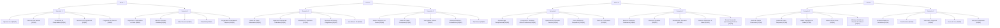
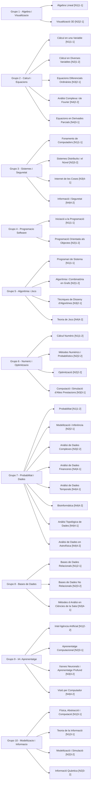

# Memoria TFG - Borrador inicial

## 1. Contexto y motivacion

Este Trabajo de Fin de Grado plantea el diseño e implementacion de un sistema de cuestionarios academicos con soporte para:

- gestion de banco de preguntas,
- juego interactivo de autoevaluacion,
- analisis de calidad del dataset,
- y evolucion hacia modelos pedagogicos mas realistas (multiasignatura y prerequisitos).

El punto de partida actual es un banco de 480 preguntas en formato CSV y un juego en Python con **modo libre** implementado (`Juego/juego_cuestionario.py`). Los modos **historia** (progresión narrativa) y **feedback** (retroalimentación pedagógica) están **en desarrollo**. Las filas del CSV siguen un **orden canónico** (listado de materias, bloques 5+5 Teoría/Cálculo, escalón de dificultad y ciclo de respuestas correctas; ver sección **14**). El inventario de ficheros de datos y scripts queda descrito en la **seccion 14**.

## 2. Estado actual del sistema

Actualmente, cada pregunta se representa con una etiqueta principal de `Materia` en `Data/Preguntas.csv`. El **modo libre** del juego utiliza esta etiqueta para filtrar preguntas en partida y enriquecerlas con metadatos del archivo `Data/listado_materias.csv`.

| Modo | Estado | Descripción breve |
|------|--------|-------------------|
| **Libre** | Implementado | Partida configurable, filtros, dificultad progresiva, ranking. **Banco:** (1) dataset = MODO FINAL; (2–3) plantillas = MODO BETA (todo el pool o solo entradas no presentes en el CSV revisado). |
| **Historia** | En desarrollo | Avance por escenas o salas ligadas al grado (escape room / novela gráfica); los puzles del banco desbloquean la narrativa. |
| **Feedback** | En desarrollo | Tras cada respuesta, explicación orientada al aprendizaje (acierto/error, conceptos, vínculo con materias y, en el futuro, prerrequisitos). |

Esta modelizacion es funcional para una primera version, pero presenta limitaciones didacticas:

1. No permite representar de forma explicita preguntas con solapamiento conceptual entre varias asignaturas.
2. No captura dependencias de conocimiento entre asignaturas (prerequisitos) como parte del dato de pregunta.

## 3. Problema pedagogico detectado

Durante la revision con profesorado se identifican dos escenarios relevantes:

### 3.1 Solapamiento tematico

Hay preguntas que encajan de forma natural en mas de una asignatura. Por ejemplo, cuestiones de inferencia estadistica pueden aparecer en Probabilidad y en Modelizacion e Inferencia, o regresion lineal en IA y en asignaturas de modelizacion.

### 3.2 Imprescindibilidad tematica (prerequisitos)

Existen preguntas de cursos avanzados que requieren dominar conceptos previos de otras asignaturas (por ejemplo, optimizacion apoyada en calculo multivariable).

## 4. Propuesta de evolucion del modelo de datos

Se propone evolucionar desde `Materia` singular hacia un esquema con mas contexto academico:

- `Materia`: etiqueta principal para trazabilidad academica.
- `Materias_relacionadas`: lista opcional de etiquetas secundarias para representar solapamiento.
- `Prerequisitos`: lista de asignaturas/conceptos recomendados para resolver la pregunta con garantias.

Con esta estructura se mantiene compatibilidad con el flujo actual y se habilita una capa pedagogica mas rica para analisis, filtrado y personalizacion.

## 5. Alcance de revision de preguntas

Dado el volumen total (480 preguntas), se considera razonable un plan de revision distribuida:

- revision prioritaria por asignaturas impartidas por cada docente,
- revision secundaria por asignaturas afines,
- y validacion transversal de consistencia terminologica y nivel de dificultad.

Este enfoque reduce carga, mejora calidad experta y acorta tiempos de iteracion.

### 5.1 Estado de la revision manual (2026-06-03)

| Tramo | Ids | Materias (resumen) | Registro |
|-------|-----|-------------------|----------|
| Hecho | 1–30 | Àlgebra, Càlcul I, Fonaments | `Data/revision_manual.md` |
| Hecho | 31–130 | Iniciació … Modelització i Inferència (13 materias) | `Data/revision_manual.md` |
| Hecho | 131–200 | Tècniques … Optimització (7 materias) | `Data/revision_manual.md` |
| Hecho | 201–240 | Visualització 3D … Optimització (cierre bloque 20 materias) | `Data/revision_manual.md` |
| Hecho | 241–480 | Aprenentatge Computacional … Visió per Computador (20 materias) | `Data/revision_manual.md` |

**Progreso:** **480 / 480** — banco cerrado por el autor (redacción genérica, sin referencias a temario de asignatura). Mantenimiento de artefactos: `limpiar_plantillas.py` → `inyectar_dataset_en_plantillas.py` → `sincronizar_plantillas_repuesto.py` → `auditar_distractores.py` (ver `Data/revision_manual.md` cabecera).

**Cambios destacados en 31–130:** Programari (terminal/shell/git, sin HPC); Grafs con A* y Dijkstra (sin ruta del viajante); POO solo Python; Probabilitat con una Bayes; BDR id 105 normalización; EDO sin Wronskiano y id 120 PVI; Modelització sin RL, bloque de inferencia coherente.

**Cambios destacados en 131–200:** Complexa/Fourier; Dades Complexes (regresión, bootstrap); IA (búsqueda y razonamiento, sin A*); MN (cálculo numérico); Optimització (Simplex/Newton/KKT). Visualització 3D (141–150): revisado sin alterar contenido salvo petición explícita.

## 6. Proximos pasos

1. Definir criterios de etiquetado para `Materias_relacionadas` y `Prerequisitos`.
2. Adaptar scripts de validacion y estadisticas para soportar etiquetas multiples.
3. Mantener compatibilidad temporal para leer datasets antiguos con columna `Tema` (los scripts en `Files/` la normalizan a `Materia` al cargar o guardar; ver `utils_dataset_csv.py`).
4. Implementar **modo historia** y **modo feedback** en el cliente de juego (hoy solo está el **modo libre**); en paralelo, preparar selección por `Materias_relacionadas` / prerrequisitos cuando existan en el CSV.
5. ~~Revision por bloques del banco~~ **Hecho (480/480)**; opcional: pulido de distractores según `Data/auditoria_distractores.md` y ampliar pool en materias con pocas plantillas extra.
6. **Futuro:** unicidad semántica completa (ver §11.3 «Tareas pendientes»): 3 pares en CSV, ~13 intra-materia en plantillas, catálogo internet por materia, etc.

## 7. Contribucion esperada

La principal contribucion es pasar de un quiz convencional a una herramienta con criterio didactico explicito, capaz de reflejar:

- transversalidad entre asignaturas,
- dependencia de conocimientos previos,
- y trazabilidad de calidad del banco de preguntas.

Este enfoque incrementa la validez academica del sistema y mejora su utilidad para autoevaluacion y apoyo docente.

## 8. Cambios implementados en esta iteracion

En esta iteracion se han aplicado cambios concretos sobre el modelo de materias y sobre la logica del juego (se detallan ademas el repositorio y los scripts en la **seccion 14**):

- El archivo `Data/listado_materias.csv` incorpora las columnas `Curso`, `Semestre` y `Tematica`.
- Se ha trabajado con una estructura de 40 materias distribuida en 4 cursos, 2 semestres por curso y 5 materias por semestre.
- Se ha reforzado la unicidad de combinaciones `(Grupo, Nivel, Curso, Semestre)` para evitar secuencias repetidas.
- Se han consolidado 10 grupos tematicos globales, asignando cada materia a una sola tematica.
- Se han realizado ajustes de coherencia en grupos y niveles para reflejar simultaneidad o progresion cuando correspondia.
- El banco `Data/Preguntas.csv` queda definido con **480** preguntas (**12 por materia**: 2FT 2MT 2DT 2FC 2MC 2DC), columna **`Materia`** (no `Tema`) y **10 columnas** (`Id`, `Materia`, `Dificultad`, `Tipo`, `Pregunta`, `A`…`D`, `Correcta`); el resto de metadatos academicos sale de `listado_materias.csv` al cargar o al guardar con `utils_dataset_csv.guardar_filas_csv`.

En la aplicacion del quiz — **modo libre** (`Juego/juego_cuestionario.py`):

- Se carga `Data/listado_materias.csv` como fuente de metadatos academicos.
- Cada pregunta se enriquece con `grupo`, `nivel`, `curso` y `semestre` a partir de su `materia`.
- La `tematica` queda definida en `Data/listado_materias.csv` como capa semantica global por grupo.
- Se añaden nuevos filtros de partida por `curso`, `semestre`, `grupo` y `nivel`, ademas de los ya existentes (`materia` y `dificultad`).
- En cada pregunta mostrada al jugador se visualizan tambien estos metadatos, mejorando el contexto academico de la evaluacion.

Estos cambios conectan el banco de preguntas con la planificacion docente y facilitan una evaluacion mas segmentada por etapa formativa.

## 9. Diagrama global de jerarquia de materias

El siguiente esquema visual resume la organizacion de las 40 materias por `Curso` y `Semestre`. En cada materia se indica `[Gx|Ny]`, donde:

- `Gx` = grupo
- `Ny` = nivel


```mermaid
flowchart TB
    C1["Curso 1"] --> C1S1["Semestre 1"]
    C1["Curso 1"] --> C1S2["Semestre 2"]
    C2["Curso 2"] --> C2S1["Semestre 1"]
    C2["Curso 2"] --> C2S2["Semestre 2"]
    C3["Curso 3"] --> C3S1["Semestre 1"]
    C3["Curso 3"] --> C3S2["Semestre 2"]
    C4["Curso 4"] --> C4S1["Semestre 1"]
    C4["Curso 4"] --> C4S2["Semestre 2"]

    C1S1 --> M01["Àlgebra Lineal [G1|N1]"]
    C1S1 --> M02["Càlcul en una Variable [G2|N1]"]
    C1S1 --> M03["Fonaments de Computadors [G3|N1]"]
    C1S1 --> M04["Iniciació a la Programació [G4|N1]"]
    C1S1 --> M05["Programari de Sistema [G5|N1]"]

    C1S2 --> M06["Algorítmia i Combinatòria en Grafs [G5|N2]"]
    C1S2 --> M07["Càlcul en Diverses Variables [G2|N2]"]
    C1S2 --> M08["Càlcul Numèric [G6|N1]"]
    C1S2 --> M09["Probabilitat [G7|N1]"]
    C1S2 --> M10["Programació Orientada als Objectes [G4|N2]"]

    C2S1 --> M11["Bases de Dades Relacionals [G8|N1]"]
    C2S1 --> M12["Equacions Diferencials Ordinàries [G2|N3]"]
    C2S1 --> M13["Modelització i Inferència [G7|N2]"]
    C2S1 --> M14["Tècniques de Disseny d'Algoritmes [G5|N3]"]
    C2S1 --> M15["Visualització 3D [G1|N2]"]

    C2S2 --> M16["Anàlisi Complexa i de Fourier [G2|N4]"]
    C2S2 --> M17["Anàlisi de Dades Complexes [G7|N3]"]
    C2S2 --> M18["Intel·ligència Artificial [G9|N1]"]
    C2S2 --> M19["Mètodes Numèrics i Probabilístics [G6|N2]"]
    C2S2 --> M20["Optimització [G6|N2]"]

    C3S1 --> M21["Aprenentatge Computacional [G9|N2]"]
    C3S1 --> M22["Computació i Simulació d'Altes Prestacions [G6|N3]"]
    C3S1 --> M23["Equacions en Derivades Parcials [G2|N4]"]
    C3S1 --> M24["Física, Abstracció i Computació [G10|N1]"]
    C3S1 --> M25["Teoria de la Informació [G10|N1]"]

    C3S2 --> M26["Bases de Dades No Relacionals [G8|N2]"]
    C3S2 --> M27["Informació Quàntica [G10|N2]"]
    C3S2 --> M28["Modelització i Simulació [G10|N2]"]
    C3S2 --> M29["Sistemes Distribuïts i el Núvol [G3|N2]"]
    C3S2 --> M30["Xarxes Neuronals i Aprenentatge Profund [G9|N3]"]

    C4S1 --> M31["Anàlisi de Dades Financeres [G7|N4]"]
    C4S1 --> M32["Anàlisi de Dades Temporals [G7|N4]"]
    C4S1 --> M33["Anàlisi Topològica de Dades [G7|N4]"]
    C4S1 --> M34["Internet de les Coses [G3|N3]"]
    C4S1 --> M35["Mètodes d Anàlisi en Ciències de la Salut [G8|N3]"]

    C4S2 --> M36["Anàlisi de Dades en Astrofísica [G7|N4]"]
    C4S2 --> M37["Bioinformàtica [G7|N4]"]
    C4S2 --> M38["Informació i Seguretat [G3|N4]"]
    C4S2 --> M39["Teoria de Jocs [G5|N4]"]
    C4S2 --> M40["Visió per Computador [G9|N4]"]
```

## 10. Diagrama por grupos de materias

El siguiente diagrama organiza las materias por `Grupo`. Cada nodo incluye `[Nivel|Curso-Semestre]` para visualizar la progresion interna. Cada grupo representa una tematica global:

- G1: Algebra i Geometria
- G2: Calcul i Equacions
- G3: Sistemes i Seguretat Computacional
- G4: Programacio de Software
- G5: Algoritmia i Teoria de Jocs
- G6: Metodes Numerics i Optimitzacio
- G7: Probabilitat i Ciencia de Dades
- G8: Bases de Dades
- G9: Intel·ligencia Artificial i Aprenentatge Automatic
- G10: Modelitzacio Fisica i Informacio


```mermaid
flowchart LR
    G1["Grupo 1 - Algebra i Visualitzacio"] --> G1A["Àlgebra Lineal [N1|1-1]"]
    G1 --> G1B["Visualització 3D [N2|2-1]"]

    G2["Grupo 2 - Calcul i Equacions"] --> G2A["Càlcul en una Variable [N1|1-1]"]
    G2 --> G2B["Càlcul en Diverses Variables [N2|1-2]"]
    G2 --> G2C["Equacions Diferencials Ordinàries [N3|2-1]"]
    G2 --> G2D["Anàlisi Complexa i de Fourier [N4|2-2]"]
    G2 --> G2E["Equacions en Derivades Parcials [N4|3-1]"]

    G3["Grupo 3 - Sistemes i Seguretat"] --> G3A["Fonaments de Computadors [N1|1-1]"]
    G3 --> G3B["Sistemes Distribuïts i el Núvol [N2|3-2]"]
    G3 --> G3C["Internet de les Coses [N3|4-1]"]
    G3 --> G3D["Informació i Seguretat [N4|4-2]"]

    G4["Grupo 4 - Programacio Software"] --> G4A["Iniciació a la Programació [N1|1-1]"]
    G4 --> G4B["Programació Orientada als Objectes [N2|1-2]"]

    G5["Grupo 5 - Algoritmia i Jocs"] --> G5A["Programari de Sistema [N1|1-1]"]
    G5 --> G5B["Algorítmia i Combinatòria en Grafs [N2|1-2]"]
    G5 --> G5C["Tècniques de Disseny d'Algoritmes [N3|2-1]"]
    G5 --> G5D["Teoria de Jocs [N4|4-2]"]

    G6["Grupo 6 - Numeric i Optimitzacio"] --> G6A["Càlcul Numèric [N1|1-2]"]
    G6 --> G6B["Mètodes Numèrics i Probabilístics [N2|2-2]"]
    G6 --> G6C["Optimització [N2|2-2]"]
    G6 --> G6D["Computació i Simulació d'Altes Prestacions [N3|3-1]"]

    G7["Grupo 7 - Probabilitat i Dades"] --> G7A["Probabilitat [N1|1-2]"]
    G7 --> G7B["Modelització i Inferència [N2|2-1]"]
    G7 --> G7C["Anàlisi de Dades Complexes [N3|2-2]"]
    G7 --> G7D["Anàlisi de Dades Financeres [N4|4-1]"]
    G7 --> G7E["Anàlisi de Dades Temporals [N4|4-1]"]
    G7 --> G7F["Bioinformàtica [N4|4-2]"]
    G7 --> G7G["Anàlisi Topològica de Dades [N4|4-1]"]
    G7 --> G7H["Anàlisi de Dades en Astrofísica [N4|4-2]"]
    
    G8["Grupo 8 - Bases de Dades"] --> G8A["Bases de Dades Relacionals [N1|2-1]"]
    G8 --> G8B["Bases de Dades No Relacionals [N2|3-2]"]
    G8 --> G8C["Mètodes d Anàlisi en Ciències de la Salut [N3|4-1]"]

    G9["Grupo 9 - IA i Aprenentatge"] --> G9A["Intel·ligència Artificial [N1|2-2]"]
    G9 --> G9B["Aprenentatge Computacional [N2|3-1]"]
    G9 --> G9C["Xarxes Neuronals i Aprenentatge Profund [N3|3-2]"]
    G9 --> G9D["Visió per Computador [N4|4-2]"]

    G10["Grupo 10 - Modelitzacio i Informacio"] --> G10A["Física, Abstracció i Computació [N1|3-1]"]
    G10 --> G10B["Teoria de la Informació [N1|3-1]"]
    G10 --> G10C["Modelització i Simulació [N2|3-2]"]
    G10 --> G10D["Informació Quàntica [N2|3-2]"]
    
```

## 11. Seccion tecnica del script del juego en Python

El lanzador `Juego/juego_cuestionario.py` arranca el menú; la lógica está en el paquete **`Juego/Consola/`** (import `Consola`). El **modo libre** está implementado; **historia** (examen balanceado con histórico de qualificacions) y **feedback** comparten la misma capa de datos (`Data/Preguntas.csv`, `listado_materias.csv`, plantillas e histórico CSV).

El diseño separa rutas, carga de datos, reglas de partida, modos e informes de examen (sin ranking global: sustituido por informes `.txt` en `Juego/Informes/`).

### 11.0 Modos de juego (alcance TFG)

| Modo | Estado | Código |
|------|--------|--------|
| Libre | **Implementado** | `Consola/modo_libre.py` — banco dataset o plantillas (beta), filtros, informes |
| Historia | **Implementado** (v1) | `Consola/modo_historia.py` + `generador_examen_historia.py` — examen balanceado |
| Feedback | **En desarrollo** | `Consola/modo_feedback.py` — explicación tras cada respuesta |

### 11.1 Entrada de datos y resolucion de rutas

El script detecta automaticamente la ruta base del proyecto para funcionar tanto en ejecucion normal como empaquetado con PyInstaller. A partir de esa base localiza:

- `Data/Preguntas.csv` como dataset principal.
- `Data/listado_materias.csv` para enriquecer cada pregunta con metadatos academicos.
- `Data/plantillas.json`, `Data/Historic_qualificacions_MatCAD_completo.csv` segun modo.
- `Juego/Informes/` para informes de examen cerrado (`.txt`, gitignored salvo `.gitkeep`).

La funcion de carga valida que cada pregunta tenga enunciado, cuatro opciones completas y respuesta correcta en el conjunto `{A, B, C, D}`.

### 11.2 Modelo interno de pregunta

Cada fila del CSV se transforma en una instancia de la clase `Pregunta`, que incluye:

- contenido de evaluacion (`texto`, `opciones`, `correcta`),
- metadatos academicos (`materia`, `tematica`, `grupo`, `nivel`, `curso`, `semestre`),
- y metadatos didacticos (`dificultad`, `tipo`).

Este modelo evita trabajar con diccionarios sueltos durante la partida y mejora la legibilidad de la logica.

### 11.3 Banco de preguntas y flujo de partida (modo libre)

Al iniciar cada partida, el jugador elige el **banco**:

| Opción | Calidad | Fuente |
|--------|---------|--------|
| 1 — Dataset | **MODO SEGURO** (por defecto) | `Data/Preguntas.csv` — **480** preguntas revisadas |
| 2 — Todo | **MODO BETA** | **480 + 960 = 1440** (dataset + pool extra de plantillas) |
| 3 — Plantillas extra | **MODO BETA** | **960** instancias (**24** por materia, 2× el dataset; no revisadas) |

Equilibrio del pool extra: `python Files/equilibrar_pool_extra_juego.py --inplace` (tras cambios en `plantillas.json`). Si hay duplicados o variantes sintéticas (`ampliado_perm`, `pool_extra`, …): `python Files/dedup_reemplazar_plantillas.py --inplace` y después volver a equilibrar. Catálogo de reemplazo: `Files/catalogo_internet_plantillas.py`.

La coincidencia con el dataset usa la misma clave que el mantenimiento (materia + enunciado + opciones + correcta). Las plantillas con placeholders sin sustituir se omiten.

**Estado de datos (cerrado para uso, 2026-06):** `Preguntas.csv` (**480**), `plantillas.json` (copias `dataset_480` alineadas, pool extra **960**, bancos del juego **480 / 960 / 1440**) y metadatos en `listado_materias.csv` se consideran **correctos y listos para usar**. El **modo seguro** (banco 1) es el recomendado para evaluación del TFG; modos 2–3 son beta.

**Tareas pendientes (futuro — calidad / unicidad semántica):** no bloquean el uso actual; revisar con `python Files/duplicados.py revisar`.

1. **CSV (modo seguro):** sustituir o reescribir **3 pares similares** (Ids 14↔21, 298↔322, 69↔72).
2. **Plantillas (misma materia):** reducir **~13 pares similares** intra-materia (p. ej. repuesto vs `internet`).
3. **Plantillas (entre materias):** ampliar `catalogo_internet_plantillas.py` con preguntas distintas por materia, no solo sufijo `[materia]`, para bajar **~129 pares** entre temas de la misma temática.
4. **Limpieza opcional:** alinear o eliminar entradas `repuesto` que dupliquen enunciado pero no opciones del CSV (p. ej. LSTM, ratio de Sharpe).
5. **Modo beta:** valorar dedup semántica al cargar el banco extra si se exige unicidad global entre las 960 instancias jugables.

Tras elegir banco, el jugador indica nombre y numero de preguntas objetivo. Luego selecciona un filtro principal entre:

- todas las preguntas,
- filtrado por tematica,
- filtrado por semestre (mediante combinacion `curso-semestre`),
- o filtrado por tipo.

Tras aplicar este filtro principal se construye el `pool` de preguntas candidatas. Si no hay resultados, la partida no comienza y se solicita cambiar el criterio.

### 11.4 Dificultad global progresiva

El juego usa una dificultad global numerica que depende de la complejidad de cada pregunta. Dicha complejidad combina:

- dificultad declarada de la pregunta (`Facil/Media/Dificil`),
- y nivel academico de la materia (`nivel`).

La partida empieza en una dificultad global inicial configurable (`1..max`) y sube progresivamente cada tres preguntas respondidas hasta alcanzar el maximo disponible del `pool`.

### 11.5 Sistema de puntuacion y vidas

El sistema de evaluacion aplica:

- `+10 / +20 / +30` puntos por acierto segun dificultad (`Facil/Media/Dificil`),
- penalizacion por error de al menos 5 puntos (o la mitad del valor base),
- y un total de 3 vidas por partida.

La partida termina al agotar vidas o al completar el numero objetivo de preguntas.

### 11.6 Informes de partida

En partidas con correccion al final, `Consola/informe_examen.py` escribe un `.txt` en `Juego/Informes/` (o `Informes/` junto al `.exe` empaquetado), con ID de sesion y detalle de respuestas. No hay fichero de ranking global.

### 11.7 Valor para el TFG

Desde la perspectiva del TFG, este script actua como banco de pruebas funcional para:

- validar la calidad y coherencia del dataset de preguntas,
- comprobar la utilidad de los metadatos academicos en escenarios reales de uso,
- y medir el impacto de las decisiones de diseño (filtros, progresion de dificultad y scoring) sobre la experiencia de autoevaluacion.

## 12. Documento de proyecto (Projecte.docx)

Contenido extraido del documento Word entregado como descripcion formal del proyecto.

Alumno: Daniel Fageda Figueredo

NIU: 1601846

Tutor: Víctor Navas Portella

0. Título provisional

Diseño y desarrollo de un videojuego educativo tipo escape room basado en contenidos del grado en Matemática Computacional y Análisis de Datos

1. Introducción y motivación

Los videojuegos educativos han demostrado ser una herramienta eficaz para reforzar el aprendizaje mediante la interacción y la resolución activa de problemas. En particular, los juegos basados en puzles permiten aplicar conocimientos teóricos en contextos prácticos, fomentando el razonamiento lógico y el pensamiento computacional.

En el ámbito de la Matemática Computacional y el Análisis de Datos, muchos conceptos presentan una elevada carga abstracta, lo que puede dificultar su asimilación. Este Trabajo de Fin de Grado propone el desarrollo de un videojuego educativo que utilice mecánicas propias de un escape room y una novela gráfica para presentar retos basados en contenidos reales del grado, transformando el proceso de resolución matemática en una experiencia interactiva.

La motivación principal del proyecto es combinar programación, matemáticas y diseño interactivo en una aplicación práctica que consolide los conocimientos adquiridos durante el grado.

2. Objetivos del proyecto

Objetivo general

Diseñar e implementar un videojuego educativo interactivo en el que la progresión del jugador depende de la resolución de puzles basados en contenidos del grado en Matemática Computacional y Análisis de Datos.

Objetivos específicos

Diseñar una narrativa interactiva que sirva de marco para la resolución de problemas.

Crear distintos tipos de puzles relacionados con materias del grado (álgebra, cálculo, estadística, optimización, análisis de datos, etc.).

Implementar algoritmos que validen las soluciones introducidas por el jugador.

Desarrollar una interfaz gráfica sencilla e intuitiva.

Evaluar el correcto funcionamiento del videojuego y su valor como herramienta de aprendizaje

3. Descripción del videojuego y alcance

El proyecto consistirá en el desarrollo de un videojuego tipo escape room con elementos de novela gráfica. El jugador avanzará a través de diferentes escenas o “salas”, cada una asociada a una temática concreta del grado. Esa experiencia corresponde al **modo historia** (en desarrollo). Hoy el repositorio ofrece un **modo libre** operativo (cuestionario con filtros y ranking) y planifica además un **modo feedback** (explicaciones tras cada respuesta).

Para avanzar en la historia, el jugador deberá resolver puzles matemáticos y computacionales, tales como:

Resolución de sistemas de ecuaciones.

Problemas de optimización.

Análisis de datos y toma de decisiones basada en resultados.

Interpretación de gráficos y modelos matemáticos.

El videojuego estará orientado a estudiantes con conocimientos básicos de matemáticas universitarias y se ejecutará en un entorno de escritorio.

4. Tecnologías y herramientas

Para el desarrollo del proyecto se utilizarán las siguientes tecnologías:

Lenguaje de programación: Python.

Entorno de desarrollo de videojuegos: librerías como Pygame o motores sencillos compatibles con Python, o alternativamente herramientas de creación visual de novelas gráficas.

Herramientas de desarrollo: editor de código, control de versiones con Git.

Recursos gráficos y narrativos: diseño propio o recursos libres adaptados al proyecto.

Python se ha elegido por su facilidad de uso, su potencia para el cálculo matemático y su amplia utilización en el análisis de datos.

5. Metodología y desarrollo

El desarrollo del proyecto se realizará de forma incremental, dividiéndose en las siguientes fases:

Análisis y diseño: definición de la narrativa, tipos de puzles y estructura del videojuego.

Implementación: desarrollo de la lógica del juego, resolución y validación de puzles y gestión de la interacción con el usuario.

Pruebas: comprobación del correcto funcionamiento del sistema y corrección de errores.

Evaluación final: análisis del resultado obtenido y posibles mejoras futuras.

6. Resultados esperados

Como resultado del proyecto se espera obtener:

Un videojuego educativo completamente funcional.

Un sistema de puzles matemáticos integrados en una narrativa interactiva.

Código fuente documentado y estructurado.

Una reflexión final sobre el potencial del videojuego como herramienta de apoyo al aprendizaje.

7. Conclusión

Este Trabajo de Fin de Grado combina matemáticas, programación y diseño interactivo para crear una aplicación práctica basada en los contenidos del grado. El proyecto pretende demostrar cómo los conceptos de Matemática Computacional y Análisis de Datos pueden aplicarse de forma creativa en entornos interactivos, reforzando el aprendizaje mediante la resolución activa de problemas.

## 13. Repositorio en GitHub

El codigo y la documentacion del proyecto se publican en el siguiente repositorio remoto:

- **URL:** https://github.com/Dafafi63f/Escape-Room.git

Para obtener una copia local:

```text
git clone https://github.com/Dafafi63f/Escape-Room.git
```

Para subir cambios, GitHub requiere autenticacion mediante **Personal Access Token** (HTTPS) o una clave **SSH**. No incluyas nunca tokens, contrasenas ni claves privadas dentro de archivos versionados; usalas solo en el gestor de credenciales del sistema o en configuracion local no versionada.

## 14. Estructura del repositorio, `Data/` y scripts (`Files/`)

Esta seccion resume los ficheros relevantes del codigo y de los datos para que la memoria coincida con el estado actual del proyecto (480 preguntas, CSV minimo de **10 columnas** mas `listado_materias.csv`, pipeline de balanceo en Python).

### 14.1 Carpeta `Data/`

| Fichero | Rol |
|---------|-----|
| `Preguntas.csv` | Banco principal: **480** preguntas (**40 × 12**), separador `;`, UTF-8. **10 columnas** en orden: `Id`;`Materia`;`Dificultad`;`Tipo`;`Pregunta`;`A`;`B`;`C`;`D`;`Correcta`. **Estructura por materia:** 2FT 2MT 2DT 2FC 2MC 2DC (6 Teoría + 6 Cálculo, ladder F→M→D en cada mitad). Reparto global: **160 / 160 / 160** dificultad; **120** por letra A–D; `Correcta` según `(Id−1) mod 4`. Validación: `python Files/mantenimiento.py validar`. Regeneración histórica: solo `Files/Archivo/` con `TFG_PERMITIR_CSV=1`. |
| `listado_materias.csv` | **40** materias del grado con columnas `Id`, `Materia`, `Grupo`, `Nivel`, `Curso`, `Semestre`, `Tematica` (y metadatos usados por el juego). |
| `plantillas.json` | Pool por materia para mantenimiento; el juego puede usarlo en **MODO BETA** (opciones 2–3 del modo libre). **MODO FINAL** = solo `Preguntas.csv`. |
| `auditoria_distractores.md` / `.json` | Informe de calidad de opciones A–D (generado por `auditar_distractores.py`). |
| `revision_manual.md` | Trazabilidad interna de la revisión por bloques de Ids. |
| `criterios_clasificacion_materia.csv` | Palabras clave y notas por materia; fuente de `utils_puntuacion_materia.py` (clasificación semántica en balance agresivo). |
| `Historic_qualificacions_MatCAD_completo.csv` | Tabla historica de qualificacions (CSV) para analisis estadistico auxiliar. |

### 14.2 Objetivos de balanceo (`Files/objetivos_balanceo.py`)

El tamano objetivo del banco tras el pipeline completo es **`TARGET_TOTAL_PREGUNTAS = 480`**. A partir de ahi se derivan, con las 40 materias del listado:

- **Por materia:** 12 preguntas (2FT 2MT 2DT 2FC 2MC 2DC).
- **Por tipo global:** 240 `Teoria` y 240 `Calculo`.
- **Por dificultad global:** 160 / 160 / 160 (Facil / Media / Dificil).
- **Por respuesta correcta:** 120 por letra A–D.

**Clasificación por contenido:** `utils_clasificacion_pregunta.clasificar_pregunta(enunciado, A, B, C, D, correcta)` devuelve la mejor tripleta Materia + Tipo + Dificultad inferida solo del texto. `comparar_con_asignacion(fila)` contrasta con las columnas del CSV; la **Dificultad** del banco canónico sigue la escalera del bloque (F/M/D), por lo que la inferida es orientativa salvo contrastes fuertes (Facil vs Dificil).

**`Files/mantenimiento.py`** es el punto único de entrada del banco cerrado (`validar`, `revision`, `plantillas`, `auditar-*`, …). **`Files/balance.py`** solo delega `validar`. Los comandos de regeneración (`conservador`, `agresivo`, …) están en `Files/Archivo/` y bloqueados para el CSV.

**`Files/duplicados.py`** centraliza la deduplicación: `revisar`, `plantillas`, `todo` (flujo recomendado), `exacto` y `enunciado`. Criterios compartidos en `utils_deduplicacion.py`.

Scripts antiguos de balanceo y deduplicación (`balancear_*.py`, `balanceo_completo.py`, `ordenar_dataset.py`, `eliminar_duplicados*.py`, `deduplicar_plantillas.py`, etc.) se han **unificado** en `balance.py`, `dataset_pipeline.py` y `duplicados.py`; no deben invocarse por nombre antiguo.

### 14.3 Catálogo de scripts: `Files/` (activos) vs `Files/Archivo/` (legado)

**Criterio:** en **`Files/`** queda todo lo que usa el banco cerrado (solo lectura del CSV o mantenimiento de `plantillas.json`). En **`Files/Archivo/`** queda la regeneración/reescritura histórica del CSV y CLIs sustituidos; al ejecutarlos, `utils_banco_cerrado.py` bloquea salvo `TFG_PERMITIR_CSV=1`.

#### Entrada y orquestación (`Files/`)

| Script | Función |
|--------|---------|
| `mantenimiento.py` | **CLI principal:** `validar`, `revision`, `dataset`, `auditar-*`, `plantillas`, `duplicados`, `criterios`, `pycache`. |
| `balance.py` | Alias → `mantenimiento.py` (solo `validar` operativo; resto mensaje de banco cerrado). |
| `duplicados.py` + `duplicados_lib.py` | Dedup y revisión (`revisar`, `plantillas`, …). |
| `plantillas_sync.py` | `inyectar`, `limpiar`, `repuesto`, `pipeline` sobre `plantillas.json`. |
| `equilibrar_pool_extra_juego.py` | Pool extra 24×40 para el juego (solo JSON). |
| `dedup_reemplazar_plantillas.py` | Purga sintéticas + catálogo internet + dedup (JSON). |
| `validacion_dataset.py` | Revisión amplia del CSV (`mantenimiento revision` / `dataset`). |
| `auditoria.py` | Distractores y `auditar-plantillas`. |
| `clasificar_pregunta.py` | Clasificación por contenido (lectura). |
| `exportar_criterios_clasificacion_materia.py` | Regenera `criterios_clasificacion_materia.csv`. |
| `estadisticas_historic_qualificacions.py` | Estadísticas del histórico de qualificacions. |
| *(raíz)* `borrar_pycache.py` | Limpieza de `__pycache__` en todo el proyecto (autónomo; ver también `utils_dataset_csv.borrar_pycache_en_proyecto` en scripts). |

#### Bibliotecas compartidas (`Files/` — no ejecutar como CLI salvo las de arriba)

| Módulo | Función |
|--------|---------|
| `utils_dataset_csv.py` | CSV, columnas, guardado con metadatos, `borrar_pycache_en_proyecto`. |
| `utils_banco_cerrado.py` | Protección del CSV cerrado. |
| `objetivos_balanceo.py` | Objetivos 480, `USO_PLANTILLA_DATASET`, slots 12×40. |
| `balance_lib.py` | Validación y orden canónico (usado por `validar`). |
| `utils_orden_temas.py`, `utils_texto.py` | Orden de materias y normalización. |
| `utils_deduplicacion.py` | Criterios de similitud. |
| `utils_plantillas_pool.py` | Pool plantillas y etiqueta `dataset_480`. |
| `utils_clasificacion_pregunta.py`, `utils_puntuacion_materia.py` | Clasificación semántica. |
| `plantillas_repuesto_catalogo.py`, `catalogo_internet_plantillas.py` | Catálogos de ampliación (datos). |

#### Legado / regeneración (`Files/Archivo/` — no usar en operación normal)

| Script | Motivo en Archivo |
|--------|-------------------|
| `dataset_pipeline.py` | Regeneración masiva del CSV. |
| `fix_final_materias.py` | Reclasificación y guardado del banco (histórico). |
| `aplicar_clasificacion_optima.py`, `aplicar_correcciones_materia.py` | Sustitución/regeneración por contenido. |
| `ampliar_dataset_480.py` | Ampliación 400→480 (ya aplicada). |
| `ampliar_plantillas.py`, `ampliar_plantillas_desde_web.py` | Ampliación antigua del JSON (sustituido por `equilibrar` + `catalogo_internet`). |
| `reducir_dataset_objetivo.py`, `crear_borrar_preguntas.py` | Ajuste de tamaño del CSV. |
| `recategorizar_y_equilibrar.py`, `reparar_materia_algoritmes.py` | Movimientos puntuales de Ids. |
| `limpiar_duplicados_csv.py`, `revisar_castellano_csv.py` | Limpieza/ortografía CSV. |
| `revisar_materia_contenido.py` | Revisión/sustitución por materia. |
| `variedad_materias.py` + `utils_variedad.py` | Variedad temática (Jaccard). |
| `dataset_plantillas_cli.py`, `materias_cli.py` | Enrutadores CLI antiguos. |
| `sync_plantillas_materias.py` | Reubica plantillas por reglas de contenido (sustituido por `plantillas pipeline`). |
| `balance.py` | Copia legacy de validación; usar `Files/balance.py` o `mantenimiento.py validar`. |

Scripts unificados que **ya no existen** en la raíz de `Files/` (nombres antiguos en documentación vieja): `validar_csv.py`, `revision_final.py`, `limpiar_plantillas.py`, `sincronizar_plantillas_repuesto.py`, `auditar_distractores.py`, `auditar_plantillas_global.py`, `asegurar_plantillas_sobre_dataset.py`, `revisar_plantillas.py` → cubiertos por `validacion_dataset.py`, `plantillas_sync.py`, `auditoria.py`, `mantenimiento.py`.

### 14.4 Mantenimiento (banco cerrado)

**Banco cerrado (2026-06-03):** `Data/Preguntas.csv` está protegido. `guardar_filas_csv()` y scripts en `Files/Archivo/` fallan salvo `TFG_PERMITIR_CSV=1`.

**CLI:** `python Files/Scripts/mantenimiento.py <comando>` (alias: `python Files/Scripts/balance.py validar` si existe).

| Comando | Función |
|---------|---------|
| `validar` [--detalle] | Balance y orden canónico (solo lectura) |
| `revision` / `revision --estadisticas` | Revisión del CSV |
| `dataset` [--variedad] | Validación extendida |
| `auditar-distractores` | Genera `Data/auditoria_distractores.md` |
| `auditar-plantillas` | Cobertura de `plantillas.json` |
| `plantillas pipeline` | limpiar → inyectar → repuesto → dedup |
| `criterios` | Actualiza `criterios_clasificacion_materia.csv` |
| `duplicados revisar` / `plantillas` | Ver `duplicados.py` |
| `dedup_reemplazar_plantillas.py --inplace` | Purga sintéticas, dedup, inyecta catálogo internet; luego `equilibrar_pool_extra_juego.py --inplace` |

**Otros:** `python borrar_pycache.py` [--dry-run] (raíz del TFG) · `python Files/Scripts/clasificar_pregunta.py` (sin `--inplace`).

**Flujo habitual:** (1) `validar` → (2) `plantillas pipeline` → (3) `criterios` → (4) `auditar-distractores`.

**No ejecutar:** scripts en `Files/Archivo/`, ni `mantenimiento.py conservador|agresivo|ajustar|…`.

**Documentación del banco:** `Data/revision_manual.md` (trazabilidad por materia). Informe de distractores: `Data/auditoria_distractores.md` (generado).

### 14.5 Juego y empaquetado (`Juego/`)

Documentacion: `Juego/README.md`, `Juego/Consola/README.md`, `Juego/Informes/README.md`, `Juego/Tests/README.md`.

| Elemento | Descripcion |
|----------|-------------|
| `juego_cuestionario.py` | Lanzador del menu (modos libre, historia, feedback). |
| `Consola/` | Paquete del juego (datos, modos, reglas, informes, rutas). |
| `Informes/` | Informes `.txt` generados al jugar (local; `.gitignore`). |
| `Tests/` | Pruebas unitarias (`python -m unittest discover -s Juego/Tests`). |
| `build_exe_onefile.ps1` | Genera `juego_cuestionario.exe` (PyInstaller, empaqueta `Data/`). |
| `build/`, `juego_cuestionario.spec`, `*.exe` | Artefactos locales de build; `build/` y `.exe` ignorados en git; el `.spec` se regenera y puede borrarse. |

### 14.6 Coherencia con el modelo de datos del TFG

Las secciones 4 y 6 proponen columnas futuras (`Materias_relacionadas`, `Prerequisitos`). El CSV actual **no** las incluye aun; el esquema vigente es el de la tabla 14.1 (**10 columnas** en `Preguntas.csv`, metadatos curriculares solo en `listado_materias.csv`). La columna unica de disciplina en el banco de preguntas es **`Materia`**, alineada con `listado_materias.csv`.