# Memoria TFG - Borrador inicial

## 1. Contexto y motivacion

Este Trabajo de Fin de Grado plantea el diseño e implementacion de un sistema de cuestionarios academicos con soporte para:

- gestion de banco de preguntas,
- juego interactivo de autoevaluacion,
- analisis de calidad del dataset,
- y evolucion hacia modelos pedagogicos mas realistas (multiasignatura y prerequisitos).

El punto de partida actual es un banco de 400 preguntas en formato CSV y un juego en Python que selecciona preguntas por `Materia` y `Dificultad`.

## 2. Estado actual del sistema

Actualmente, cada pregunta se representa con una etiqueta principal de `Materia` en `Data/Preguntas.csv`. El juego (`Juego/juego_cuestionario.py`) utiliza esta etiqueta para filtrar preguntas en partida y enriquecerlas con metadatos del archivo `Data/listado_materias.csv`.

Esta modelizacion es funcional para una primera version, pero presenta limitaciones didacticas:

1. No permite representar de forma explicita preguntas con solapamiento conceptual entre varias asignaturas.
2. No captura dependencias de conocimiento entre asignaturas (prerequisitos) como parte del dato de pregunta.

## 3. Problema pedagogico detectado

Durante la revision con profesorado se identifican dos escenarios relevantes:

### 3.1 Solapamiento tematico

Hay preguntas que encajan de forma natural en mas de una asignatura. Por ejemplo, cuestiones de inferencia estadistica pueden aparecer en Probabilidad y en Modelizacion e Inferencia, o regresion lineal en IA y en asignaturas de modelizacion.

### 3.2 Imprescindibilidad tematica (prerequisitos)

Existen preguntas de cursos avanzados que requieren dominar conceptos previos de otras asignaturas (por ejemplo, optimizacion apoyada en calculo multivariable).

## 4. Propuesta de evolucion del modelo de datos

Se propone evolucionar desde `Materia` singular hacia un esquema con mas contexto academico:

- `Materia`: etiqueta principal para trazabilidad academica.
- `Materias_relacionadas`: lista opcional de etiquetas secundarias para representar solapamiento.
- `Prerequisitos`: lista de asignaturas/conceptos recomendados para resolver la pregunta con garantias.

Con esta estructura se mantiene compatibilidad con el flujo actual y se habilita una capa pedagogica mas rica para analisis, filtrado y personalizacion.

## 5. Alcance de revision de preguntas

Dado el volumen total (400 preguntas), se considera razonable un plan de revision distribuida:

- revision prioritaria por asignaturas impartidas por cada docente,
- revision secundaria por asignaturas afines,
- y validacion transversal de consistencia terminologica y nivel de dificultad.

Este enfoque reduce carga, mejora calidad experta y acorta tiempos de iteracion.

## 6. Proximos pasos

1. Definir criterios de etiquetado para `Materias_relacionadas` y `Prerequisitos`.
2. Adaptar scripts de validacion y estadisticas para soportar etiquetas multiples.
3. Mantener compatibilidad temporal para leer datasets legacy con columna `Tema`.
4. Actualizar el juego para incorporar modos de seleccion por relacion entre materias.
5. Ejecutar una primera ronda de revision docente por bloques.

## 7. Contribucion esperada

La principal contribucion es pasar de un quiz convencional a una herramienta con criterio didactico explicito, capaz de reflejar:

- transversalidad entre asignaturas,
- dependencia de conocimientos previos,
- y trazabilidad de calidad del banco de preguntas.

Este enfoque incrementa la validez academica del sistema y mejora su utilidad para autoevaluacion y apoyo docente.

## 8. Cambios implementados en esta iteracion

En esta iteracion se han aplicado cambios concretos sobre el modelo de materias y sobre la logica del juego:

- El archivo `Data/listado_materias.csv` incorpora las columnas `Curso`, `Semestre` y `Tematica`.
- Se ha trabajado con una estructura de 40 materias distribuida en 4 cursos, 2 semestres por curso y 5 materias por semestre.
- Se ha reforzado la unicidad de combinaciones `(Grupo, Nivel, Curso, Semestre)` para evitar secuencias repetidas.
- Se han consolidado 10 grupos tematicos globales, asignando cada materia a una sola tematica.
- Se han realizado ajustes de coherencia en grupos y niveles para reflejar simultaneidad o progresion cuando correspondia.

En la aplicacion del quiz (`Juego/juego_cuestionario.py`):

- Se carga `Data/listado_materias.csv` como fuente de metadatos academicos.
- Cada pregunta se enriquece con `grupo`, `nivel`, `curso` y `semestre` a partir de su `materia`.
- La `tematica` queda definida en `Data/listado_materias.csv` como capa semantica global por grupo.
- Se añaden nuevos filtros de partida por `curso`, `semestre`, `grupo` y `nivel`, ademas de los ya existentes (`materia` y `dificultad`).
- En cada pregunta mostrada al jugador se visualizan tambien estos metadatos, mejorando el contexto academico de la evaluacion.

Estos cambios conectan el banco de preguntas con la planificacion docente y facilitan una evaluacion mas segmentada por etapa formativa.

## 9. Diagrama global de jerarquia de materias

El siguiente esquema visual resume la organizacion de las 40 materias por `Curso` y `Semestre`. En cada materia se indica `[Gx|Ny]`, donde:

- `Gx` = grupo
- `Ny` = nivel

```mermaid
flowchart TB
    C1["Curso 1"] --> C1S1["Semestre 1"]
    C1["Curso 1"] --> C1S2["Semestre 2"]
    C2["Curso 2"] --> C2S1["Semestre 1"]
    C2["Curso 2"] --> C2S2["Semestre 2"]
    C3["Curso 3"] --> C3S1["Semestre 1"]
    C3["Curso 3"] --> C3S2["Semestre 2"]
    C4["Curso 4"] --> C4S1["Semestre 1"]
    C4["Curso 4"] --> C4S2["Semestre 2"]

    C1S1 --> M01["Àlgebra Lineal [G1|N1]"]
    C1S1 --> M02["Càlcul en una Variable [G2|N1]"]
    C1S1 --> M03["Fonaments de Computadors [G3|N1]"]
    C1S1 --> M04["Iniciació a la Programació [G4|N1]"]
    C1S1 --> M05["Programari de Sistema [G5|N1]"]

    C1S2 --> M06["Algorítmia i Combinatòria en Grafs [G5|N2]"]
    C1S2 --> M07["Càlcul en Diverses Variables [G2|N2]"]
    C1S2 --> M08["Càlcul Numèric [G6|N1]"]
    C1S2 --> M09["Probabilitat [G7|N1]"]
    C1S2 --> M10["Programació Orientada als Objectes [G4|N2]"]

    C2S1 --> M11["Bases de Dades Relacionals [G8|N1]"]
    C2S1 --> M12["Equacions Diferencials Ordinàries [G2|N3]"]
    C2S1 --> M13["Modelització i Inferència [G7|N2]"]
    C2S1 --> M14["Tècniques de Disseny d'Algoritmes [G5|N3]"]
    C2S1 --> M15["Visualització 3D [G1|N2]"]

    C2S2 --> M16["Anàlisi Complexa i de Fourier [G2|N4]"]
    C2S2 --> M17["Anàlisi de Dades Complexes [G7|N3]"]
    C2S2 --> M18["Intel·ligència Artificial [G9|N1]"]
    C2S2 --> M19["Mètodes Numèrics i Probabilístics [G6|N2]"]
    C2S2 --> M20["Optimització [G6|N2]"]

    C3S1 --> M21["Aprenentatge Computacional [G9|N2]"]
    C3S1 --> M22["Computació i Simulació d'Altes Prestacions [G6|N3]"]
    C3S1 --> M23["Equacions en Derivades Parcials [G2|N4]"]
    C3S1 --> M24["Física, Abstracció i Computació [G10|N1]"]
    C3S1 --> M25["Teoria de la Informació [G10|N1]"]

    C3S2 --> M26["Bases de Dades No Relacionals [G8|N2]"]
    C3S2 --> M27["Informació Quàntica [G10|N2]"]
    C3S2 --> M28["Modelització i Simulació [G10|N2]"]
    C3S2 --> M29["Sistemes Distribuïts i el Núvol [G3|N2]"]
    C3S2 --> M30["Xarxes Neuronals i Aprenentatge Profund [G9|N3]"]

    C4S1 --> M31["Anàlisi de Dades Financeres [G7|N4]"]
    C4S1 --> M32["Anàlisi de Dades Temporals [G7|N4]"]
    C4S1 --> M33["Anàlisi Topològica de Dades [G7|N4]"]
    C4S1 --> M34["Internet de les Coses [G3|N3]"]
    C4S1 --> M35["Mètodes d Anàlisi en Ciències de la Salut [G8|N3]"]

    C4S2 --> M36["Anàlisi de Dades en Astrofísica [G7|N4]"]
    C4S2 --> M37["Bioinformàtica [G7|N4]"]
    C4S2 --> M38["Informació i Seguretat [G3|N4]"]
    C4S2 --> M39["Teoria de Jocs [G5|N4]"]
    C4S2 --> M40["Visió per Computador [G9|N4]"]
```

## 10. Diagrama por grupos de materias

El siguiente diagrama organiza las materias por `Grupo`. Cada nodo incluye `[Nivel|Curso-Semestre]` para visualizar la progresion interna. Cada grupo representa una tematica global:

- G1: Algebra i Geometria
- G2: Calcul i Equacions
- G3: Sistemes i Seguretat Computacional
- G4: Programacio de Software
- G5: Algoritmia i Teoria de Jocs
- G6: Metodes Numerics i Optimitzacio
- G7: Probabilitat i Ciencia de Dades
- G8: Bases de Dades
- G9: Intel·ligencia Artificial i Aprenentatge Automatic
- G10: Modelitzacio Fisica i Informacio

```mermaid
flowchart LR
    G1["Grupo 1 - Algebra i Visualitzacio"] --> G1A["Àlgebra Lineal [N1|1-1]"]
    G1 --> G1B["Visualització 3D [N2|2-1]"]

    G2["Grupo 2 - Calcul i Equacions"] --> G2A["Càlcul en una Variable [N1|1-1]"]
    G2 --> G2B["Càlcul en Diverses Variables [N2|1-2]"]
    G2 --> G2C["Equacions Diferencials Ordinàries [N3|2-1]"]
    G2 --> G2D["Anàlisi Complexa i de Fourier [N4|2-2]"]
    G2 --> G2E["Equacions en Derivades Parcials [N4|3-1]"]

    G3["Grupo 3 - Sistemes i Seguretat"] --> G3A["Fonaments de Computadors [N1|1-1]"]
    G3 --> G3B["Sistemes Distribuïts i el Núvol [N2|3-2]"]
    G3 --> G3C["Internet de les Coses [N3|4-1]"]
    G3 --> G3D["Informació i Seguretat [N4|4-2]"]

    G4["Grupo 4 - Programacio Software"] --> G4A["Iniciació a la Programació [N1|1-1]"]
    G4 --> G4B["Programació Orientada als Objectes [N2|1-2]"]

    G5["Grupo 5 - Algoritmia i Jocs"] --> G5A["Programari de Sistema [N1|1-1]"]
    G5 --> G5B["Algorítmia i Combinatòria en Grafs [N2|1-2]"]
    G5 --> G5C["Tècniques de Disseny d'Algoritmes [N3|2-1]"]
    G5 --> G5D["Teoria de Jocs [N4|4-2]"]

    G6["Grupo 6 - Numeric i Optimitzacio"] --> G6A["Càlcul Numèric [N1|1-2]"]
    G6 --> G6B["Mètodes Numèrics i Probabilístics [N2|2-2]"]
    G6 --> G6C["Optimització [N2|2-2]"]
    G6 --> G6D["Computació i Simulació d'Altes Prestacions [N3|3-1]"]

    G7["Grupo 7 - Probabilitat i Dades"] --> G7A["Probabilitat [N1|1-2]"]
    G7 --> G7B["Modelització i Inferència [N2|2-1]"]
    G7 --> G7C["Anàlisi de Dades Complexes [N3|2-2]"]
    G7 --> G7D["Anàlisi de Dades Financeres [N4|4-1]"]
    G7 --> G7E["Anàlisi de Dades Temporals [N4|4-1]"]
    G7 --> G7F["Bioinformàtica [N4|4-2]"]
    G7 --> G7G["Anàlisi Topològica de Dades [N4|4-1]"]
    G7 --> G7H["Anàlisi de Dades en Astrofísica [N4|4-2]"]
    
    G8["Grupo 8 - Bases de Dades"] --> G8A["Bases de Dades Relacionals [N1|2-1]"]
    G8 --> G8B["Bases de Dades No Relacionals [N2|3-2]"]
    G8 --> G8C["Mètodes d Anàlisi en Ciències de la Salut [N3|4-1]"]

    G9["Grupo 9 - IA i Aprenentatge"] --> G9A["Intel·ligència Artificial [N1|2-2]"]
    G9 --> G9B["Aprenentatge Computacional [N2|3-1]"]
    G9 --> G9C["Xarxes Neuronals i Aprenentatge Profund [N3|3-2]"]
    G9 --> G9D["Visió per Computador [N4|4-2]"]

    G10["Grupo 10 - Modelitzacio i Informacio"] --> G10A["Física, Abstracció i Computació [N1|3-1]"]
    G10 --> G10B["Teoria de la Informació [N1|3-1]"]
    G10 --> G10C["Modelització i Simulació [N2|3-2]"]
    G10 --> G10D["Informació Quàntica [N2|3-2]"]
    
```

## 11. Seccion tecnica del script del juego en Python

El archivo `Juego/juego_cuestionario.py` implementa el motor principal del quiz en consola. Su diseño separa la carga de datos, la logica de partida y la persistencia de resultados para facilitar mantenimiento y evolucion.

### 11.1 Entrada de datos y resolucion de rutas

El script detecta automaticamente la ruta base del proyecto para funcionar tanto en ejecucion normal como empaquetado con PyInstaller. A partir de esa base localiza:

- `Data/Preguntas.csv` como dataset principal.
- `Data/listado_materias.csv` para enriquecer cada pregunta con metadatos academicos.
- `Data/ranking_quiz.csv` para guardar puntuaciones entre partidas.

La funcion de carga valida que cada pregunta tenga enunciado, cuatro opciones completas y respuesta correcta en el conjunto `{A, B, C, D}`.

### 11.2 Modelo interno de pregunta

Cada fila del CSV se transforma en una instancia de la clase `Pregunta`, que incluye:

- contenido de evaluacion (`texto`, `opciones`, `correcta`),
- metadatos academicos (`materia`, `tematica`, `grupo`, `nivel`, `curso`, `semestre`),
- y metadatos didacticos (`dificultad`, `tipo`).

Este modelo evita trabajar con diccionarios sueltos durante la partida y mejora la legibilidad de la logica.

### 11.3 Flujo de partida y filtros

Al iniciar, el jugador elige nombre y numero de preguntas objetivo. Luego selecciona un filtro principal entre:

- todas las preguntas,
- filtrado por tematica,
- filtrado por semestre (mediante combinacion `curso-semestre`),
- o filtrado por tipo.

Tras aplicar este filtro principal se construye el `pool` de preguntas candidatas. Si no hay resultados, la partida no comienza y se solicita cambiar el criterio.

### 11.4 Dificultad global progresiva

El juego usa una dificultad global numerica que depende de la complejidad de cada pregunta. Dicha complejidad combina:

- dificultad declarada de la pregunta (`Facil/Media/Dificil`),
- y nivel academico de la materia (`nivel`).

La partida empieza en una dificultad global inicial configurable (`1..max`) y sube progresivamente cada tres preguntas respondidas hasta alcanzar el maximo disponible del `pool`.

### 11.5 Sistema de puntuacion y vidas

El sistema de evaluacion aplica:

- `+10 / +20 / +30` puntos por acierto segun dificultad (`Facil/Media/Dificil`),
- penalizacion por error de al menos 5 puntos (o la mitad del valor base),
- y un total de 3 vidas por partida.

La partida termina al agotar vidas o al completar el numero objetivo de preguntas.

### 11.6 Persistencia y ranking

Al finalizar, el script registra en `ranking_quiz.csv`:

- nombre del jugador,
- puntos totales,
- preguntas respondidas,
- y numero de aciertos.

Despues muestra un top de ranking ordenado por puntuacion (y por aciertos como criterio secundario).

### 11.7 Valor para el TFG

Desde la perspectiva del TFG, este script actua como banco de pruebas funcional para:

- validar la calidad y coherencia del dataset de preguntas,
- comprobar la utilidad de los metadatos academicos en escenarios reales de uso,
- y medir el impacto de las decisiones de diseño (filtros, progresion de dificultad y scoring) sobre la experiencia de autoevaluacion.
